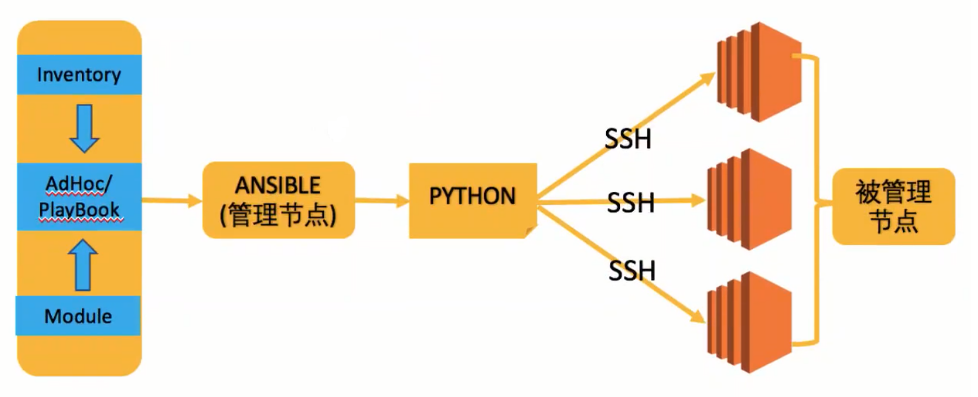

# Ansible

## 一 工作原理



## 静态资产表: hosts

* 默认文件

    ```text
    /etc/ansible/hosts
    ```

* 静态资产表配置参考

    ```text
    # This is the default ansible 'hosts' file.
    #
    # It should live in /etc/ansible/hosts
    #
    #   - Comments begin with the '#' character
    #   - Blank lines are ignored
    #   - Groups of hosts are delimited by [header] eleements
    #   - You can enter hostnames or ip addresses
    #   - A hostname/ip can be a member of multiple groups

    # Ex 1: Ungrouped hosts, specify before any group headers.

    green.example.com
    blue.example.com
    192.168.100.1
    192.168.100.10

    # Ex 2: A collection of hosts belonging to the 'webservers' group

    [webservers]
    alpha.example.org
    beta.example.org
    192.168.1.100
    192.168.1.110

    # If you have multiple hosts following a pattern you can specify
    # them like this:

    www[001:006].example.com

    # Ex 3: A collection of database servers in the 'dbservers' group

    [dbservers]
    db01.intranet.mydomain.net
    db02.intranet.mydomain.net
    10.25.1.56
    10.25.1.57

    # Here's another example of host ranges, this time there are no
    # leading 0s:

    db-[99:101]-node.example.com

    # Ex 4: Group children

    [ansible_g01]
    192.168.1.200
    
    [ansible_g02]
    192.168.1.201
    
    [ansible_host]
    [ansible_host:children]
    ansible_g01
    ansible_g02
    ```

* 查询资产

    ```sh
    ansible all --list-host         # 列出默认资产表文件(/etc/ansible/hosts)中所有主机
    ansible webserver --list-host   # 列出默认资产表文件(/etc/ansible/hosts)中webserver的主机
    ansible all -i ./hosts.ini      # 列出当前目录下自定义的资产表文件(./hosts.ini)中所有主机
    ```


## 二 资产选择器

```
group1:group2   并集
group1:&group2  交集
group1:!group2  差集: 只在group1中, 不在group2中
```

## 三 模块

- 核心模块(core module): ansible官方  
- 附加模块(extra module): openstack社区,docker社区等  
- 自定义模块(consume module): 自定义  

### 模块: command, shell

- `command` 是默认模块  
- `command` 模块无法执行SHELL的内置命令  
- `shell` 模块可以执行SHELL的内置命令和特性(比如管道符)  

### 模块: script

将管理节点上的脚本传递到被管理节点上执行。理论上此模块的执行完全不需要被管理服务器上有python。

### 模块: copy

> 复制文件

常用参数：

```text
src         源文件地址
dest        目标文件地址
backup=yes  若源文件和目标文件不同，则对目标文件进行备份
owner       目标文件的所有者
group       目标文件的所有组
mode        目标文件的权限
```

### 模块: yum_repository

> 添加YUM仓库

常用参数：

```
name        仓库名称，即[]中的名称; 必须指定;
description 仓库描述信息; 当state=present(即指定添加)时必须指定;
baseurl     yum存储库repodata目录所在目录的URL; 当state=present(即指定添加)时必须指定;
file        仓库文件保存在本地的文件名，不包含".repo"; 默认是"name"参数的值;
state       present确认添加仓库文件; absent 删除仓库文件(需要file指定文件, 默认会在{{name}}.repo中查找);
gpgcheck    是否检查GPG yes|no, 没有默认值, 使用/etc/yum.conf中的配置;
gpgkey      GPG key文件
```

### 模块: yum

> 安装软件包

常用参数:

```
name 安装的软件包名;若要安装软件包组, 需要在软件包组名添加@号: name='@Development Tools'
state 对当前指定的软件进行状态改变
    - present        已安装
    - installed      已安装
    - latest         已安装且为最新状态
    - absent,removed 移除状态
```

所有参数: 

```
allow_downgrade=no      Specify if the named package and version is allowed to downgrade a maybe already installed higher version of that package. 
                        Note that setting 'allow_downgrade=True' can make this module behave in a non-idempotent way. 
                        The task could end up with a set of packages that does not match the complete list of specified packages to install 
                        (because dependencies between the downgraded package and others can cause changes to the packages which were in the earlier transaction).
autoremove=no           If `yes', removes all "leaf" packages from the system that were originally installed as dependencies of user-installed packages but which are no longer required by any such package. 
                        Should be used alone or when state is `absent'. NOTE: This feature requires yum >= 3.4.3 (RHEL/CentOS 7+)
bugfix=no               If set to `yes', and `state=latest' then only installs updates that have been marked bugfix related.
conf_file=(null)        The remote yum configuration file to use for the transaction.
disable_excludes=(null) Disable the excludes defined in YUM config files.
                            If set to 'all', disables all excludes.
                            If set to 'main', disable excludes defined in [main] in yum.conf.
                            If set to 'repoid', disable excludes defined for given repo id.
disable_gpg_check=no    Whether to disable the GPG checking of signatures of packages being installed. Has an effect only if state is `present' or `latest'.
download_only=no        Only download the packages, do not install them.
download_dir=(null)     Specifies an alternate directory to store packages. Has an effect only if `download_only' is specified.
disable_plugin=(null)   'Plugin' name to disable for the install/update operation. The disabled plugins will not persist beyond the transaction.
enable_plugin=(null)    'Plugin' name to enable for the install/update operation. The enabled plugin will not persist beyond the transaction.
disablerepo=(null)      'Repoid' of repositories to disable for the install/update operation. These repos will not persist beyond the transaction.  
                        When specifying multiple repos, separate them with a ",". As of Ansible 2.7, this can alternatively be a list instead of "," separated string
enablerepo=(null)       'Repoid' of repositories to enable for the install/update operation. These repos will not persist beyond the transaction. 
                        When specifying multiple repos, separate them with a ",". As of Ansible 2.7, this can alternatively be a list instead of "," separated string.
exclude=(null)          Package name(s) to exclude when state=present, or latest
install_weak_deps=yes   Will also install all packages linked by a weak dependency relation. NOTE: This feature requires yum >= 4 (RHEL/CentOS 8+)
installroot=/           Specifies an alternative installroot, relative to which all packages will be installed.
list=(null)             Package name to run the equivalent of yum list --showduplicates <package> against. 
                        In addition to listing packages, use can also list the following: 'installed', 'updates', 'available' and 'repos'.
lock_timeout=30         Amount of time to wait for the yum lockfile to be freed.
name=(null)             A package name or package specifier with version, like `name-1.0'.
releasever=(null)       Specifies an alternative release from which all packages will be installed.
bugfix=no               If set to `yes', and `state=latest' then only installs updates that have been marked bugfix related.
security=no             If set to `yes', and `state=latest' then only installs updates that have been marked security related.
skip_broken=no          Skip packages with broken dependencies(devsolve) and are causing problems.
state                   'present' unless the 'autoremove' option is enabled for this module, then 'absent' is inferred.
update_cache=no         Force yum to check if cache is out of date and redownload if needed. Has an effect only if state is `present' or `latest'.
update_only=no          当state=latest时, 仅升级已安装的软件包, 对于未安装的软件包不进行升级
```

### 模块: systemd, service

> Centos/RHEL 6: service, 管理远程节点上的SysVinit服务(System V), 路径为 /etc /rc?.d/,/etc/init.d/  
> Centos/RHEL 7: systemd, 管理远程节点上的systemd服务, 即管理由systemd所管理的服务  

```
daemon_reload   重新载入systemd，扫描新的或有变动的单元
enabled         是否开机自启动yes|no
name            服务名称
state           服务状态:started,stopped,restarted,reload
```


### 模块: group

```
gid=(null)       Optional 'GID' to set for the group.
local=no         Forces the use of "local" command alternatives on platforms that implement it.
                    This is useful in environments that use centralized authentication when you want to manipulate the local groups. (e.g. it uses 'lgroupadd' instead of 'groupadd').
                    This requires that these commands exist on the targeted host, otherwise it will be a fatal error.
name             Name of the group to manage.
non_unique=no    This option allows to change the group ID to a non-unique value. Requires 'gid'.
                    Not supported on macOS or BusyBox distributions.
state=present    Whether the group should be present or not on the remote host. (Choices: absent, present)
system=no        If 'yes', indicates that the group created is a system group.
```

### 模块: user

常用参数:

```
name                用户名
password            密码(加密)
update_password     更新密码的条件
home                家目录
shell               shell类型
comment             描述
create_home         是否创建家目录
group               主组
groups              从组
uid                 UID
system              是否创建为系统用户
expires             账号过期时间
state               删除还是添加
remove              是否删除家目录
```

全部参数:

```
append=no                   If 'yes', add the user to the groups specified in `groups'.
                            If 'no', user will only be added to the groups specified in 'groups', removing them from all other groups.
                                Mutually exclusive with 'local'
comment=(null)              Optionally sets the description (aka `GECOS') of user account.
create_home=yes             Unless set to 'no', a home directory will be made for the user when the account is created or if the home directory does not exist. 
                                (Aliases: createhome (Ansible 2.5))
expires=(null)              An expiry time for the user in epoch, it will be ignored on platforms that do not support this.
                                Since Ansible 2.6 you can remove the expiry time specify a negative value(eg. -1). 
force=no                    This only affects 'state=absent', it forces removal of the user and associated directories on supported platforms.
                                The behavior is the same as `userdel --force', check the man page for 'userdel' on your system for details and support.
                                When used with 'generate_ssh_key=yes' this forces an existing key to be overwritten.
generate_ssh_key=no         Whether to generate a SSH key for the user in question.
                                This will *not* overwrite an existing SSH key unless used with 'force=yes'.
group=(null)                Optionally sets the user's primary group (takes a group name).
groups=(null)               List of groups user will be added to. When set to an empty string '', the user is removed from all groups except the primary group.
                                Before Ansible 2.3, the only input format allowed was a comma(,) separated string.
                                Mutually exclusive with `local'
home=(null)                 Optionally set the user's home directory.(/home/USERNAME)
local                       Forces the use of "local" command alternatives on platforms that implement it.
                                This is useful in environments that use centralized authentification when you want to manipulate the local users (i.e. it uses 'luseradd' instead of `useradd').
                                This will check `/etc/passwd' for an existing account before invoking commands. If the local account database exists somewhere other than '/etc/passwd', this setting will not work properly.
                                This requires that the above commands as well as '/etc/passwd' must exist on the target host, otherwise it will be a fatal error.
                                Mutually exclusive with 'groups' and 'append'
                                [Default: False]
login_class=(null)          Optionally sets the user's login class, a feature of most BSD OSs.
move_home=no                If set to 'yes' when used with 'home:', attempt to move the user's old home directory to the specified directory if it isn't there already and the old home exists.
name                        Name of the user to create, remove or modify. (Aliases: user)
non_unique                  Optionally when used with the -u option, this option allows to change the user ID to a non-unique value.
password=(null)             Optionally set the user's password to this crypted value.
                                On macOS systems, this value has to be cleartext. Beware of security issues.
                                To create a disabled account on Linux systems, set this to '!' or '*'.
                                To create a disabled account on OpenBSD, set this to '*************'.
                                See https://docs.ansible.com/ansible/faq.html#how-do-i-generate-encrypted-passwords-for-the-user-module for details on various ways to generate these password values.
                                    >1. ansible all -i localhost, -m debug -a "msg={{ 'mypassword' | password_hash('sha512', 'mysecretsalt') }}"
                                    >2. python -c 'import crypt,getpass;pw="123456";print(crypt.crypt(pw))'
password_lock=(null)        Lock the password (usermod -L, pw lock, usermod -C).
                            BUT implementation differs on different platforms, this option does not always mean the user cannot login via other methods.
                            This option does not disable the user, only lock the password. Do not change the password in the same task.
remove=no                   This only affects 'state=absent', it attempts to remove directories associated with the user.
                            The behavior is the same as 'userdel --remove', check the man page for details and support.
seuser=(null)               Optionally sets the seuser type (user_u) on selinux enabled systems.
shell=(null)                Optionally set the user's shell.
                                On other operating systems(except macOS), the default shell is determined by the underlying tool being used. See Notes for details.
skeleton=(null)             Optionally set a home skeleton directory. Requires 'create_home' option!
ssh_key_bits                Optionally specify number of bits in SSH key to create.
                                [Default: default set by ssh-keygen]
ssh_key_comment             Optionally define the comment for the SSH key.
                                [Default: ansible-generated on $HOSTNAME]
ssh_key_file='.ssh/id_rsa'  Optionally specify the SSH key filename. If this is a relative filename then it will be relative to the user's home directory.
                                This parameter defaults to '.ssh/id_rsa'.
ssh_key_passphrase=(null)   Set a passphrase for the SSH key.
                                If no passphrase is provided, the SSH key will default to having no passphrase.
ssh_key_type=rsa            Optionally specify the type of SSH key to generate. 
                                Available SSH key types will depend on implementation present on target host.
state=present               Taking action if the account state is different from what is stated. (Choices: absent, present)
system=no                   When creating an account 'state=present', setting this to 'yes' makes the user a system account.
                                This setting cannot be changed on existing users.
uid=(null)                  Optionally sets the 'UID' of the user.
update_password=always      'always' will update passwords if they differ.
                            'on_create' will only set the password for newly created users.
```


```sh
shell$ python -c 'import crypt,getpass;pw="123456";print(crypt.crypt(pw))'
    $6$wN90snkpbveLPu/J$IUZ35BCUCk9NNP0Cc1n/9ggBzY8SGH2sBexW8vhzl5pNv.DMVkFMm5DNxkKh2zxUL1B3ZB8/w7SmvBK0k16DL.

shell$ pass='$6$wN90snkpbveLPu/J$IUZ35BCUCk9NNP0Cc1n/9ggBzY8SGH2sBexW8vhzl5pNv.DMVkFMm5DNxkKh2zxUL1B3ZB8/w7SmvBK0k16DL.'

shell$ ansible ansible02 -m user -a "name=qwe1234 local=yes password=${pass}"
```

### 模块: file

> 主要用于远程主机上的文件操作

```
group           文件/目录的属组
mode            文件/目录的权限
owner           文件/目录的属主
path            文件/目录的路径
recurse         递归设置属性
src             源文件(state=link)
dest            目标文件(state=link)
state
    =directory   目录形式存在
    =file        文件形式存在
    =link        软链接形式存在
    =hard        硬链接形式存在
    =touch       等于命令touch
    =absent      删除文件/目录
```

```sh
shell> ansible ansible01 -m file -a 'state=touch path=/tmp/aaaa owner=nobody'
shell> ansible ansible01 -m file -a 'state=link src=/tmp/aaaa dest=/tmp/aaaa.lnk'
shell> ansible ansible01 -m file -a 'state=absent path=/tmp/aaaa.lnk'
shell> ansible ansible01 -m file -a 'state=directory path=/tmp/aaaa'
```


### 模块: cron

> 管理远程节点的定时任务

常用参数

```
name        定时任务名称, 便于日后删除
minute      分(*, 0-59, */2, etc.)
hour        时(*, 0-23, */2, etc.)
day         日(*, 1-31, */2, etc.)
month       月(*, 1-12, */2, etc.)
weekend     周(*, 0-6(Sun-Sat), etc.)
job         脚本
state       状态
```

```sh
shell> ansible ansible01 -m cron -a "name='NO1' minute=* job='ls /root'"

shell> crontab -l
#Ansible: NO1
* * * * * ls /root
```


### 模块: debug

> 主要用于调试, 通常的作用是将一个变量的值打印出来  

```
var     直接打印一个指定的变量值
msg     打印一段可以格式化的字符串
```

```sh
shell> ansible ansible01 -m debug -a "var=var01" -e "var01=webbbb"                  # -e 传入变量
shell> ansible ansible01 -m debug -a "msg='var01 is {{var01}}'" -e "var01=webbbb"
```


### 模块: template

> template模块使用`Jinja2`格式作为文件模板,可以进行文档内变量的替换;  
> 它每次使用后都会被ansible编辑为"changed"状态, 文件以`.j2`结尾  

用法其实和copy模块基本一样, template木块的强大指出就是使用变量替换: 可以把传递给ansible的变量值替换到模板文件中然后发到被控端

常用参数: 

```
src     指定ansible控制端的文件路径
dest    指定ansible被控端的文件路径
owner   指定文件的属主
group   指定文件的属组
mode    指定文件的权限
backup  创建一个包含时间戳信息的被备份文件; 这样如果错误的破环了原始文件, 可以将其恢复(yes|no)
```

```sh
shell> cat hello_world.j2
Hello {{var}}!
shell> ansible ansible01 -m template -a "src=hello_world.j2 dest=/tmp/hello_world01" -e "var=world01"  # /tmp/hello_world01: 传入world01
shell> ansible ansible01 -m template -a "src=hello_world.j2 dest=/tmp/hello_world02" -e "var=world02"  # /tmp/hello_world02: 传入world02
shell> ansible ansible01 -m template -a "src=hello_world.j2 dest=/tmp/hello_world02 backup=yes" -e "var=world02"  # /tmp/hello_world02: 先备份, 然后传入world03 
shell> ls -l /tmp/
-rw-r--r--.  1 root root   15 Jan 18 16:37 hello_world01
-rw-r--r--.  1 root root   15 Jan 18 16:38 hello_world02
-rw-r--r--.  1 root root   15 Jan 18 16:37 hello_world02.28895.2021-01-18@16:38:49~   # 备份的文件
```

### 模块: lineinfile

> 在被管理节点上, 用正则匹配的方式**对目标文件的一行内容执行修改,删除等操作**  
> 如果是**对一个文件中把所有匹配到的行进行统一处理**, 要参考`replace`模块  
> 如果是**对一个文件中的多行进行添加,更新,删除等操作**, 要参考`blockinfile`模块  

常用参数:

```text
path    目标文件路径
state   absent删除 | present替换(默认)
regexp  使用该正则表达式在文件的每一行中查找; 对与state=present, 仅被找到的最后一行被替换(对于state=absent, 所有匹配的行均会被删除)
line    指定行用于插入/替换; 需要state=present
create  文件不存在时,是否创建文件并添加内容(yes|no)
```

全部参数:

```text
attributes=(null)	The attributes the resulting file or directory should have. (Aliases: attr)
					To get supported flags look at the man page for 'chattr' on the target system.
					This string should contain the attributes in the same order as the one displayed by 'lsattr'.
					The '=' operator is assumed as default, otherwise '+' or '-' operators need to be included in the string.
backrefs=no			Used with 'state=present'.(反向引用)
						If set, 'line' can contain backreferences (both positional and named) that will get populated if the 'regexp' matches.
					This parameter changes the operation of the module slightly; 
						'insertbefore' and 'insertafter' will be ignored, and if the 'regexp' does not match anywhere in the file, the file will be left unchanged.
						If the 'regexp' does match, the last matching line will be replaced by the expanded line parameter.
backup=no			Create a backup file including the timestamp information so you can get the original file back if you somehow clobbered it incorrectly.
create=no			Used with 'state=present'.
						If specified, the file will be created if it does not already exist. 
						By default it will fail if the file is missing.
firstmatch=no       Used with 'insertafter' or 'insertbefore'.
						If set, 'insertafter' and 'insertbefore' will work with the first line that matches the given regular expression.
group=(null)		Name of the group that should own the file/directory, as would be fed to 'chown'.
insertafter=EOF		Used with 'state=present'. 
					If specified, the line will be inserted after the last match of specified regular expression.(Choices: EOF, *regex*)
						If the first match is required, use(firstmatch=yes).
						A special value is available; 'EOF' for inserting the line at the end of the file.
							If specified regular expression has no matches, EOF will be used instead.
						If 'insertbefore' is set, default value 'EOF' will be ignored.
					If regular expressions are passed to both 'regexp' and 'insertafter', 'insertafter' is only honored if no match for 'regexp' is found.
					May not be used with 'backrefs' or 'insertbefore'.
insertbefore=(null)	Used with 'state=present'.(Choices: BOF, *regex*)
					If specified, the line will be inserted before the last match of specified regular expression.
						If the first match is required, use 'firstmatch=yes'.
						A value is available; 'BOF' for inserting the line at the beginning of the file.
							If specified regular expression has no matches, the line will be inserted at the end of the file.
					If regular expressions are passed to both 'regexp' and 'insertbefore', 'insertbefore' is only honored if no match for 'regexp' is found.
					May not be used with 'backrefs' or 'insertafter'.
line=(null)         The line to insert/replace into the file. Required for 'state=present'.(Aliases: value)
						If 'backrefs' is set, may contain backreferences that will get expanded with the 'regexp' capture groups if the regexp matches.
						如果设置了“backrefs”，则可能包含反向引用，如果regexp匹配，则将使用“regexp”捕获组进行扩展。
mode=(null)         The permissions the resulting file or directory should have.
						For those used to '/usr/bin/chmod' remember that modes are actually octal numbers. 
						You must either add a leading zero so that Ansible's YAML parser knows it is an octal number (like '0644' or '01777') 
						or quote it (like '644' or '1777') so Ansible receives a string and can do its own conversion from string into number.
					Giving Ansible a number without following one of these rules will end up with a decimal number which will have unexpected results.
						As of Ansible 1.8, the mode may be specified as a symbolic mode (for example, 'u+rwx' or 'u=rw,g=r,o=r').
others=(null) 		All arguments accepted by the [file] module also work here.
owner=(null)		Name of the user that should own the file/directory, as would be fed to 'chown'.
path    			The file to modify.(Aliases: dest, destfile, name)
						Before Ansible 2.3 this option was only usable as 'dest', 'destfile' and 'name'.
regexp=(null)		The regular expression to look for in every line of the file.(Aliases: regex)
						For 'state=present', the pattern to replace if found. Only the last line found will be replaced.
						For 'state=absent', the pattern of the line(s) to remove.
					If the regular expression is not matched, the line will be added to the file in keeping with 'insertbefore' or 'insertafter' settings.
					When modifying a line the regexp should typically match both the initial state of the line as well as its state after replacement by 'line=' to ensure idempotence.
						Uses Python regular expressions. See http://docs.python.org/2/library/re.html.
selevel=s0		    The level part of the SELinux file context.
						This is the MLS/MCS attribute, sometimes known as the 'range'.
						When set to '_default', it will use the 'level' portion of the policy if available.
serole=(null)       The role part of the SELinux file context.
						When set to '_default', it will use the 'role' portion of the policy if available.
setype=(null)		The type part of the SELinux file context.
						When set to '_default', it will use the 'type' portion of the policy if available.
seuser=(null)       The user part of the SELinux file context.
						By default it uses the 'system' policy, where applicable.
						When set to '_default', it will use the 'user' portion of the policy if available.
state=present 		Whether the line should be there or not. (Choices: absent, present)
unsafe_writes=no
validate        	The validation command to run before copying into place.
					The path to the file to validate is passed in via '%s' which must be present as in the examples below.
					The command is passed securely so shell features like expansion and pipes will not work.
						Validate the sudoers file before saving
						validate='/usr/sbin/visudo -cf %s'
```

```shell
shell> ansible ansible01 -m lineinfile -a "path=/tmp/hello_world01 regex='^xxx' line='zzz' state=present"       # 替换
shell> ansible ansible01 -m lineinfile -a "path=/tmp/hello_world01 regex='^zzz' state=absent"                   # 删除
shell> ansible ansible01 -m lineinfile -a "path=/tmp/hello_world01 insertafter='1234' line='xy' state=present"  # 行后插入
shell> 待补充     # 反向引用
```


## 四 Playbook

Playbook的**核心元素**: 
- `Hosts`：主机组  
- `Tasks`：任务列表  
- `Variables`：变量，设置方式有四种  
- `Templates`：包含了模板语法的文本文件  
- `Handlers`：由特定条件触发的任务  

### YAML

#### 基本特点

- `#` 作为注释符  
- `.yml`, `.yaml` 作为文件格式  
- `---`作为文档开始标识, `...`作为文档结束标识 (两者都是可选的,一般只写`---`即可)  
- 大小写敏感  
- 使用缩进表示层级关系  
- 缩进时使用TAB还是空格一定要统一(推荐空格)  
- 左侧对齐即可表示为相同层级的元素  

#### 支持的数据结构

- 字符串  

    * 可以使用引号也可以不使用引号, 且单引号,双引号均可
    ```
    this is a string
    'this is a string'
    "this is a string"
    ```
    * 换行: "`|`", "`>`", 下一层级:

    ```yaml
    long_line: |
        line 1
        line 2
        line 3
    #或者
    long_line: >
        line 1
        line 2
        line 3
    #或者
    long_line: line 1
        line 2
    ```

- 列表  

> 固定形式: `- value` :

```yaml
- red
- blue
- green
```

转换成python显示如下:

```python
['red', 'blue', 'green']
```

- 字典  

> 固定形式: `key:  value` :

```yaml
name: Using Ansible
code: D1234
```

转换成python显示如下:

```python
{'name': 'Using Ansible', 'code': 'D1234'}
```

- 混合结构

```yaml
---
class: 
  - name: stu1
    num: 001
  - name: stu2
    num: 002
  - name: stu3
    num: 003
#Python: {'class': [{'name': 'stu1', 'num': 1},{'name': 'stu2', 'num': 2},{'name': 'stu3', 'num': 3}]}
...
```

#### 验证YAML语法

```sh
python -c 'import yaml,sys; print yaml.load(sys.stdin)' < my_yaml.yml
python3 -c 'import yaml,sys; print(yaml.load(sys.stdin))' < my_yaml.yml
# 若有问题, 可将 yaml.load ==> yaml.safe_load
```


### Play的定义

Playbook由一个或多个Play组成, Play的定义:  
- 每个Play以短横杠'`-`'开始  
- 每个Play都是一个YAML格式的字典  

eg. 一个play构成的playbook  

```yaml
---
- key1: value1
  key2: value2
  key3: value3
...
```

eg. 三个play构成的playbook

```yaml
---
- key1: value1
  key2: value2
  key3: value3
- key4: value4
  key5: value5
  key6: value6
- key7: value7
  key8: value8
  key9: value9
...
```

- 以`key1-9`中的每一个key, 都是已经在Play中有特定的含义, 不能自定义; 通用的Play属性如下:  

```
name            当前Play的名字
hosts           当前Play涉及操作的目标服务器
tasks           当前Play具体要完成的任务, 以列表形式表达
sudo            当前Play涉及操作是否需要需要提权
sudo_user       当前Play提权到某个具体用户
become_method   当前Play提权使用那种方式, 如sudo,su等
remote_user     当前Play指定连接的用户; 若未指定, 则默认使用当前执行ansible Playbook的用户
ignore_errors       当前Play忽略任务错误, 继续往下执行; 此设置对链接错误不生效
ignore_unreachable  当前Play忽略不可达主机错误, 继续往下执行; 此设置对任务错误不生效
max_fail_percentage 设定最大失败率; 当任务失败率达到设定值,会中止Playbook执行
roles           当前Play需要导入的角色
post_tasks      A list of tasks to execute after the tasks section.
pre_tasks       A list of tasks to execute before roles.
port            连接时使用的端口
tags            为task块或者play块打上标签, 这样可以在执行时控制是否执行:ansible-playbook --tags tag01:执行tag01; --skip-tags tag01:跳过执行tag02
timeout         限制Play执行的时间
vars            Dictionary/map of variables
vars_files      List of files that contain vars to include in the play.
vars_prompt     List of variables to prompt for
```

### Play中task多种写法

```yaml
# 以启动nginx服务为例

# 单行形式
service: name=nginx enabled=true state=started

# 多行形式
service: name=nginx
         enabled=tru
         state=started

# 多行字典形式
service: 
  name: nginx
  enabled: true
  state: started
```

### 多个play的示例

```yaml
---
- name: manage web servers
  hosts: web_servers
  remote_user: root
  tasks:
    - name: install nginx package
      yum: name=nginx state=present
    - name: copy nginx.conf to remote server
      copy: src=nginx.conf dest=/etc/nginx/nginx.conf
    - name: start nginx server
      service: 
        name: nginx
        enabled: true
        state: started

- name: manager db servers
  hosts: db_servers
  tasks:
    - name: update database config
      copy: src=my.cnf dest=/etc/my.cnf
```

### 执行Playbook

```sh
ansible-playbook tmp.yml
ansible-playbook --syntax-check tmp.yml # 检查语法
ansible-playbook --step tmp.yml         # 单步调试
ansible-playbook -C tmp.yml             # 模拟测试运行, 实际不在会主机上执行
```

### Playbook Keywords

> Aliases for the directives are not reflected here, nor are mutable one. For example, action in task can be substituted by the name of any Ansible module.
> The keywords do not have version_added information at this time
> Some keywords set defaults for the objects inside of them rather than for the objects themselves

#### Play

```
any_errors_fatal    Force any un-handled task errors on any host to propagate to all hosts and end the play.
become              Boolean that controls if privilege escalation is used or not on Task execution. Implemented by the become plugin. See Become Plugins.
become_exe          Path to the executable used to elevate privileges. Implemented by the become plugin. See Become Plugins.
become_flags        A string of flag(s) to pass to the privilege escalation program when become is True.
become_method       Which method of privilege escalation to use (such as sudo or su).
become_user         User that you 'become' after using privilege escalation. The remote/login user must have permissions to become this user.
check_mode          A boolean that controls if a task is executed in 'check' mode. See Validating tasks: check mode and diff mode.
collections         List of collection namespaces to search for modules, plugins, and roles. See Using collections in a Playbook
                        Note: Tasks within a role do not inherit the value of collections from the play. To have a role search a list of collections, use the collections keyword in meta/main.yml within a role.
connection          Allows you to change the connection plugin used for tasks to execute on the target. See Using connection plugins.
debugger            Enable debugging tasks based on state of the task result. See Debugging tasks.
diff                Toggle to make tasks return 'diff' information or not.
environment         A dictionary that gets converted into environment vars to be provided for the task upon execution. This can ONLY be used with modules. This isn't supported for any other type of plugins nor Ansible itself nor its configuration, it just sets the variables for the code responsible for executing the task. This is not a recommended way to pass in confidential data.
fact_path           Set the fact path option for the fact gathering plugin controlled by gather_facts.
force_handlers      Will force notified handler execution for hosts even if they failed during the play. Will not trigger if the play itself fails.
gather_facts        A boolean that controls if the play will automatically run the 'setup' task to gather facts for the hosts.
gather_subset       Allows you to pass subset options to the fact gathering plugin controlled by gather_facts.
gather_timeout      Allows you to set the timeout for the fact gathering plugin controlled by gather_facts.
handlers            A section with tasks that are treated as handlers, these won't get executed normally, only when notified after each section of tasks is complete. A handler's listen field is not templatable.
hosts               A list of groups, hosts or host pattern that translates into a list of hosts that are the play's target.
ignore_errors       Boolean that allows you to ignore task failures and continue with play. It does not affect connection errors.
ignore_unreachable  Boolean that allows you to ignore task failures due to an unreachable host and continue with the play. This does not affect other task errors (see ignore_errors) but is useful for groups of volatile/ephemeral hosts.
max_fail_percentage can be used to abort the run after a given percentage of hosts in the current batch has failed.
module_defaults     Specifies default parameter values for modules.
name                Identifier. Can be used for documentation, in or tasks/handlers.
no_log              Boolean that controls information disclosure.
order               Controls the sorting of hosts as they are used for executing the play. Possible values are inventory (default), sorted, reverse_sorted, reverse_inventory and shuffle.
port                Used to override the default port used in a connection.
post_tasks          A list of tasks to execute after the tasks section.
pre_tasks           A list of tasks to execute before roles.
remote_user         User used to log into the target via the connection plugin.
roles               List of roles to be imported into the play
run_once            Boolean that will bypass the host loop, forcing the task to attempt to execute on the first host available and afterwards apply any results and facts to all active hosts in the same batch.
serial              Explicitly define how Ansible batches the execution of the current play on the play's target
                        See also: Setting the batch size with serial
strategy            Allows you to choose the connection plugin to use for the play.
tags                Tags applied to the task or included tasks, this allows selecting subsets of tasks from the command line.
tasks               Main list of tasks to execute in the play, they run after roles and before post_tasks.
throttle            Limit number of concurrent task runs on task, block and playbook level. This is independent of the forks and serial settings, but cannot be set higher than those limits. For example, if forks is set to 10 and the throttle is set to 15, at most 10 hosts will be operated on in parallel.
timeout             Time limit for task to execute in, if exceeded Ansible will interrupt and fail the task.
vars                Dictionary/map of variables
vars_files          List of files that contain vars to include in the play.
vars_prompt         list of variables to prompt for.
```

#### Role

```
any_errors_fatal    Force any un-handled task errors on any host to propagate to all hosts and end the play.
become              Boolean that controls if privilege escalation is used or not on Task execution. Implemented by the become plugin. See Become Plugins.
become_exe          Path to the executable used to elevate privileges. Implemented by the become plugin. See Become Plugins.
become_flags        A string of flag(s) to pass to the privilege escalation program when become is True.
become_method       Which method of privilege escalation to use (such as sudo or su).
become_user         User that you 'become' after using privilege escalation. The remote/login user must have permissions to become this user.
check_mode          A boolean that controls if a task is executed in 'check' mode. See Validating tasks: check mode and diff mode.
collections         List of collection namespaces to search for modules, plugins, and roles. See Using collections in a Playbook
                        Note: Tasks within a role do not inherit the value of collections from the play. To have a role search a list of collections, use the collections keyword in meta/main.yml within a role.
connection          Allows you to change the connection plugin used for tasks to execute on the target. See Using connection plugins.
debugger            Enable debugging tasks based on state of the task result. See Debugging tasks.
delegate_facts      Boolean that allows you to apply facts to a delegated host instead of inventory_hostname.
delegate_to         Host to execute task instead of the target (inventory_hostname). Connection vars from the delegated host will also be used for the task.
diff                Toggle to make tasks return 'diff' information or not.
environment         A dictionary that gets converted into environment vars to be provided for the task upon execution. This can ONLY be used with modules. This isn't supported for any other type of plugins nor Ansible itself nor its configuration, it just sets the variables for the code responsible for executing the task. This is not a recommended way to pass in confidential data.
ignore_errors       Boolean that allows you to ignore task failures and continue with play. It does not affect connection errors.
ignore_unreachable  Boolean that allows you to ignore task failures due to an unreachable host and continue with the play. This does not affect other task errors (see ignore_errors) but is useful for groups of volatile/ephemeral hosts.
module_defaults     Specifies default parameter values for modules.
name                Identifier. Can be used for documentation, in or tasks/handlers.
no_log              Boolean that controls information disclosure.
port                Used to override the default port used in a connection.
remote_user         User used to log into the target via the connection plugin.
run_once            Boolean that will bypass the host loop, forcing the task to attempt to execute on the first host available and afterwards apply any results and facts to all active hosts in the same batch.
tags                Tags applied to the task or included tasks, this allows selecting subsets of tasks from the command line.
throttle            Limit number of concurrent task runs on task, block and playbook level. This is independent of the forks and serial settings, but cannot be set higher than those limits. For example, if forks is set to 10 and the throttle is set to 15, at most 10 hosts will be operated on in parallel.
timeout             Time limit for task to execute in, if exceeded Ansible will interrupt and fail the task.
vars                Dictionary/map of variables
when                Conditional expression, determines if an iteration of a task is run or not.
```

#### Block

```
always              List of tasks, in a block, that execute no matter if there is an error in the block or not.
any_errors_fatal    Force any un-handled task errors on any host to propagate to all hosts and end the play.
become              Boolean that controls if privilege escalation is used or not on Task execution. Implemented by the become plugin. See Become Plugins.
become_exe          Path to the executable used to elevate privileges. Implemented by the become plugin. See Become Plugins.
become_flags        A string of flag(s) to pass to the privilege escalation program when become is True.
become_method       Which method of privilege escalation to use (such as sudo or su).
become_user         User that you 'become' after using privilege escalation. The remote/login user must have permissions to become this user.
block               List of tasks in a block.
check_mode          A boolean that controls if a task is executed in 'check' mode. See Validating tasks: check mode and diff mode.
collections         List of collection namespaces to search for modules, plugins, and roles. See Using collections in a Playbook
                        Note: Tasks within a role do not inherit the value of collections from the play. To have a role search a list of collections, use the collections keyword in meta/main.yml within a role.
connection          Allows you to change the connection plugin used for tasks to execute on the target. See Using connection plugins.
debugger            Enable debugging tasks based on state of the task result. See Debugging tasks.
delegate_facts      Boolean that allows you to apply facts to a delegated host instead of inventory_hostname.
delegate_to         Host to execute task instead of the target (inventory_hostname). Connection vars from the delegated host will also be used for the task.
diff                Toggle to make tasks return 'diff' information or not.
environment         A dictionary that gets converted into environment vars to be provided for the task upon execution. This can ONLY be used with modules. This isn't supported for any other type of plugins nor Ansible itself nor its configuration, it just sets the variables for the code responsible for executing the task. This is not a recommended way to pass in confidential data.
ignore_errors       Boolean that allows you to ignore task failures and continue with play. It does not affect connection errors.
ignore_unreachable  Boolean that allows you to ignore task failures due to an unreachable host and continue with the play. This does not affect other task errors (see ignore_errors) but is useful for groups of volatile/ephemeral hosts.
module_defaults     Specifies default parameter values for modules.
name                Identifier. Can be used for documentation, in or tasks/handlers.
no_log              Boolean that controls information disclosure.
port                Used to override the default port used in a connection.
remote_user         User used to log into the target via the connection plugin.
rescue              List of tasks in a block that run if there is a task error in the main block list.
run_once            Boolean that will bypass the host loop, forcing the task to attempt to execute on the first host available and afterwards apply any results and facts to all active hosts in the same batch.
tags                Tags applied to the task or included tasks, this allows selecting subsets of tasks from the command line.
throttle            Limit number of concurrent task runs on task, block and playbook level. This is independent of the forks and serial settings, but cannot be set higher than those limits. For example, if forks is set to 10 and the throttle is set to 15, at most 10 hosts will be operated on in parallel.
timeout             Time limit for task to execute in, if exceeded Ansible will interrupt and fail the task.
vars                Dictionary/map of variables
when                Conditional expression, determines if an iteration of a task is run or not.
```

#### Task

```
action              The 'action' to execute for a task, it normally translates into a C(module) or action plugin.
any_errors_fatal    Force any un-handled task errors on any host to propagate to all hosts and end the play.
args                A secondary way to add arguments into a task. Takes a dictionary in which keys map to options and values.
async               Run a task asynchronously if the C(action) supports this; value is maximum runtime in seconds.
become              Boolean that controls if privilege escalation is used or not on Task execution. Implemented by the become plugin. See Become Plugins.
become_exe          Path to the executable used to elevate privileges. Implemented by the become plugin. See Become Plugins.
become_flags        A string of flag(s) to pass to the privilege escalation program when become is True.
become_method       Which method of privilege escalation to use (such as sudo or su).
become_user         User that you 'become' after using privilege escalation. The remote/login user must have permissions to become this user.
changed_when        Conditional expression that overrides the task's normal 'changed' status.
check_mode          A boolean that controls if a task is executed in 'check' mode. See Validating tasks: check mode and diff mode.
collections         List of collection namespaces to search for modules, plugins, and roles. See Using collections in a Playbook
                        Note: Tasks within a role do not inherit the value of collections from the play. To have a role search a list of collections, use the collections keyword in meta/main.yml within a role.
connection          Allows you to change the connection plugin used for tasks to execute on the target. See Using connection plugins.
debugger            Enable debugging tasks based on state of the task result. See Debugging tasks.
delay               Number of seconds to delay between retries. This setting is only used in combination with until.
delegate_facts      Boolean that allows you to apply facts to a delegated host instead of inventory_hostname.
delegate_to         Host to execute task instead of the target (inventory_hostname). Connection vars from the delegated host will also be used for the task.
diff                Toggle to make tasks return 'diff' information or not.
environment         A dictionary that gets converted into environment vars to be provided for the task upon execution. This can ONLY be used with modules. This isn't supported for any other type of plugins nor Ansible itself nor its configuration, it just sets the variables for the code responsible for executing the task. This is not a recommended way to pass in confidential data.
failed_when         Conditional expression that overrides the task's normal 'failed' status.
ignore_errors       Boolean that allows you to ignore task failures and continue with play. It does not affect connection errors.
ignore_unreachable  Boolean that allows you to ignore task failures due to an unreachable host and continue with the play. This does not affect other task errors (see ignore_errors) but is useful for groups of volatile/ephemeral hosts.

local_action        Same as action but also implies delegate_to: localhost
loop                Takes a list for the task to iterate over, saving each list element into the item variable (configurable via loop_control)
loop_control        Several keys here allow you to modify/set loop behaviour in a task.
                        See also: Adding controls to loops
module_defaults     Specifies default parameter values for modules.
name                Identifier. Can be used for documentation, in or tasks/handlers.
no_log              Boolean that controls information disclosure.
notify              List of handlers to notify when the task returns a 'changed=True' status.
poll                Sets the polling interval in seconds for async tasks (default 10s).
port                Used to override the default port used in a connection.
register            Name of variable that will contain task status and module return data.
remote_user         User used to log into the target via the connection plugin.
retries             Number of retries before giving up in a until loop. This setting is only used in combination with until.
run_once            Boolean that will bypass the host loop, forcing the task to attempt to execute on the first host available and afterwards apply any results and facts to all active hosts in the same batch.
tags                Tags applied to the task or included tasks, this allows selecting subsets of tasks from the command line.
throttle            Limit number of concurrent task runs on task, block and playbook level. This is independent of the forks and serial settings, but cannot be set higher than those limits. For example, if forks is set to 10 and the throttle is set to 15, at most 10 hosts will be operated on in parallel.
timeout             Time limit for task to execute in, if exceeded Ansible will interrupt and fail the task.
until               This keyword implies a 'retries loop' that will go on until the condition supplied here is met or we hit the retries limit.
vars                Dictionary/map of variables
when                Conditional expression, determines if an iteration of a task is run or not.
with_<lookup_plugin>    The same as loop but magically adds the output of any lookup plugin to generate the item list.
```

## 五 Ansible变量

- 命名规则: **变量的名字由字母、下划线和数字`['0-9','a-z','A_Z','_']`组成，必须以字母开头**

- 保留的关键字(基本上是Python关键字):

```
add, append, as_integer_ratio, bit_length, capitalize, center, clear, 
conjugate, copy, count, decode, denominator, difference, 
difference_update, discard, encode, endswith, expandtabs, 
extend, find, format, fromhex, fromkeys, get, has_key, hex, 
imag, index, insert, intersection, intersection_update, isalnum, 
isalpha, isdecimal, isdigit, isdisjoint, is_integer, islower, 
isnumeric, isspace, issubset, issuperset, istitle, isupper, 
items, iteritems, iterkeys, itervalues, join, keys, ljust, lower,
 lstrip, numerator, partition, pop, popitem, real, remove,
 replace, reverse, rfind, rindex, rjust, rpartition, rsplit, rstrip,
 setdefault, sort, split, splitlines, startswith, strip, swapcase,
symmetric_difference, symmetric_difference_update, title, 
translate, union, update, upper, values, viewitems, viewkeys,
viewvalues, zfill
```

- 变量类型: 大体可分为以下三类, 不过只是一个比较粗糙的划分，不能囊括Ansible中的所有变量:   
    * 全局变量
    * 剧本变量
    * 资产变量

- 不同位置变量优先执行顺序

```
playbook里的定义的vars > host_vars目录下的主机文件  > inventory清单主机文件里的主机行变量 > group_vars目录下的组文件 > inventory清单主机文件里的组[xx:vars]组变量
```

### 全局变量

> 使用 `ansible` 或使用 `ansible-playbook` 时，手动通过 `-e` 参数传递给 Ansible 的变量

```
# ansible --help/ansible-playbook --help可查看到以下解释

-e EXTRA_VARS, --extra-vars EXTRA_VARS
                      set additional variables as key=value or YAML/JSON, if
                      filename prepend with @
```

示例:

传递普通的key=value 的形式

```sh
shell> ansible all -i localhost, -m debug -a "msg='my key is {{ key }}'" -e "key=value"

localhost | SUCCESS => {
    "msg": "my key is value"
}
```

传递一个YAML/JSON 的形式(注意不管是YAML还是JSON，它们的最终格式一定要是一个字典)

```
# a.json
{"name":"qfedu","type":"school"}

# a.yml
---
name: qfedu
type: school
...
```

```sh
shell> ansible all -i localhost, -m debug -a "msg='name is {{ name  }}, type is {{ type }}'" -e @a.json
localhost | SUCCESS => {
    "msg": "name is qfedu, type is school"
}

shell> ansible all -i localhost, -m debug -a "msg='name is {{ name  }}, type is {{ type }}'" -e @a.yml
localhost | SUCCESS => {
    "msg": "name is qfedu, type is school"
}
```

### 剧本变量

此种变量和PlayBook 有关，定义在PlayBook中的。它的定义方式有多种, 常用的有以下两种:

- 通过PLAY 属性 `vars` 定义

```yaml
---
- name: test play vars 
  hosts: all
  vars:
    user: lilei
    home: /home/lilei
```

- 通过PLAY 属性 `vars_files` 定义

```yaml
---
- name: test play vars
  hosts: all
  vars_files:
    - vars/users.yml
```

```yaml
---
# vars/users.yml
  user: lilei
  home: /home/lilei
```

### 资产变量

- 主机变量  
- 组变量  

#### 主机变量

- 定义在资产表中

```ini
# ./server_hosts
[web_servers]
172.18.0.3 user=lilei
172.18.0.4
```

- 定义在单独文件中

> 此方法可定义较复杂变量  

> 注: `host_vars`可以创建于playbook下，也可以创建于资产表(/etc/ansible/hosts)此类文件同目录下

```yaml
---
# ./host_vars/localhost
content: hello world!
physical_port:
  - int_name: GE1/0/1
    int_ip: 192.168.12.2/24
    neighbor_name: r3
    
  - int_name: GE1/0/2
    int_ip: 192.168.23.2/24
    neighbor_name: r1
```


#### 组变量

定义在资产表中:

```ini
[web_servers]
172.18.0.3
172.18.0.4

[web_servers:vars]
home="/home/lilei"
```

定义在单独文件中, 此时需要在资产表同级目录下的`group_vars`目录中定义:  

> 此方法可定义较复杂变量

> 注: `group_vars`可以创建于playbook下，也可以创建于资产表(`/etc/ansible/hosts`)此类文件同目录下

```yaml
---
# ./group_vars/db
  mysqlservice: mysqld
  mysql_port: 3306
  dbuser: demouser
  dbname: demodb
  upassword: demo

---
# ./group_vars/all
  httpd_port: 80
  ntpserver: 192.168.1.200
```

#### 变量继承

随资产继承, 同时继承变量

```ini
[web_servers]
192.168.1.201

[db_servers]
192.168.1.202

[all_servers_01]
192.168.1.201
192.168.1.202

[all_servers_02]
[all_servers_02:children]
db_servers
web_servers

[all_servers_02:vars]
user=qwer
```

此时, 针对任意一个组均可使用`user=qwer`这个变量

####  Inventory 内置变量

```
ansible_ssh_host                将要连接的远程主机名.与你想要设定的主机的别名不同的话,可通过此变量设置.
ansible_ssh_port                ssh端口号.如果不是默认的端口号,通过此变量设置.
ansible_ssh_user                默认的 ssh 用户名
ansible_ssh_pass                ssh 密码(这种方式并不安全,官方强烈建议使用 --ask-pass 或 SSH 密钥)
ansible_sudo_pass               sudo 密码(这种方式并不安全,官方强烈建议使用 --ask-sudo-pass)
ansible_sudo_exe                sudo 命令路径(适用于1.8及以上版本)
ansible_ssh_private_key_file    ssh 使用的私钥文件.适用于有多个密钥,而你不想使用 SSH 代理的情况.
ansible_python_interpreter      目标主机的 python 路径.适用于的情况: 系统中有多个 Python, 或者命令路径不是"/usr/bin/python",比如 /usr/local/bin/python3
ansible_version                 ansible的版本号
```

#### 注册变量

往往用于保存一个task任务的执行结果, 以便于debug时使用。

或者将此次task任务的结果作为条件，去判断是否去执行其他task任务。

注册变量在PlayBook中通过register关键字去实现。

```yaml
---
- name: install a package and print the result
  hosts: all
  remote_user: root
  tasks:
    - name: install nginx package
      yum: name=nginx state=present
      register: install_result              <==
    - name: print result
      debug: var=install_result             <==
```

#### Playbook交互变量

- 获取用户和密码

```yaml
---
- name: Get password 1
  hosts: web_servers
  remote_user: root
  vars_prompt:
    - name: 'user_name'
      prompt: 'Enter username'
      private: no                   # 输入的值有回显
    - name: 'user_password'
      prompt: 'Enter password'
  tasks:
    - name: output the string after hash
      debug: msg="username={{ user_name }}, userpassword={{ user_password }}"

# Enter username: qwer
# Enter password: 
# ...
# ok: [192.168.1.202] => {
#     "msg": "username=qwer, userpassword=123qweQ"
# }
# ...
```

- 对密码加密


```yaml
---
- name: Get password 2
  hosts: web_servers
  remote_user: root
  vars_prompt:
    - name: 'user_password_hash'
      prompt: 'Enter password'
      private: no
      encrypt: 'sha512_crypt'
  tasks:
    - name: output the string after hash
      debug: msg={{ user_password_hash }}

# Enter password: 123qweQ
# ...
# ok: [192.168.1.202] => {
#     "msg": "$6$WzwQ8bBeU2kkQpX3$vHNQ6ecCn59N6RiWv9Sp8TN7eARCJ0EXLQoGpeZV9IKryOpzNIIfm4C9Rn3P5N1wTdotNe7FSiubsm2le0dF6/"
# }
# ...
```

- 密码加密后, 可使用`user`模块修改密码

```
---
- name: Get password 3
  hosts: web_servers
  remote_user: root
  vars_prompt:
    - name: 'user_name'
      prompt: 'Enter username'
      private: no
    - name: 'user_password_hash'
      prompt: 'Enter password'
      private: no
      confirm: yes              # 再次输入密码确认
      encrypt: 'sha512_crypt'
  tasks:
    - name: create user
      user: 
        name: "{{ user_name }}"
        password: "{{ user_password_hash }}"

# Enter username: qwerqwer
# Enter password: 123qweQ
# confirm Enter password: 123qweQ     <=confirm: yes
# ...
```

- `vars_prompt`其他选项

```
default: A   <=设定变量默认值
```

#### fact变量

```sh
ansible localhost -m setup                          # 输出全部变量
ansible localhost -m setup -a "filter=*memory*"     # 筛选含memory的变量
```

> 若在整个PlayBook 的执行过程中，完全未使用过Facts 变量，此时我们可以使用`gather_facts: no`其关闭，以加快PlayBook的执行速度。

```json
{
    "ansible_facts": {
        "ansible_all_ipv4_addresses": [
            "192.168.160.27", 
            "192.168.1.200"
        ], 
        "ansible_all_ipv6_addresses": [
            "fe80::20c:29ff:fe99:d16b", 
            "fe80::20c:29ff:fe99:d161"
        ], 
        "ansible_apparmor": {
            "status": "disabled"
        }, 
        "ansible_architecture": "x86_64", 
        "ansible_bios_date": "07/22/2020", 
        "ansible_bios_version": "6.00", 
        "ansible_cmdline": {
            "BOOT_IMAGE": "/vmlinuz-3.10.0-514.el7.x86_64", 
            "LANG": "en_US.UTF-8", 
            "quiet": true, 
            "rd.lvm.lv": "rhel_host0/swap", 
            "rhgb": true, 
            "ro": true, 
            "root": "/dev/mapper/rhel_host0-root"
        }, 
        "ansible_date_time": {
            "date": "2021-01-22", 
            "day": "22", 
            "epoch": "1611286837", 
            "hour": "11", 
            "iso8601": "2021-01-22T03:40:37Z", 
            "iso8601_basic": "20210122T114037315093", 
            "iso8601_basic_short": "20210122T114037", 
            "iso8601_micro": "2021-01-22T03:40:37.315093Z", 
            "minute": "40", 
            "month": "01", 
            "second": "37", 
            "time": "11:40:37", 
            "tz": "CST", 
            "tz_offset": "+0800", 
            "weekday": "Friday", 
            "weekday_number": "5", 
            "weeknumber": "03", 
            "year": "2021"
        }, 
        "ansible_default_ipv4": {
            "address": "192.168.160.27", 
            "alias": "ens38", 
            "broadcast": "192.168.161.255", 
            "gateway": "192.168.160.1", 
            "interface": "ens38", 
            "macaddress": "00:0c:29:99:d1:6b", 
            "mtu": 1500, 
            "netmask": "255.255.254.0", 
            "network": "192.168.160.0", 
            "type": "ether"
        }, 
        "ansible_default_ipv6": {}, 
        "ansible_device_links": {
            "ids": {
                "dm-0": [
                    "dm-name-rhel_host0-root", 
                    "dm-uuid-LVM-M0dcE01fvEEeSMXlSAknPtY1NVJvqUiclQGpsdipZsI1rFitASDLZyBsZVlnXJuL"
                ], 
                "dm-1": [
                    "dm-name-rhel_host0-swap", 
                    "dm-uuid-LVM-M0dcE01fvEEeSMXlSAknPtY1NVJvqUicAzIrOncT60an61W4T7ohy0msxqZt6k4Z"
                ], 
                "sda2": [
                    "lvm-pv-uuid-yCU1Zn-2cP5-Ar1P-oHqP-RUya-rhL1-N8L8yp"
                ], 
                "sr0": [
                    "ata-VMware_Virtual_SATA_CDRW_Drive_01000000000000000001"
                ]
            }, 
            "labels": {
                "sr0": [
                    "RHEL-7.3\\x20Server.x86_64"
                ]
            }, 
            "masters": {
                "sda2": [
                    "dm-0", 
                    "dm-1"
                ]
            }, 
            "uuids": {
                "dm-0": [
                    "5c2a21ef-7cc8-43ad-8580-e2b68df8663e"
                ], 
                "dm-1": [
                    "d1629d18-8fc3-4c58-9de3-60f99bd7538c"
                ], 
                "sda1": [
                    "7e241480-120a-431c-bf5e-6566fd5b43c8"
                ], 
                "sdb1": [
                    "7ab680f4-0b7b-4a14-b63f-31e3d8c90976"
                ], 
                "sr0": [
                    "2016-10-19-18-32-06-00"
                ]
            }
        }, 
        "ansible_devices": {
            "dm-0": {
                "holders": [], 
                "host": "", 
                "links": {
                    "ids": [
                        "dm-name-rhel_host0-root", 
                        "dm-uuid-LVM-M0dcE01fvEEeSMXlSAknPtY1NVJvqUiclQGpsdipZsI1rFitASDLZyBsZVlnXJuL"
                    ], 
                    "labels": [], 
                    "masters": [], 
                    "uuids": [
                        "5c2a21ef-7cc8-43ad-8580-e2b68df8663e"
                    ]
                }, 
                "model": null, 
                "partitions": {}, 
                "removable": "0", 
                "rotational": "1", 
                "sas_address": null, 
                "sas_device_handle": null, 
                "scheduler_mode": "", 
                "sectors": "35643392", 
                "sectorsize": "512", 
                "size": "17.00 GB", 
                "support_discard": "0", 
                "vendor": null, 
                "virtual": 1
            }, 
            "dm-1": {
                "holders": [], 
                "host": "", 
                "links": {
                    "ids": [
                        "dm-name-rhel_host0-swap", 
                        "dm-uuid-LVM-M0dcE01fvEEeSMXlSAknPtY1NVJvqUicAzIrOncT60an61W4T7ohy0msxqZt6k4Z"
                    ], 
                    "labels": [], 
                    "masters": [], 
                    "uuids": [
                        "d1629d18-8fc3-4c58-9de3-60f99bd7538c"
                    ]
                }, 
                "model": null, 
                "partitions": {}, 
                "removable": "0", 
                "rotational": "1", 
                "sas_address": null, 
                "sas_device_handle": null, 
                "scheduler_mode": "", 
                "sectors": "4194304", 
                "sectorsize": "512", 
                "size": "2.00 GB", 
                "support_discard": "0", 
                "vendor": null, 
                "virtual": 1
            }, 
            "sda": {
                "holders": [], 
                "host": "SCSI storage controller: LSI Logic / Symbios Logic 53c1030 PCI-X Fusion-MPT Dual Ultra320 SCSI (rev 01)", 
                "links": {
                    "ids": [], 
                    "labels": [], 
                    "masters": [], 
                    "uuids": []
                }, 
                "model": "VMware Virtual S", 
                "partitions": {
                    "sda1": {
                        "holders": [], 
                        "links": {
                            "ids": [], 
                            "labels": [], 
                            "masters": [], 
                            "uuids": [
                                "7e241480-120a-431c-bf5e-6566fd5b43c8"
                            ]
                        }, 
                        "sectors": "2097152", 
                        "sectorsize": 512, 
                        "size": "1.00 GB", 
                        "start": "2048", 
                        "uuid": "7e241480-120a-431c-bf5e-6566fd5b43c8"
                    }, 
                    "sda2": {
                        "holders": [
                            "rhel_host0-root", 
                            "rhel_host0-swap"
                        ], 
                        "links": {
                            "ids": [
                                "lvm-pv-uuid-yCU1Zn-2cP5-Ar1P-oHqP-RUya-rhL1-N8L8yp"
                            ], 
                            "labels": [], 
                            "masters": [
                                "dm-0", 
                                "dm-1"
                            ], 
                            "uuids": []
                        }, 
                        "sectors": "39843840", 
                        "sectorsize": 512, 
                        "size": "19.00 GB", 
                        "start": "2099200", 
                        "uuid": null
                    }
                }, 
                "removable": "0", 
                "rotational": "1", 
                "sas_address": null, 
                "sas_device_handle": null, 
                "scheduler_mode": "deadline", 
                "sectors": "41943040", 
                "sectorsize": "512", 
                "size": "20.00 GB", 
                "support_discard": "0", 
                "vendor": "VMware,", 
                "virtual": 1
            }, 
            "sdb": {
                "holders": [], 
                "host": "SCSI storage controller: LSI Logic / Symbios Logic 53c1030 PCI-X Fusion-MPT Dual Ultra320 SCSI (rev 01)", 
                "links": {
                    "ids": [], 
                    "labels": [], 
                    "masters": [], 
                    "uuids": []
                }, 
                "model": "VMware Virtual S", 
                "partitions": {
                    "sdb1": {
                        "holders": [], 
                        "links": {
                            "ids": [], 
                            "labels": [], 
                            "masters": [], 
                            "uuids": [
                                "7ab680f4-0b7b-4a14-b63f-31e3d8c90976"
                            ]
                        }, 
                        "sectors": "192512", 
                        "sectorsize": 512, 
                        "size": "94.00 MB", 
                        "start": "2048", 
                        "uuid": "7ab680f4-0b7b-4a14-b63f-31e3d8c90976"
                    }
                }, 
                "removable": "0", 
                "rotational": "1", 
                "sas_address": null, 
                "sas_device_handle": null, 
                "scheduler_mode": "deadline", 
                "sectors": "2097152", 
                "sectorsize": "512", 
                "size": "1.00 GB", 
                "support_discard": "0", 
                "vendor": "VMware,", 
                "virtual": 1
            }, 
            "sr0": {
                "holders": [], 
                "host": "SATA controller: VMware SATA AHCI controller", 
                "links": {
                    "ids": [
                        "ata-VMware_Virtual_SATA_CDRW_Drive_01000000000000000001"
                    ], 
                    "labels": [
                        "RHEL-7.3\\x20Server.x86_64"
                    ], 
                    "masters": [], 
                    "uuids": [
                        "2016-10-19-18-32-06-00"
                    ]
                }, 
                "model": "VMware SATA CD01", 
                "partitions": {}, 
                "removable": "1", 
                "rotational": "1", 
                "sas_address": null, 
                "sas_device_handle": null, 
                "scheduler_mode": "cfq", 
                "sectors": "7409664", 
                "sectorsize": "2048", 
                "size": "3.53 GB", 
                "support_discard": "0", 
                "vendor": "NECVMWar", 
                "virtual": 1
            }
        }, 
        "ansible_distribution": "RedHat", 
        "ansible_distribution_file_parsed": true, 
        "ansible_distribution_file_path": "/etc/redhat-release", 
        "ansible_distribution_file_search_string": "Red Hat", 
        "ansible_distribution_file_variety": "RedHat", 
        "ansible_distribution_major_version": "7", 
        "ansible_distribution_release": "Maipo", 
        "ansible_distribution_version": "7.3", 
        "ansible_dns": {
            "nameservers": [
                "192.168.2.3", 
                "192.168.2.9"
            ], 
            "search": [
                "canway.net"
            ]
        }, 
        "ansible_domain": "", 
        "ansible_effective_group_id": 0, 
        "ansible_effective_user_id": 0, 
        "ansible_ens33": {
            "active": true, 
            "device": "ens33", 
            "features": {
                "busy_poll": "off [fixed]", 
                "fcoe_mtu": "off [fixed]", 
                "generic_receive_offload": "on", 
                "generic_segmentation_offload": "on", 
                "highdma": "off [fixed]", 
                "hw_tc_offload": "off [fixed]", 
                "l2_fwd_offload": "off [fixed]", 
                "large_receive_offload": "off [fixed]", 
                "loopback": "off [fixed]", 
                "netns_local": "off [fixed]", 
                "ntuple_filters": "off [fixed]", 
                "receive_hashing": "off [fixed]", 
                "rx_all": "off", 
                "rx_checksumming": "off", 
                "rx_fcs": "off", 
                "rx_vlan_filter": "on [fixed]", 
                "rx_vlan_offload": "on", 
                "rx_vlan_stag_filter": "off [fixed]", 
                "rx_vlan_stag_hw_parse": "off [fixed]", 
                "scatter_gather": "on", 
                "tcp_segmentation_offload": "on", 
                "tx_checksum_fcoe_crc": "off [fixed]", 
                "tx_checksum_ip_generic": "on", 
                "tx_checksum_ipv4": "off [fixed]", 
                "tx_checksum_ipv6": "off [fixed]", 
                "tx_checksum_sctp": "off [fixed]", 
                "tx_checksumming": "on", 
                "tx_fcoe_segmentation": "off [fixed]", 
                "tx_gre_segmentation": "off [fixed]", 
                "tx_gso_robust": "off [fixed]", 
                "tx_ipip_segmentation": "off [fixed]", 
                "tx_lockless": "off [fixed]", 
                "tx_mpls_segmentation": "off [fixed]", 
                "tx_nocache_copy": "off", 
                "tx_scatter_gather": "on", 
                "tx_scatter_gather_fraglist": "off [fixed]", 
                "tx_sctp_segmentation": "off [fixed]", 
                "tx_sit_segmentation": "off [fixed]", 
                "tx_tcp6_segmentation": "off [fixed]", 
                "tx_tcp_ecn_segmentation": "off [fixed]", 
                "tx_tcp_segmentation": "on", 
                "tx_udp_tnl_segmentation": "off [fixed]", 
                "tx_vlan_offload": "on [fixed]", 
                "tx_vlan_stag_hw_insert": "off [fixed]", 
                "udp_fragmentation_offload": "off [fixed]", 
                "vlan_challenged": "off [fixed]"
            }, 
            "hw_timestamp_filters": [], 
            "ipv4": {
                "address": "192.168.1.200", 
                "broadcast": "192.168.1.255", 
                "netmask": "255.255.255.0", 
                "network": "192.168.1.0"
            }, 
            "ipv6": [
                {
                    "address": "fe80::20c:29ff:fe99:d161", 
                    "prefix": "64", 
                    "scope": "link"
                }
            ], 
            "macaddress": "00:0c:29:99:d1:61", 
            "module": "e1000", 
            "mtu": 1500, 
            "pciid": "0000:02:01.0", 
            "promisc": false, 
            "speed": 1000, 
            "timestamping": [
                "tx_software", 
                "rx_software", 
                "software"
            ], 
            "type": "ether"
        }, 
        "ansible_ens38": {
            "active": true, 
            "device": "ens38", 
            "features": {
                "busy_poll": "off [fixed]", 
                "fcoe_mtu": "off [fixed]", 
                "generic_receive_offload": "on", 
                "generic_segmentation_offload": "on", 
                "highdma": "off [fixed]", 
                "hw_tc_offload": "off [fixed]", 
                "l2_fwd_offload": "off [fixed]", 
                "large_receive_offload": "off [fixed]", 
                "loopback": "off [fixed]", 
                "netns_local": "off [fixed]", 
                "ntuple_filters": "off [fixed]", 
                "receive_hashing": "off [fixed]", 
                "rx_all": "off", 
                "rx_checksumming": "off", 
                "rx_fcs": "off", 
                "rx_vlan_filter": "on [fixed]", 
                "rx_vlan_offload": "on", 
                "rx_vlan_stag_filter": "off [fixed]", 
                "rx_vlan_stag_hw_parse": "off [fixed]", 
                "scatter_gather": "on", 
                "tcp_segmentation_offload": "on", 
                "tx_checksum_fcoe_crc": "off [fixed]", 
                "tx_checksum_ip_generic": "on", 
                "tx_checksum_ipv4": "off [fixed]", 
                "tx_checksum_ipv6": "off [fixed]", 
                "tx_checksum_sctp": "off [fixed]", 
                "tx_checksumming": "on", 
                "tx_fcoe_segmentation": "off [fixed]", 
                "tx_gre_segmentation": "off [fixed]", 
                "tx_gso_robust": "off [fixed]", 
                "tx_ipip_segmentation": "off [fixed]", 
                "tx_lockless": "off [fixed]", 
                "tx_mpls_segmentation": "off [fixed]", 
                "tx_nocache_copy": "off", 
                "tx_scatter_gather": "on", 
                "tx_scatter_gather_fraglist": "off [fixed]", 
                "tx_sctp_segmentation": "off [fixed]", 
                "tx_sit_segmentation": "off [fixed]", 
                "tx_tcp6_segmentation": "off [fixed]", 
                "tx_tcp_ecn_segmentation": "off [fixed]", 
                "tx_tcp_segmentation": "on", 
                "tx_udp_tnl_segmentation": "off [fixed]", 
                "tx_vlan_offload": "on [fixed]", 
                "tx_vlan_stag_hw_insert": "off [fixed]", 
                "udp_fragmentation_offload": "off [fixed]", 
                "vlan_challenged": "off [fixed]"
            }, 
            "hw_timestamp_filters": [], 
            "ipv4": {
                "address": "192.168.160.27", 
                "broadcast": "192.168.161.255", 
                "netmask": "255.255.254.0", 
                "network": "192.168.160.0"
            }, 
            "ipv6": [
                {
                    "address": "fe80::20c:29ff:fe99:d16b", 
                    "prefix": "64", 
                    "scope": "link"
                }
            ], 
            "macaddress": "00:0c:29:99:d1:6b", 
            "module": "e1000", 
            "mtu": 1500, 
            "pciid": "0000:02:06.0", 
            "promisc": false, 
            "speed": 1000, 
            "timestamping": [
                "tx_software", 
                "rx_software", 
                "software"
            ], 
            "type": "ether"
        }, 
        "ansible_env": {
            "HISTCONTROL": "ignoredups", 
            "HISTSIZE": "1000", 
            "HOME": "/root", 
            "HOSTNAME": "devhost01", 
            "LANG": "en_US.UTF-8", 
            "LESSOPEN": "||/usr/bin/lesspipe.sh %s", 
            "LOGNAME": "root", 
            "LS_COLORS": "rs=0:di=38;5;27:ln=38;5;51:mh=44;38;5;15:pi=40;38;5;11:so=38;5;13:do=38;5;5:bd=48;5;232;38;5;11:cd=48;5;232;38;5;3:or=48;5;232;38;5;9:mi=05;48;5;232;38;5;15:su=48;5;196;38;5;15:sg=48;5;11;38;5;16:ca=48;5;196;38;5;226:tw=48;5;10;38;5;16:ow=48;5;10;38;5;21:st=48;5;21;38;5;15:ex=38;5;34:*.tar=38;5;9:*.tgz=38;5;9:*.arc=38;5;9:*.arj=38;5;9:*.taz=38;5;9:*.lha=38;5;9:*.lz4=38;5;9:*.lzh=38;5;9:*.lzma=38;5;9:*.tlz=38;5;9:*.txz=38;5;9:*.tzo=38;5;9:*.t7z=38;5;9:*.zip=38;5;9:*.z=38;5;9:*.Z=38;5;9:*.dz=38;5;9:*.gz=38;5;9:*.lrz=38;5;9:*.lz=38;5;9:*.lzo=38;5;9:*.xz=38;5;9:*.bz2=38;5;9:*.bz=38;5;9:*.tbz=38;5;9:*.tbz2=38;5;9:*.tz=38;5;9:*.deb=38;5;9:*.rpm=38;5;9:*.jar=38;5;9:*.war=38;5;9:*.ear=38;5;9:*.sar=38;5;9:*.rar=38;5;9:*.alz=38;5;9:*.ace=38;5;9:*.zoo=38;5;9:*.cpio=38;5;9:*.7z=38;5;9:*.rz=38;5;9:*.cab=38;5;9:*.jpg=38;5;13:*.jpeg=38;5;13:*.gif=38;5;13:*.bmp=38;5;13:*.pbm=38;5;13:*.pgm=38;5;13:*.ppm=38;5;13:*.tga=38;5;13:*.xbm=38;5;13:*.xpm=38;5;13:*.tif=38;5;13:*.tiff=38;5;13:*.png=38;5;13:*.svg=38;5;13:*.svgz=38;5;13:*.mng=38;5;13:*.pcx=38;5;13:*.mov=38;5;13:*.mpg=38;5;13:*.mpeg=38;5;13:*.m2v=38;5;13:*.mkv=38;5;13:*.webm=38;5;13:*.ogm=38;5;13:*.mp4=38;5;13:*.m4v=38;5;13:*.mp4v=38;5;13:*.vob=38;5;13:*.qt=38;5;13:*.nuv=38;5;13:*.wmv=38;5;13:*.asf=38;5;13:*.rm=38;5;13:*.rmvb=38;5;13:*.flc=38;5;13:*.avi=38;5;13:*.fli=38;5;13:*.flv=38;5;13:*.gl=38;5;13:*.dl=38;5;13:*.xcf=38;5;13:*.xwd=38;5;13:*.yuv=38;5;13:*.cgm=38;5;13:*.emf=38;5;13:*.axv=38;5;13:*.anx=38;5;13:*.ogv=38;5;13:*.ogx=38;5;13:*.aac=38;5;45:*.au=38;5;45:*.flac=38;5;45:*.mid=38;5;45:*.midi=38;5;45:*.mka=38;5;45:*.mp3=38;5;45:*.mpc=38;5;45:*.ogg=38;5;45:*.ra=38;5;45:*.wav=38;5;45:*.axa=38;5;45:*.oga=38;5;45:*.spx=38;5;45:*.xspf=38;5;45:", 
            "MAIL": "/var/spool/mail/root", 
            "PATH": "/usr/local/sbin:/sbin:/bin:/usr/sbin:/usr/bin:/root/bin", 
            "PWD": "/root", 
            "SHELL": "/bin/bash", 
            "SHLVL": "3", 
            "SUDO_COMMAND": "/bin/bash", 
            "SUDO_GID": "1001", 
            "SUDO_UID": "1001", 
            "SUDO_USER": "wenger", 
            "TERM": "xterm-256color", 
            "USER": "root", 
            "USERNAME": "root", 
            "_": "/usr/bin/python2"
        }, 
        "ansible_fibre_channel_wwn": [], 
        "ansible_fips": false, 
        "ansible_form_factor": "Other", 
        "ansible_fqdn": "devhost01", 
        "ansible_hostname": "devhost01", 
        "ansible_hostnqn": "", 
        "ansible_interfaces": [
            "lo", 
            "ens38", 
            "ens33"
        ], 
        "ansible_is_chroot": false, 
        "ansible_iscsi_iqn": "", 
        "ansible_kernel": "3.10.0-514.el7.x86_64", 
        "ansible_kernel_version": "#1 SMP Wed Oct 19 11:24:13 EDT 2016", 
        "ansible_lo": {
            "active": true, 
            "device": "lo", 
            "features": {
                "busy_poll": "off [fixed]", 
                "fcoe_mtu": "off [fixed]", 
                "generic_receive_offload": "on", 
                "generic_segmentation_offload": "on", 
                "highdma": "on [fixed]", 
                "hw_tc_offload": "off [fixed]", 
                "l2_fwd_offload": "off [fixed]", 
                "large_receive_offload": "off [fixed]", 
                "loopback": "on [fixed]", 
                "netns_local": "on [fixed]", 
                "ntuple_filters": "off [fixed]", 
                "receive_hashing": "off [fixed]", 
                "rx_all": "off [fixed]", 
                "rx_checksumming": "on [fixed]", 
                "rx_fcs": "off [fixed]", 
                "rx_vlan_filter": "off [fixed]", 
                "rx_vlan_offload": "off [fixed]", 
                "rx_vlan_stag_filter": "off [fixed]", 
                "rx_vlan_stag_hw_parse": "off [fixed]", 
                "scatter_gather": "on", 
                "tcp_segmentation_offload": "on", 
                "tx_checksum_fcoe_crc": "off [fixed]", 
                "tx_checksum_ip_generic": "on [fixed]", 
                "tx_checksum_ipv4": "off [fixed]", 
                "tx_checksum_ipv6": "off [fixed]", 
                "tx_checksum_sctp": "on [fixed]", 
                "tx_checksumming": "on", 
                "tx_fcoe_segmentation": "off [fixed]", 
                "tx_gre_segmentation": "off [fixed]", 
                "tx_gso_robust": "off [fixed]", 
                "tx_ipip_segmentation": "off [fixed]", 
                "tx_lockless": "on [fixed]", 
                "tx_mpls_segmentation": "off [fixed]", 
                "tx_nocache_copy": "off [fixed]", 
                "tx_scatter_gather": "on [fixed]", 
                "tx_scatter_gather_fraglist": "on [fixed]", 
                "tx_sctp_segmentation": "on", 
                "tx_sit_segmentation": "off [fixed]", 
                "tx_tcp6_segmentation": "on", 
                "tx_tcp_ecn_segmentation": "on", 
                "tx_tcp_segmentation": "on", 
                "tx_udp_tnl_segmentation": "off [fixed]", 
                "tx_vlan_offload": "off [fixed]", 
                "tx_vlan_stag_hw_insert": "off [fixed]", 
                "udp_fragmentation_offload": "on", 
                "vlan_challenged": "on [fixed]"
            }, 
            "hw_timestamp_filters": [], 
            "ipv4": {
                "address": "127.0.0.1", 
                "broadcast": "", 
                "netmask": "255.0.0.0", 
                "network": "127.0.0.0"
            }, 
            "ipv6": [
                {
                    "address": "::1", 
                    "prefix": "128", 
                    "scope": "host"
                }
            ], 
            "mtu": 65536, 
            "promisc": false, 
            "timestamping": [
                "rx_software", 
                "software"
            ], 
            "type": "loopback"
        }, 
        "ansible_local": {}, 
        "ansible_lsb": {}, 
        "ansible_lvm": {
            "lvs": {
                "root": {
                    "size_g": "17.00", 
                    "vg": "rhel_host0"
                }, 
                "swap": {
                    "size_g": "2.00", 
                    "vg": "rhel_host0"
                }
            }, 
            "pvs": {
                "/dev/sda2": {
                    "free_g": "0", 
                    "size_g": "19.00", 
                    "vg": "rhel_host0"
                }
            }, 
            "vgs": {
                "rhel_host0": {
                    "free_g": "0", 
                    "num_lvs": "2", 
                    "num_pvs": "1", 
                    "size_g": "19.00"
                }
            }
        }, 
        "ansible_machine": "x86_64", 
        "ansible_machine_id": "2ac481862fb449c7a4187af71b1db869", 
        "ansible_memfree_mb": 1030, 
        "ansible_memory_mb": {
            "nocache": {
                "free": 1410, 
                "used": 574
            }, 
            "real": {
                "free": 1030, 
                "total": 1984, 
                "used": 954
            }, 
            "swap": {
                "cached": 0, 
                "free": 2047, 
                "total": 2047, 
                "used": 0
            }
        }, 
        "ansible_memtotal_mb": 1984, 
        "ansible_mounts": [
            {
                "block_available": 228684, 
                "block_size": 4096, 
                "block_total": 259584, 
                "block_used": 30900, 
                "device": "/dev/sda1", 
                "fstype": "xfs", 
                "inode_available": 523961, 
                "inode_total": 524288, 
                "inode_used": 327, 
                "mount": "/boot", 
                "options": "rw,seclabel,relatime,attr2,inode64,noquota", 
                "size_available": 936689664, 
                "size_total": 1063256064, 
                "uuid": "7e241480-120a-431c-bf5e-6566fd5b43c8"
            }, 
            {
                "block_available": 0, 
                "block_size": 2048, 
                "block_total": 1852148, 
                "block_used": 1852148, 
                "device": "/dev/sr0", 
                "fstype": "iso9660", 
                "inode_available": 0, 
                "inode_total": 0, 
                "inode_used": 0, 
                "mount": "/mnt", 
                "options": "ro,relatime", 
                "size_available": 0, 
                "size_total": 3793199104, 
                "uuid": "2016-10-19-18-32-06-00"
            }, 
            {
                "block_available": 3719466, 
                "block_size": 4096, 
                "block_total": 4452864, 
                "block_used": 733398, 
                "device": "/dev/mapper/rhel_host0-root", 
                "fstype": "xfs", 
                "inode_available": 8821069, 
                "inode_total": 8910848, 
                "inode_used": 89779, 
                "mount": "/", 
                "options": "rw,seclabel,relatime,attr2,inode64,noquota", 
                "size_available": 15234932736, 
                "size_total": 18238930944, 
                "uuid": "5c2a21ef-7cc8-43ad-8580-e2b68df8663e"
            }
        ], 
        "ansible_nodename": "devhost01", 
        "ansible_os_family": "RedHat", 
        "ansible_pkg_mgr": "yum", 
        "ansible_proc_cmdline": {
            "BOOT_IMAGE": "/vmlinuz-3.10.0-514.el7.x86_64", 
            "LANG": "en_US.UTF-8", 
            "quiet": true, 
            "rd.lvm.lv": [
                "rhel_host0/root", 
                "rhel_host0/swap"
            ], 
            "rhgb": true, 
            "ro": true, 
            "root": "/dev/mapper/rhel_host0-root"
        }, 
        "ansible_processor": [
            "0", 
            "GenuineIntel", 
            "Intel(R) Core(TM) i5-8250U CPU @ 1.60GHz"
        ], 
        "ansible_processor_cores": 1, 
        "ansible_processor_count": 1, 
        "ansible_processor_threads_per_core": 1, 
        "ansible_processor_vcpus": 1, 
        "ansible_product_name": "VMware Virtual Platform", 
        "ansible_product_serial": "VMware-56 4d 30 b0 ac 07 67 8a-b7 a9 d1 0e 7a 99 d1 61", 
        "ansible_product_uuid": "B0304D56-07AC-8A67-B7A9-D10E7A99D161", 
        "ansible_product_version": "None", 
        "ansible_python": {
            "executable": "/usr/bin/python2", 
            "has_sslcontext": true, 
            "type": "CPython", 
            "version": {
                "major": 2, 
                "micro": 5, 
                "minor": 7, 
                "releaselevel": "final", 
                "serial": 0
            }, 
            "version_info": [
                2, 
                7, 
                5, 
                "final", 
                0
            ]
        }, 
        "ansible_python_version": "2.7.5", 
        "ansible_real_group_id": 0, 
        "ansible_real_user_id": 0, 
        "ansible_selinux": {
            "config_mode": "permissive", 
            "mode": "permissive", 
            "policyvers": 28, 
            "status": "enabled", 
            "type": "targeted"
        }, 
        "ansible_selinux_python_present": true, 
        "ansible_service_mgr": "systemd", 
        "ansible_ssh_host_key_ecdsa_public": "AAAAE2VjZHNhLXNoYTItbmlzdHAyNTYAAAAIbmlzdHAyNTYAAABBBGlo9BxwpPHa6Qk3ICbU3nLbJ98pM25UiCicot7B4jINTPtC2T5475QS3AheMPDK1CPklS/tBQepRcDobWDhC6g=", 
        "ansible_ssh_host_key_ed25519_public": "AAAAC3NzaC1lZDI1NTE5AAAAIMSg5kiWuzcl+5bkofNeUG3Dhm/OqS/+yTawyExbI4RJ", 
        "ansible_ssh_host_key_rsa_public": "AAAAB3NzaC1yc2EAAAADAQABAAABAQCyt8QfMoTBJ3e3VjpIH38K+gZ7upX+p07vEdm96S2DE8bF+5mxg5OSZSCNkQvT+2mObZ9JWXRJ+sKEkMnUyeSgzZDSpm7Fu92zV36mRtj3JuN0yVuTbxSrvkf/cBBKjyg++cm+zoi8urG33RmMhCAEYsVAsnl7DQ+y1OkJL4w6rvX34OuBlPf3gm8srmPt4FLWI+aMxImprxN/tC1r2mxygdscsH1eJ7SaRD9U84C9R7wcqSKMAjnKcs/W9drdPpAY8tWOJiUsmv4K81ZYTRc/xixIfOQobIkP5b0XhF9uXbw4hb96rw7tmnP3+YkWk9QoP8S8jmiZG6H9VSmWwKlz", 
        "ansible_swapfree_mb": 2047, 
        "ansible_swaptotal_mb": 2047, 
        "ansible_system": "Linux", 
        "ansible_system_capabilities": [
            "cap_chown", 
            "cap_dac_override", 
            "cap_dac_read_search", 
            "cap_fowner", 
            "cap_fsetid", 
            "cap_kill", 
            "cap_setgid", 
            "cap_setuid", 
            "cap_setpcap", 
            "cap_linux_immutable", 
            "cap_net_bind_service", 
            "cap_net_broadcast", 
            "cap_net_admin", 
            "cap_net_raw", 
            "cap_ipc_lock", 
            "cap_ipc_owner", 
            "cap_sys_module", 
            "cap_sys_rawio", 
            "cap_sys_chroot", 
            "cap_sys_ptrace", 
            "cap_sys_pacct", 
            "cap_sys_admin", 
            "cap_sys_boot", 
            "cap_sys_nice", 
            "cap_sys_resource", 
            "cap_sys_time", 
            "cap_sys_tty_config", 
            "cap_mknod", 
            "cap_lease", 
            "cap_audit_write", 
            "cap_audit_control", 
            "cap_setfcap", 
            "cap_mac_override", 
            "cap_mac_admin", 
            "cap_syslog", 
            "35", 
            "36+ep"
        ], 
        "ansible_system_capabilities_enforced": "True", 
        "ansible_system_vendor": "VMware, Inc.", 
        "ansible_uptime_seconds": 27114, 
        "ansible_user_dir": "/root", 
        "ansible_user_gecos": "root", 
        "ansible_user_gid": 0, 
        "ansible_user_id": "root", 
        "ansible_user_shell": "/bin/bash", 
        "ansible_user_uid": 0, 
        "ansible_userspace_architecture": "x86_64", 
        "ansible_userspace_bits": "64", 
        "ansible_virtualization_role": "guest", 
        "ansible_virtualization_type": "VMware", 
        "gather_subset": [
            "all"
        ], 
        "module_setup": true
    }, 
    "changed": false
}
```


## 六 Playbook的任务控制

### 条件判断: `when`

支持的运算符：

```
==
!=
> >=
< <=
is defined
is not defined
true
false
and or      # 逻辑运算符
```

eg. 

```
---
- name test
  hosts: webservers
  task:
    - name: check nginx syntax
      shell: /usr/sbin/nginx -t
      register: nginxsyntax
    - name: start nginx server
      service: name=nginx state=started
      when: nginxsyntax.rc == 0           <==判断通过以后才执行该task
```

### 循环控制

#### `with_items`

使用`with_items`实现循环控制，循环时的中间变量(类似shell循环中的 `$i` 变量)只能是关键字 `item` ，而不能随意自定义。

```yaml
- name: variable playbook example
  hosts: webservers
  gather_facts: no
  vars:
    createuser:
      - tomcat
      - www
      - mysql
  tasks:
    - name: create user
      user: name={{ item }} state=present
      with_items: "{{ createuser }}"
```

等同于:  

```yaml
- name: variable playbook example
  hosts: webservers
  gather_facts: no
  tasks:
    - name: create user
      user: name={{ item }} state=present
      with_items:
        - tomcat
        - www
        - mysql
```

也可以使用字典形式传参, 使用时类似于Python: 

```yaml
- name: create users
  user: name={{ item.name }} group={{ item.group }} state=present
  with_items:
  - {name: 'userx1', group: 'groupx1'}
  - {name: 'userx2', group: 'groupx2'}
  - {name: 'userx3', group: 'groupx3'}
```

#### `with_list`

和`with-items`类似, 不过值换成了list格式

```yaml
---
- hosts: 192.168.1.202
  remote_user: root
  gather_facts: no
  tasks:
    - debug:
        msg: "{{item}}"
      with_list:
        - [1,2,3]
        - [a,b]

# ok: [192.168.1.202] => (item=[1, 2, 3]) => {
#     "msg": [
#         1, 
#         2, 
#         3
#     ]
# }
# ok: [192.168.1.202] => (item=[u'a', u'b']) => {
#     "msg": [
#         "a", 
#         "b"
#     ]
# }
```

#### `with_flattened`

`with_lists`不会将列表展开, 如果要将列表每一项都展开, 可以使用`with_flattened`

```yaml
---
- hosts: 192.168.1.202
  remote_user: root
  gather_facts: no
  tasks:
    - debug:
        msg: "{{item}}"
      with_flattened:
        - [1,2,3]
        - [a,b]

# ok: [192.168.1.202] => (item=1) => {
#     "msg": 1
# }
# ok: [192.168.1.202] => (item=2) => {
#     "msg": 2
# }
# ok: [192.168.1.202] => (item=3) => {
#     "msg": 3
# }
# ok: [192.168.1.202] => (item=a) => {
#     "msg": "a"
# }
# ok: [192.168.1.202] => (item=b) => {
#     "msg": "b"
# }
```

#### `with_together`

`with_together`会将所有给定的列表拆分,对应位置组合成新的列表(若空,则显示为"null")

```yaml
---
- hosts: 192.168.1.202
  remote_user: root
  gather_facts: no
  tasks:
    - debug:
        msg: "{{item}}"
      with_together:
        - [1,2,3]
        - [a,b,c]
        - [x,y]

# ok: [192.168.1.202] => (item=[1, u'a', u'x']) => {
#     "msg": [
#         1, 
#         "a", 
#         "x"
#     ]
# }
# ok: [192.168.1.202] => (item=[2, u'b', u'y']) => {
#     "msg": [
#         2, 
#         "b", 
#         "y"
#     ]
# }
# ok: [192.168.1.202] => (item=[3, u'c', None]) => {
#     "msg": [
#         3, 
#         "c", 
#         null
#     ]
# }
```

#### `loop`

2.5版本以后添加的新循环关键字, 基本上`with_xxx`都能通过各种方式替换成`loop`

Ansible 2.5版本中新添加的循环结构，等价于`with_list`。大多数时候，`with_xx`的循环都可以通过一定的手段转换成`loop`循环，所以从Ansible 2.5版本之后，原来经常使用的`with_items`循环都可以尝试转换成loop。

- eg1: 

```yaml
---
- name: loop item
  hosts: all
  gather_facts: no
  tasks:
    - name: show item when item > 3
      debug:
        var: "{{ item }}"
      loop:
        - 1
        - 2
        - 3
        - 5
      when: item > 3

# skipping: [192.168.1.202] => (item=1) 
# skipping: [192.168.1.202] => (item=2) 
# skipping: [192.168.1.202] => (item=3) 
# ok: [192.168.1.202] => (item=5) => {
#     "msg": 5
# }
```

- eg2:

```yaml
---
- name: loop item
  hosts: all
  tasks:
      - name: list user
        debug: msg="{{ item.name }} {{ item.groups }}"
        loop:
          - {name: "test5", groups: "tom"}
          - {name: "test6", groups: "tom"}

# ok: [192.168.1.202] => (item={u'name': u'test5', u'groups': u'tom'}) => {
#     "msg": "test5 tom"
# }
# ok: [192.168.1.202] => (item={u'name': u'test6', u'groups': u'tom'}) => {
#     "msg": "test6 tom"
# }
```

### `Handler`属性

针对文件发布TASK 任务 "`update nginx main config`" 和 "`add virtualhost config`" 增加了新属性`notify`, 值为 "`reload nginx server`"。

它的意思是说:  
- 针对这两个文件发布的`task`, 设置一个通知机制，当Ansible 认为文件的内容发生了变化(文件MD5发生变化了)，它就会发送一个通知信号，通知 `handlers` 中的某一个任务  
- 具体发送到`handlers`中的哪个任务，由`notify` 的值"`reload nginx server`"决定  
- 通知发出后`handlers` 会根据发送的通知，在`handlers`中相关的任务中寻找名称为"`reload nginx server`" 的任务  
- 当发现存在这样名字的`task`，就会执行它; 若没有找到，则什么也不做  
- **注1**: 若我们要实现这样的机制，千万要注意`notify`属性设置的值，一定要确保能和`handlers`中的名称对应上  
- **注2**: 默认情况下, 所有`task`执行完成以后, 才会执行已经触发的`handlers`; 使用`- meta: flush_handlers`可立刻执行此命令前已经触发的`handlers`  

```yaml
---
- name: test
  hosts: web_servers
  task:
    - name: update nginx main config
      copy: src=nginx.conf dest=/etc/nginx/
      tags: updateconfig
      notify: reload nginx server

    - name: add virtualhost config
      copy: src=www.qfedu.com.conf dest=/etc/nginx/conf.d/
      tags: updateconfig
      notify: reload nginx server

    # - meta: flush_handlers        <==立刻执行此命令前已经触发的handlers

    - name: check nginx syntax
      shell: /usr/sbin/nginx -t
      register: nginxsyntax
      tags: updateconfig

    - name: check nginx running
      stat: path=/var/run/nginx.pid
      register: nginxrunning
      tags: updateconfig

  handlers:
    - name: reload nginx server
      service: name=nginx state=reloaded
      when:
        - nginxsyntax.rc == 0
        - nginxrunning.stat.exists == true
```
