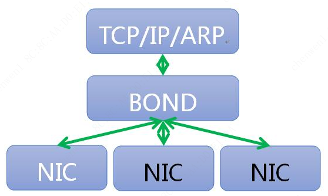
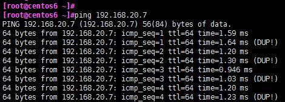
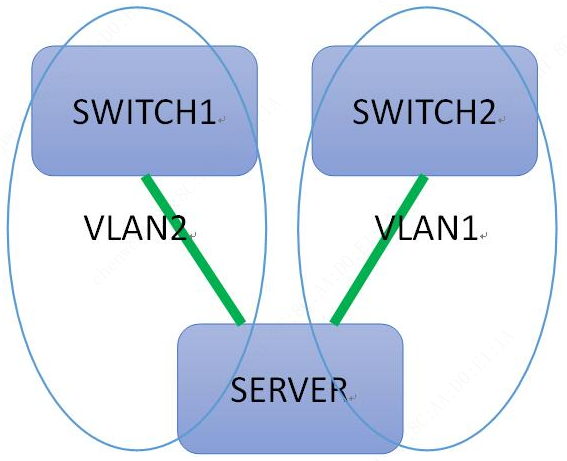

# Bonding

## 基本原理

bonding技术是将多块物理网卡绑定同一IP地址对外提供服务，通过不同的模式配置，从而达到高可用、负载均衡及链路冗余等效果

一般情况下，两块物理网卡是不可以直接配置同一个IP地址的，多网卡bonding技术的基本原理就是通过虚拟出一块逻辑网卡对外提供网络连接。

bonding基本工作原理如下图：



## 工作模式

bonding技术提供了(0-6)共7种工作模式，分别如下：

| 模式 | 含义 | 备注 |
| -- | -- | -- |
| `mode=0` | 轮询策略 round-robin | `balance-rr` |
| `mode=1` | 主备策略 active-backup | `active-backup` |
| `mode=2` | 异或策略 load balancing (xor) | `balance-xor` |
| `mode=3` | 广播策略 fault-tolerance (broadcast) | `broadcast` |
| `mode=4` | 动态链路聚合 lacp IEEE 802.3ad (IEEE 802.3ad Dynamic link aggregation) | `802.3ad` |
| `mode=5` | 适配器传输负载均衡 transmit load balancing | `balance-tlb` |
| `mode=6` | 适配器负载均衡 adaptive load balancing | `balance-alb` |

* 轮询策略 round-robin, (`balance-rr`, `mode=0`) 

    此模式下，链路处于负载均衡状态，数据以**轮询方式**向每条链路发送报文，基于`per packet`方式发送, 即每条链路各一个数据包。这模式好处在于增加了带宽，同时支持容错能力，当有链路出问题，会把流量切换到正常的链路上。

    由于是不同端口轮循发报，容易导致乱序，对端会要求重发，从而影响吞吐量

    **注**：该模式下，交换机端需要配置聚合口。在cisco交换机上叫port channel。


* 主备策略 active-backup, (`active-backup`, `mode=1`) 

    此模式下，一个端口处于主状态，一个处于备状态，所有流量都在主链路上发出和接收，备用链路不会有任何流量。当主链路端口down掉时，备用端口立即启动接管主状态，从而达到链路冗余热备目的。

    这种模式接入不需要交换机端支持。


* 异或策略 load balancing (xor), (`balance-xor`, `mode=2`) 

    在此模式下，通过源和目标mac地址hash因子来做xor算法来选择链路，这样就使得到达特定对端的流量总是从同一个接口上发出。和balance-rr一样，交换机端口需要配置为"port channel"。

    需要注意的是，若选择这种模式，如果所有流量源和目标mac都固定了，例如使用"网关模式"，即所有对外的数据传输均固定走一个网关，那么根据该模式的描述，分发算法算出的线路就一直是同一条，另外一条链路不会有任何数据流，那么这种模式就没有多少意义了。在单switch网络环境下也是如此。


* 广播策略 fault-tolerance (broadcast), (`broadcast`, `mode=3`) 

    这种模式的特点是一个报文会复制两份往bonding下的两个接口分别发送出去。当有对端交换机失效，我们感觉不到任何丢包。这个模式也需要交换机配置聚合口。如下图，带dup的行即是重复发往第2个网卡的数据。

    


    拓扑结构：

    


* 动态链路聚合 lacp IEEE 802.3ad (IEEE 802.3ad Dynamic link aggregation), (`802.3ad`, `mode=4`) 

    该模式是基于IEEE 802.3ad Dynamic link aggregation（动态链接聚合）协议。在该模式下，操作系统和交换机都会创建一个**聚合组**，在同一聚合组下的网口共享同样的速率和双工设定。

    操作系统根据802.3ad 协议将多个slave 网卡绑定在一个聚合组下。

    聚合组向外发送数据选择哪一块儿网卡是基于传输hash 策略，该策略可以通过`xmit_hash_policy` 选项从缺省的XOR 策略改变到其他策略。

    缺省的策略如下: 

    ```text
    (源MAC地址 XOR 目标MAC地址)% slave数量
    ```

    该模式的**必要条件**：  

    - 1、ethtool 支持获取每个slave 的速率和双工设定；  
    - 2、交换机支持 *IEEE 802.3ad Dynamic link aggregation*（动态链路聚合）。大多数交换机需要经过特定配置才能支持802.3ad模式。  

* 适配器传输负载均衡 transmit load balancing, (`balance-tlb`, `mode=5`)  

    这种模式相较mode2异或策略及mode4 LACP模式的hash策略相对智能，会主动根据对端的MAC地址上的流量，智能的分配流量从哪个网卡发出。但不足之处在于，仍使用一块网卡接收数据。存在的问题与load balancing (xor)也是一样的: 如果对端MAC地址是唯一的，那么策略就会失效。

    这个模式下bonding成员使用各自的mac，而不是上面几种模式是使用bonding0接口的mac。此模式无需交换机支持。

* 适配器负载均衡 adaptive load balancing, (`balance-alb`, `mode=6`) 

    该模式除了balance-tlb适配器传输负载均衡模式的功能外，同时加上针对IPV4流量接收的负载均衡。

    接收负载均衡是通过ARP协商实现的。在进行ARP协商的过程中，bonding模块将对端和本地的mac地址进行绑定，这样从同一端发出的数据，在本地也会一直使用同一块网卡来接收。

    若是网络上发出的广播包，则由不同网卡轮询的方式来进行接收。通过这种方式实现了接收的负载均衡。该模式同样无需交换机支持。


注：在网卡绑定的七种模式下，其中mode=0、2、3需要交换机支持EtherChannel，mode=4需要交换机同时支持EtherChannel和LACP，mode=1、5、6不需要交换机配置支持。


## 配置

### 通过配置文件配置

* 创建bond0网卡配置文件

    ```sh
    ~] vim /etc/sysconfig/network-scripts/ifcfg-bond0

    DEVICE=bond0                                                    # 虚拟网卡设备名称
    BOOTPROTO=static                                                # 使用静态IP
    ONBOOT=yes
    BONDING_OPTS="mode=1 miimon=100"                                # bonding模式设定，此例使用mode1模式 miimon=100 为每隔100ms监控主网卡的状态
    # BONDING_OPTS="mode=1 miimon=100 fail_over_mac=1 primary=eth0" # fail_over_mac是为了解决以下截图报错；primary=eth0指定主网卡
    IPADDR=192.168.1.3                                              # IP地址
    PREFIX=24                                                       # 子网掩码
    # GATEWAY=192.168.1.1                                           # 默认网关
    # DNS1=114.114.114.114                                          # DNS服务器，若没有，可不用配置
    # TYPE=Ethernet                                                 # 网络类型，按需配置
    # USERCTL=no                                                    # 用户权限控制：yes-非root用户允许控制该网络接口; no-非root用户不运行控制该网络接口
    ```

    一般而言, 需要以下参数即可:

    ```text
    DEVICE=bond0
    BOOTPROTO=static
    ONBOOT=yes
    BONDING_OPTS="mode=1 miimon=100"
    IPADDR=192.168.1.3 
    PREFIX=24
    ```

    * 说明一: 关于 `fail_over_mac=1`

        配置完成后如果出现下图问题，但是bond0能够正常启动也能够正常使用，只不过没有起到备份模式的效果。当使用ifdown eth0后，网络出现不通现象。

        

        bonding获取mac地址有两种方式, 一种是从第一个活跃网卡中获取mac地址，然后其余的SLAVE网卡的mac地址都使用该mac地址；另一种是使用`fail_over_mac`参数，是bonding使用当前活跃网卡的mac地址，mac地址或者活跃网卡的转换而变。

        既然 VMware Workstation 不支持第一种获取mac地址的方式，那么可以使用`fail_over_mac=1`参数。

    * 说明二: 关于 `BONDING_OPTS`

        除了在 `ifcfg-bond0` 配置文件中配置了 `BONDING_OPTS`, 还可以使用以下方法配置:

        * 将以下内容写入`/etc/modprobe.d/modprobe.conf`或者`/etc/modprobe.d/bonding.conf`文件中: 

            ```text
            alias bond0 bonding
            options bond0 miimon=100 mode=1 fail_over_mac=1 primary=eth0
            ```
            
        * 手动加载模块
            
            手动：`modprobe bonding`   
            开机自动加载模块：`echo 'modprobe bonding &> /dev/null' >> /etc/rc.local`  

        * 如果需要配置修改相关配置时, 需先移除已经加载的模块, 然后重新加载

            ```text
            rmmod bonding
            modprobe bonding
            ```


* 创建/修改网卡配置文件1

    ```sh
    ~] vim /etc/sysconfig/network-scripts/ifcfg-eth0

    DEVICE=eth0
    BOOTPROTO=none
    ONBOOT=yes
    #TYPE=Ethernet
    USERCTL=no
    MASTER=bond0
    SLAVE=yes
    ```

* 创建/修改网卡配置文件2

    ```sh
    ~] vim /etc/sysconfig/network-scripts/ifcfg-eth1

    DEVICE=eth1
    BOOTPROTO=none
    ONBOOT=yes
    #TYPE=Ethernet
    USERCTL=no
    MASTER=bond0
    SLAVE=yes
    ```

* 重启网络

    ```sh
    service network restart
    ```

* 查看bond0工作状态

    ```sh
    ~] cat /proc/net/bonding/bond0

    Ethernet Channel Bonding Driver: v3.6.0 (September 26, 2009)

    Bonding Mode: fault-tolerance (active-backup) (fail_over_mac active)
    Primary Slave: eth1 (primary_reselect always)
    Currently Active Slave: eth1
    MII Status: up
    MII Polling Interval (ms): 100
    Up Delay (ms): 0
    Down Delay (ms): 0

    Slave Interface: eth0
    MII Status: up
    Speed: 1000 Mbps
    Duplex: full
    Link Failure Count: 0
    Permanent HW addr: 00:0c:29:17:2b:79
    Slave queue ID: 0

    Slave Interface: eth1
    MII Status: up
    Speed: 1000 Mbps
    Duplex: full
    Link Failure Count: 0
    Permanent HW addr: 00:0c:29:17:2b:83
    Slave queue ID: 0
    ```


### 通过 `nmcli` 命令配置

配置之前建议使用 nmcli 命令删除相应网卡配置文件, 或者将/etc/sysconfig/network-scripts/下对网卡的配置(如ifcfg-ens33)删除

* 创建bond0, 并配置网络信息

    ```sh
    nmcli connection add type bonding con-name bond0 ifname bond0 mode active-backup ipv4.method manual ipv4.addresses 192.168.1.20/24 ipv4.gateway 192.168.1.1 ipv4.dns 192.168.1.1
    ```

    以上命令可以拆分成两句执行:  

    ```sh
    nmcli connection add type bonding con-name bond0 ifname bond0 mode active-backup
    nmcli connection modify bond0 ipv4.method manual ipv4.addresses 192.168.1.20/24 ipv4.gateway 192.168.1.1 ipv4.dns 192.168.1.1
    ```

* 添加从属接口

    ```sh
    nmcli connection add type bonding-slave con-name bond0-slave1 ifname eth33 master bond0
    nmcli connection add type bonding-slave con-name bond0-slave2 ifname eth38 master bond0
    ```

    如果未指定`con-name`, 默认会命名为 `bonding-slave-ens33`, `bonding-slave-ens38`

* 启动从属接口和bond0

    ```sh
    nmcli connection up bonding-slave1
    nmcli connection up bonding-slave2
    nmcli connection up bond0
    ```

    实际上, 即使以上命令未执行, 配置已经生效。也可以直接重启 network：

    ```sh
    systemctl restart network
    ```

* 问题

    同样的，在VMware Workstation下做实验时，配置 active-backup 模式会引起以下告警：

    

    这种情况下，修改添加参数 `fail_over_mac=1` : 

    ```bash
    nmcli modify bond0 bonding.option mode=1,fail_over_mac=1   # primary=ens33可指定主网卡
    systemctl restart network
    ```


### SUSE 12SP3下配置bonding

* 编辑: `/etc/sysconfig/network/ifcfg-bond0`

    ```text
    DEVICE='bond0'
    IPADDR='10.7.17.12'
    NETMASK='255.255.255.0'
    BROADCAST='10.7.17.255'
    NETWORK='10.7.17..0'
    STARTMODE='onboot'
    BOOTPROTO='static'
    BONDING_MASTER='yes'
    BONDING_MODULE_OPTS='mode=1 miimon=100'
    BONDING_SLAVE0='eth1'
    BONDING_SLAVE1='eth2'
    ```

* 编辑: `/etc/sysconfig/network/ifcfg-em1`

    ```sh
    DEVICE='em1'
    BOOTPROTO='static'
    STARTMODE='onboot'
    ```


* 编辑: `/etc/sysconfig/network/ifcfg-em3`

    ```sh
    DEVICE='em3'
    BOOTPROTO='static'
    STARTMODE='onboot'
    ```