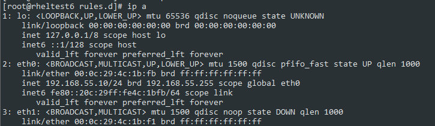
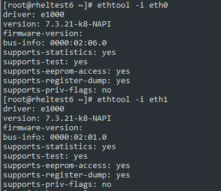
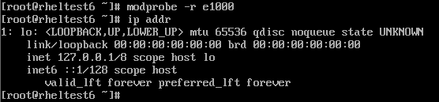
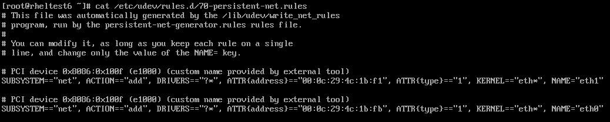
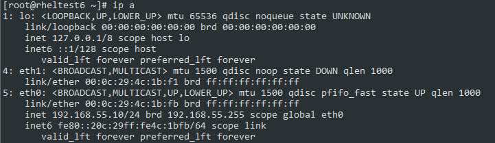
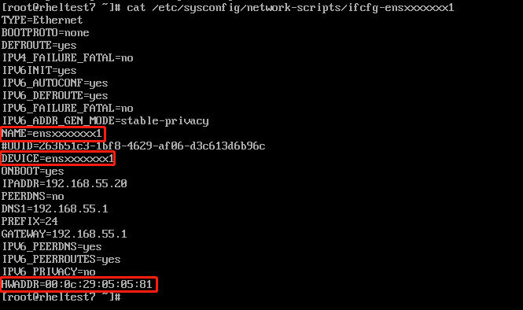
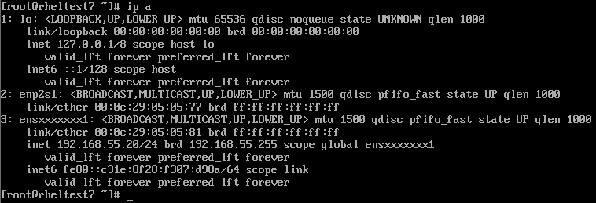

# Linux, GNU/Linux

## 单用户模式

### RHEL/Centos 6.x

```text
select "kernel…"

s 或者 single

passwd root

reboot
```
 
### RHEL/Centos 7.x/8.x

使用 `runlevel1.target` 或 `rescue.target` 实现: 

* 在此模式下, 系统会 **挂载所有的本地文件系统**, 但不会开启网络接口。
* 系统仅启动特定的几个服务和修复系统必要的尽可能少的功能
* 常用场景：
    * 修复损坏的文件系统
    * 重置root密码
    * 修复系统上的一个挂载点问题

进入单用户模式的三种方法:

* 方法 1：通过向内核添加 `rd.break` 参数

    * linux16 这一行添加:

        ```sh
        rd.break
        ```

    * `ctrl+x` 引导进入系统, 执行以下命令修改 `/sysroot` 为读写(rw)

        ```sh
        mount -o remount,rw /sysroot/
        ```

    * 切换环境
    
        ```sh
        chroot /sysroot/
        ```

    * 7/8版本系统默认使用 SELinux, 因此创建下面的隐藏文件, 这个文件会在下一次启动时重新标记所有文件
    
        ```sh
        touch /.autorelabel
        reboot
        ```

* 方法 2：通过用 `init=/bin/bash` 或 `init=/bin/sh` 替换内核中的 `rhgb quiet` 语句

    * `init=/bin/bash` 或 `init=/bin/sh` 替换内核中的 `rhgb quiet` 语句

    * 重新挂载 `/`
    
        ```sh
        mount -o remount,rw /
        ```

    * 执行完操作后, 创建标记文件并重启

        ```sh
        touch /.autorelabel
        exec /sbin/init 6
        ```

* 方法 3：通过用 `rw init=/sysroot/bin/sh` 替换内核中的 `ro` 语句

    * `rw init=/sysroot/bin/sh` 替换内核中的 `ro` 单词

    * 切换环境

        ```sh
        chroot /sysroot
        ```

    * 执行完操作后, 创建标记文件并重启

        ```sh
        touch /.autorelabel
        reboot -f
        ```

### SuSE 12

```sh
init=/bin/bash

mount -o remount,rw /

echo 'root:password' | /usr/sbin/chpasswd

mount -o remount,ro /
```

### Ubuntu

高级选项 => recovery模式 => 

修改: 

```sh
ro recovery nomode set ==> rw single init=/bin/bash
```

### Kylin V10

> GRUB密码: root/Kylin123123

```sh
# 华为泰山
init=/bin/bash console=tty1
# 飞腾
init=/bin/bash console=tty0

...

/sbin/reboot -f
```


## 恢复 grub

### 1 从备份文件中恢复

> 适用于主引导分区被破坏,无法通过手动输入引导命令解决

* 1.1 备份

    MBR位于第一块硬盘( `/dev/sda` ) 的第一个物理扇区处, 总共 512 字节, 前 446 字节是主引导记录, 分区表保存在 MBR 扇区中的第 447-510 字节中

    ```sh
    dd if=/dev/vda of=/root/grub.bak bs=446 count=1
    ```

* 1.2 模拟主引导记录丢失

    ```sh
    dd if=/dev/zero of=/dev/vda bs=446 count=1
    ```

此时重启, 服务器卡在 `boot from hard disk`

* 1.3 修复

    挂iso进入救援模式, 然后依次执行以下命令修复

    ```sh
    chroot /mnt/image
    dd if=/root/grub.bak of=/dev/vda bs=446 count=1
    reoot
    ```

### 2 手动输入引导命令

> 适用于主引导分区未被破坏, grub文件配置错误或者丢失 (此时重启系统会提示 `grub>` )

* 2.1 RHEL/CentOS 6

    > 6 系的`grub>`命令有限,  如 `ls` 等命令都没有, 因此只能使用 tab 补全

    - 模拟`grub.cfg`文件丢失, 重启后系统进入 `grub >` 提示符界面

        ```sh
        $ mv /boot/grub/grub.conf /tmp
        $ reboot
        ```

    - 选择磁盘

        ```sh
        grub> root (hd0,0)
        ```

    - 选择内核文件, 同时指定内核参数

        ```sh
        grub> kernel /vmlinuz-2.6.32-358.el6.x86_64 ro root=/dev/vda2 selinux=1  # 只指定了有限的参数: "根目录挂载", "SELinux状态设置"
        ```

    - 选择`initrd`(初始化时的根文件系统)

        ```sh
        grub> initrd /initramfs-2.6.32-358.el6.x86_64.img
        ```

    - 启动

        ```sh
        grub> boot
        ```

    - 进入系统以后, 还原 `grub.conf` 配置文件, 有以下两种方法: 

        * 1.手动编辑一份
        * 2.从同版本的系统复制一份, 修改参数 (若是统一模板的虚拟机, 参数无需修改)


        > RHEL 6.4 /boot/grub/grub.conf:
        >   ```conf
        >   default=0
        >   timeout=5
        >   splashimage=(hd0,0)/grub/splash.xpm.gz
        >   hiddenmenu
        >   title Red Hat Enterprise Linux (2.6.32-358.el6.x86_64)
        >       root (hd0,0)
        >       kernel /vmlinuz-2.6.32-358.el6.x86_64 ro root=UUID=1b0a442f-e911-4c61-8558-bb1f167affde rd_NO_LUKS rd_NO_LVM LANG=en_US.UTF-8 rd_NO_MD SYSFONT=latarcyrheb-sun16 crashkernel=128M  KEYBOARDTYPE=pc KEYTABLE=us rd_NO_DM rhgb quiet console=ttyS0
        >	    initrd /initramfs-2.6.32-358.el6.x86_64.img
        >    ```


* 2.2 RHEL/CentOS 7

    - 模拟`grub.cfg`文件丢失, 重启后系统进入 `grub >` 提示符界面
        
        ```sh
        $ mv /boot/grub2/grub.cfg /tmp/
        $ reboot
        ```

    - 查看
        
        ```sh
        grub> ls
        (hd0) (hd0,msdos3) (hd0,msdos2) (hd0,msdos1)

        grub> ls (hd0,msdos1)
            Partition hd0,msdos1: Filesystem type xfs, UUID xxxxxxxxxxxxxxxxxxx - Partition start at 1024KiB - Total size 1048576Kib <= 这个约1024Mb的就是分配给/boot的分区, 指定这个
        
        grub> cat (hd0,msdos1)/grub2/device.map
        (hd0)   /dev/vda                                   <=hd0 磁盘在系统中名称为vda
        ...
        
        grub> ls (hd0,msdos3)
            Partition hd0,msdos3: Filesystem type xfs, UUID xxxxxxxxxxxxxxxxxxx - Partition start at 2098176KiB - Total size 8387584Kib <= 这个约8G的就是分配给/的分区, linux16中需要root指定(root=/dev/vda3)
        ```
    
    - 选择磁盘
    
        ```sh
        grub > set root=(hd0,msdos1)
        ```
    
    - 选择内核文件, 同时指定内核参数
    
        ```sh
        grub > linux16 /vmlinuz-3.10.0-1160.el7.x86_64 ro root=/dev/vda3

        # 如果使用的是lvm系统, 要指定root的lv路径: 
        # grub > linux16 /vmlinuz-3.10.0-1160.el7.x86_64 ro root=/dev/mapper/rhel-root rd.lvm.lv=rhel/root
        ```
    
    - 选择`initrd`(初始化时的根文件系统)
    
        ```sh
        grub > initrd16 /initramfs-3.10.0-1160.el7.x86_64.img
        ```
    
    - 启动
    
        ```sh
        grub > boot
        ```
    
    - 进入系统以后需要还原 `grub.cfg` 配置文件
    
        ```sh
        grub2-mkconfig -o /boot/grub2/grub.cfg
        ```


### 3 救援模式下重新生成 grub 文件

> 此方法需要使用 `grub2-install`/`grub-install` 命令

* RHEL/CentOS 6

    ```text
    sh-4.1# grub-install /dev/vda
    sh-4.1# vi /boot/grub/grub.conf

    default=0
    timeout=5
    title RHEL 6.4
    kernel /vmlinuz-2.6.32-358.el6.x86_64 ro root=/dev/vda2 selinux=1
    initrd /initramfs-2.6.32-358.el6.x86_64.img
    ```

* RHEL/CentOS 7

    ```text
    sh-4.2# grub2-install /dev/vda
    sh-4.2# grub2-mkconfig -o /boot/grub2/grub.cfg
    ```

## 修改 `/tmp` 自动清理时间

* 7.x

    7.x 通过 systemd 服务指定的规则清理对应目录, 相关 systemd 服务为:

    ```sh
    # systemd-tmpfiles-setup.service         创建
    # systemd-tmpfiles-setup-dev.service     创建
    # systemd-tmpfiles-clean.service         清理
    # systemd-tmpfiles-clean.timer           定时器

    systemctl status systemd-tmpfiles-clean.timer
    ```

    修改: 

    ```sh
    ~] vi /usr/lib/tmpfiles.d/tmp.conf 

    # Clear tmp directories separately, to make them easier to override
    v /tmp 1777 root root 10d          # <=修改此处即可
    v /var/tmp 1777 root root 30d      # <=修改此处即可

    # Exclude namespace mountpoints created with PrivateTmp=yes
    x /tmp/systemd-private-%b-*
    X /tmp/systemd-private-%b-*/tmp
    x /var/tmp/systemd-private-%b-*
    X /var/tmp/systemd-private-%b-*/tmp
    ```

* 6.x

    6.x 是通过定时任务定期清理:

    ```sh
    ~] cat /etc/cron.daily/tmpwatch  # 6.9 最小化安装没有

    #! /bin/sh
    flags=-umc
    /usr/sbin/tmpwatch "$flags" -x /tmp/.X11-unix -x /tmp/.XIM-unix \
        -x /tmp/.font-unix -x /tmp/.ICE-unix -x /tmp/.Test-unix \
        -X '/tmp/hsperfdata_*' 10d /tmp
    /usr/sbin/tmpwatch "$flags" 30d /var/tmp
    for d in /var/{cache/man,catman}/{cat?,X11R6/cat?,local/cat?}; do
        if [ -d "$d" ]; then
        /usr/sbin/tmpwatch "$flags" -f 30d "$d"
        fi
    done
    ```

## 自定义编译 RH 内核

> [https://www.cnblogs.com/luohaixian/p/9313863.html](https://www.cnblogs.com/luohaixian/p/9313863.html)

### 1 准备工作

* 创建编译用户

    ```sh
    useradd rpmbuilder
    ```

* 构建编译所需环境

    * 安装依赖包

        ```sh
        yum install rpm-build redhat-rpm-config asciidoc hmaccalc perl-ExtUtils-Embed pesign xmlto
        yum install audit-libs-devel binutils-devel elfutils-devel elfutils-libelf-devel java-devel
        yum install ncurses-devel newt-devel numactl-devel pciutils-devel python-devel zlib-devel
        yum install make gcc bc openssl-devel 
        yum groupinstall "Development Tools"
        ```

    * rpm编译目录创建

        ```sh
        su - rpmbuilder
        mkdir -p ~/rpmbuild/{BUILD,BUILDROOT,RPMS,SOURCES,SPECS,SRPMS}
        # echo '%_topdir %(echo $HOME)/rpmbuild' > ~/.rpmmacros    # 默认情况下 _topdir 就是 $HOME/rpmbuild
        ```
 
### 2 获取源码

有两种办法获取源码:

* 使用"红帽系"发行版操作系统提供的 `SRPM`, 即 SRC RPM

* 下载 kernel 源码

以下介绍 SRPM 重新编译方法:

### 3 通过 SRPM 编译

* 获取 `.src.rpm` 内核源码包

    ```sh
    ~]$ uname -r 
    3.10.0-957.el7.x86_64

    ~]$ ls -l kernel-3.10.0-957.el7.src.rpm 
    -rw-------. 1 rpmbuilder rpmbuilder 101032927 Feb 26 15:44 kernel-3.10.0-957.el7.src.rpm
    ```

* 安装 `.src.rpm` 内核源码包

    ```sh
    ~]$ rpm -i kernel-3.10.0-957.el7.src.rpm 2>/dev/null
    ```

* 检查 `BuildRequire` 有没有少安装

    ```sh
    ]$ grep BuildRequire ~/rpmbuild/SPEC/kernel.spec

    BuildRequires: module-init-tools, patch >= 2.5.4, bash >= 2.03, sh-utils, tar
    BuildRequires: xz, findutils, gzip, m4, perl, make >= 3.78, diffutils, gawk
    BuildRequires: gcc >= 4.8.5-29, binutils >= 2.25, redhat-rpm-config >= 9.1.0-55
    BuildRequires: hostname, net-tools, bc
    BuildRequires: xmlto, asciidoc
    BuildRequires: openssl
    BuildRequires: hmaccalc
    BuildRequires: python-devel, newt-devel, perl(ExtUtils::Embed)  # perl-ExtUtils-Embed
    BuildRequires: pesign >= 0.109-4
    BuildRequires: elfutils-libelf-devel
    BuildRequires: sparse >= 0.4.1
    BuildRequires: elfutils-devel zlib-devel binutils-devel bison
    BuildRequires: audit-libs-devel
    BuildRequires: java-devel
    BuildRequires: numactl-devel
    BuildRequires: pciutils-devel gettext ncurses-devel
    BuildRequires: python-docutils
    BuildRequires: zlib-devel binutils-devel
    BuildRequires: rpm-build >= 4.9.0-1, elfutils >= 0.153-1
    BuildRequires: bison flex
    BuildRequires: glibc-static

    root ~] yum install module-init-tools patch bash sh-utils tar xz findutils gzip m4 perl make diffutils gawk gcc binutils redhat-rpm-config hostname net-tools bc xmlto asciidoc openssl hmaccalc python-devel newt-devel perl pesign elfutils-libelf-devel sparse elfutils-devel zlib-devel binutils-devel bison audit-libs-devel java-devel numactl-devel pciutils-devel gettext ncurses-devel python-docutils zlib-devel binutils-devel rpm-build elfutils bison flex glibc-static
    ```


* 解压并释放源码包

    ```sh
    ]$ cd ~/rpmbuild/SPECS
    ]$ rpmbuild -bp --target=$(uname -m) kernel.spec
    ```

* 修改配置文件

    ```sh
    # 1. 切换至相应目录, 准备修改".config"
    cd ~/rpmbuild/BUILD/kernel-3.10.0-957.el7/linux-3.10.0-957.el7.x86_64/

    # 2. 自定义编译模块
    make menuconfig

    # 3. .config 文件改名, 拷贝到编译配置文件目录
    cp .config ~/rpmbuild/SOURCES/kernel-3.10.0-`uname -m`.config

    ```

* 编译

    ```sh
    cd ~/rpmbuild/SPECS
    rpmbuild -bb --target=`uname -m` kernel.spec --without debug --without debuginfo
    ```


    如果出现以下报错, 则需要修改 ```~/rpmbuild/SOURCES/kernel-3.10.0-`uname -m`.config```, 首行修改为 `# x86_64`

    ```text
    ...
    + rm -f .newoptions
    + make ARCH= oldnoconfig
    Makefile:530: arch//Makefile: No such file or directory
    make: *** No rule to make target 'arch//Makefile'.  Stop.
    error: Bad exit status from /var/tmp/rpm-tmp.AEKmiI (%prep)


    RPM build errors:
        Bad exit status from /var/tmp/rpm-tmp.AEKmiI (%prep)
        ...
    ```


## 自定义网卡名

### 1 RHEL/CentOS 6

目的及预期：当前使用的是 `eth0`, MAC地址 `00:0c:29:4c:1b:f1` 。通过将 `eth0` 和 `eth1` 网卡名互换, 由 MAC 地址为 `00:0c:29:4c:1b:fb` 的网卡提供服务, 并保证网卡名依旧为 `eth0` 。



* 1.1 查看网卡驱动

    通过ethtool查看网卡的驱动：检查driver字段的值, 此处为e1000

    ```bash
    ethtool -i eth0
    ethtool -i eth1
    ```

    


* 1.2 卸载网卡驱动

    通过 `modprobe` 卸载驱动

    ```bash
    modprobe -r e1000
    ```

    


* 1.3 修改配置文件

    修改 `/etc/udev/rules.d/70-persistent-net.rules` 文件, 修改 `Name="eth0"` 和 `Name="eth1"` 处:

    ```bash
    cp /etc/udev/rules.d/70-persistent-net.rules /root/70-persistent-net.rules.bak      # 备份
    vi /etc/udev/rules.d/70-persistent-net.rules
    ```

    


* 1.4 将之前卸载的网卡驱动重新加载

    ```bash
    modprobe e1000
    ```

* 1.5 验证

    可以看见, 网卡名已经修改, 由 MAC 地址为 `00:0c:29:4c:1b:fb` 的网卡提供服务

    


### 2 RHEL/CentOS 7

RHEL 7 中, systemd 采用新的命名规则来命名网卡, rename 步骤：

* Step 1

    `/usr/lib/udev/rules.d/60-net.rules` 文件中的规则会让 `udev helper utility` (即 `/lib/udev/rename_device` ) 检查所有 `/etc/sysconfig/network-scripts/ifcfg-suffix` 文件。  

    如果发现包含 `HWADDR` 条目的 `ifcfg-文件` 与某个接口的 MAC 地址匹配, 它会将该接口重命名为 `ifcfg-文件` 中由 `DEVICE` 关键字配置的名称。

    > 注: DEVICE设置的名称应该与文件名相对应。即在配置文件 `ifcfg-suffix` 中, 应该保证 `DEVICE=suffix`

* Step 2

    `/usr/lib/udev/rules.d/71-biosdevname.rules`

    对于 *Step 1* 中没有被 rename 的接口, 当安装了 `biosdevname`, 并且内核参数未设置 `biosdevname=0` 时, `/usr/lib/udev/rules.d/71-biosdevname.rules`<sup>由 `biosdevname` 提供的文件</sup> 中的规则会让 `biosdevname` 根据其命名策略重命名该接口。

* Step 3

    `/lib/udev/rules.d/75-net-description.rules` 中的规则让 udev 通过检查网络接口设备, 填写内部 udev 设备属性值 `ID_NET_NAME_ONBOARD`、`ID_NET_NAME_SLOT`、`ID_NET_NAME_PATH`。

    注：有些设备属性可能处于未定义状态undefined

* Step 4

    `/usr/lib/udev/rules.d/80-net-name-slot.rules` 中的规则让 udev 重命名 *Step1* 和 *Step2* 中未命名的网卡。

    内核参数未设置 `net.ifname=0` 时, 按照文件中设置的规则顺序命名。如果这些属性值未设置, 则网卡无法被rename。

    默认的规则顺序如下：

    Naming Schemes Hierarchy: (命名方式层级, 可在 `/usr/lib/udev/rules.d/80-net-name-slot.rules` 设置)

    * `ID_NET_NAME_ONBOARD`: BIOS provided index numbers for on-board devices (example: eno1)  
    * `ID_NET_NAME_SLOT`: BIOS provided PCI Express hotplug slot index numbers (example: ens1)  
    * `ID_NET_NAME_PATH`: physical location of the connector of the hardware (example: enp2s0)  
    * `ID_NET_NAME_MAC`: 整个MAC地址的命名方式 (example: enx000c29050577)  
    * 传统的不可预测的内核命名方案: 其他都失效以后 (example: eth0)  

那么, 当我们要自定义自己的网卡名时, 最直接的办法是编辑 `/etc/sysconfig/network-scripts/ifcfg-suffix` 文件, 将 `suffix`、`DEVICE`、`MAC` 相应改成需要的值

例如, 想要一个名称为 `ensxxxxxxx1` 的网卡, 对应的MAC地址为 `00:0c:29:05:05:81`:



重启完成设定:




一般的, 会出现以下几种网卡名(`eth0`, `ens33`, `eno000009`), 可以通过 `/etc/default/grub` 或 `/etc/sysconfig/grub` 中修改 `GRUB_CMDLINE_LINUX` 行修改, 重启后生效, 其对应关系如下：

```text
net.ifnames=0 biosdevname=0 ==> eth0  
net.ifnames=1 biosdevname=0 ==> ens192  
```

## 查看文件创建时间

> 仅支持 `ext4` 文件系统; `ext2`, `ext3`, `xfs` 等不支持

* 获取到文件所在磁盘

    ```sh
    ~] df -hT
    Filesystem    Type    Size  Used Avail Use% Mounted on
    /dev/mapper/vg_01-Log01        # <= 
                ext4     35G   13G   21G  39% /
    tmpfs        tmpfs    939M  491M  449M  53% /dev/shm
    /dev/vda1     ext4    485M   32M  428M   7% /boot
    ```

* 获取到文件的inode号, 使用 `ls -i` 也可查询

    ```sh
    ~] stat /etc/hosts
    File: '/etc/hosts'
    Size: 186             Blocks: 8          IO Block: 4096   regular file
    Device: fd00h/64768d    Inode: 1576689     Links: 1      # <= 
    Access: (0644/-rw-r--r--)  Uid: (    0/    root)   Gid: (    0/    root)
    Access: 2022-02-10 00:45:20.769000091 +0800
    Modify: 2022-02-10 00:45:19.983000112 +0800
    Change: 2022-02-10 00:45:19.983000112 +0800
    ```

* 查询文件创建时间

    ```sh
    ~] debugfs -R 'stat <1576689>' /dev/mapper/vg_01-Log01    # <= 
    debugfs 1.41.12 (17-May-2010)
    Inode: 1576689   Type: regular    Mode:  0644   Flags: 0x80000
    Generation: 1875514122    Version: 0x00000000:00000001
    User:     0   Group:     0   Size: 186
    File ACL: 0    Directory ACL: 0
    Links: 1   Blockcount: 8
    Fragment:  Address: 0    Number: 0    Size: 0
    ctime: 0x6203ef9f:ea5d90c0 -- Thu Feb 10 00:45:19 2022
    atime: 0x6203efa0:b7580a6c -- Thu Feb 10 00:45:20 2022
    mtime: 0x6203ef9f:ea5d90c0 -- Thu Feb 10 00:45:19 2022
    crtime: 0x61ef1178:80821818 -- Tue Jan 25 04:52:08 2022   # <= 获取到文件创建时间 crtime
    Size of extra inode fields: 28
    Extended attributes stored in inode body: 
    selinux = "system_u:object_r:net_conf_t:s0\000" (32)
    EXTENTS:
    (0): 4756475
    ```


## 磁盘性能测试

磁盘性能指标:

* IOPS: *每秒读/写次数*, 单位为 *次* (计数)。存储设备的底层驱动类型决定了不同的 IOPS。
* 吞吐量: *每秒的读写数据量*, 单位为 `MB/s`。
* 时延: I/O 操作的 *发送时间到接收确认* 所经过的时间, 单位为 *秒*。

### `fio` 工具

| 参数名    | 说明 | 样例 |
|  -- | -- | -- |
| `numjobs`  | 测试进程数量 | 16 |
| `bs`       | 每次请求的块大小: 4k, 8k, 16k等 | 4k |
| `ioengine` | I/O 引擎: Linux原生异步I/O引擎 | libaio |
| `iodepth`  | 请求的 I/O 队列深度 | 32 |
| `direct`   | 指定 direct 模式: <br>True(1): 表示指定 O_DIRECT 标识符, 忽略 I/O 缓存, 数据直写(默认)<br>False(0): 表示不指定 O_DIRECT 标识符 | 1 |
| `rw`         | 指定读写模式: <br>顺序读(read), 顺序写(write), 随机读(randread), 随机写(randwrite), <br>混合随机读写(randrw)和混合顺序读写(rw, readwrite)。 | read |
| `time_based` | 指定采用时间模式。无需设置该参数值, 只要 FIO 基于时间来运行。 | N/A |
| `runtime`    | 指定测试时长, 即 FIO 运行时长. | 300 |
| `refill_buffers` | FIO 将在每次提交时重新填充 I/O 缓冲区。默认设置是仅在初始时填充并重用该数据 | N/A |
| `norandommap`    | 在进行随机 I/O 时, FIO 将覆盖文件的每个块。若给出此参数, 则将选择新的偏移量而不查看 I/O 历史记录 | N/A |
| `randrepeat`     | 随机序列是否可重复, True(1)表示随机序列可重复, False(0)表示随机序列不可重复。默认为 True(1) | 0 |
| `group_reporting` | 多个 job 并发时, 打印整个 group 的统计值 | N/A |
| `name`            | job 的名称 | fio-read |
| `size`            | I/O 测试的寻址空: 不指定的时候, 会全盘测试; 如果是文件测试, 不指定大小则会报错 | 100G |
| `filename`        | 测试对象, 即待测试的磁盘设备名称。 | /dev/sdb |
| `thread` | 默认使用fork创建job, 指定thread后使用`pthread_create`创建(POSIX Threads' function) | |
| `percentage_random` | 指定随机读/写的占比 | 100,0 |


* 裸盘 IOPS 测试

    * 随机写 IOPS

        ```sh
        fio -numjobs=16 -bs=4k -ioengine=libaio -iodepth=32 -direct=1 -rw=randwrite -time_based -runtime=300  -refill_buffers -norandommap -randrepeat=0 -group_reporting -name=fio-randwrite-iops -filename=/dev/vdb
        ```

    * 随机读 IOPS

        ```sh
        fio -numjobs=16 -bs=4k -ioengine=libaio -iodepth=32 -direct=1 -rw=randread -time_based -runtime=300  -refill_buffers -norandommap -randrepeat=0 -group_reporting -name=fio-randread-iops -filename=/dev/vdb
        ```

* 裸盘带宽测试 (顺序读, 写)

    * 顺序写带宽

        ```sh
        fio --numjobs=16 -bs=128k -ioengine=libaio -iodepth=32 -direct=1 -rw=write -time_based -runtime=300  -refill_buffers -norandommap -randrepeat=0 -group_reporting -name=fio-write-throughput -filename=/dev/vdb
        ```

    * 顺序读带宽

        ```sh
        fio --numjobs=16 -bs=128k -ioengine=libaio -iodepth=32 -direct=1 -rw=read -time_based -runtime=300  -refill_buffers -norandommap -randrepeat=0 -group_reporting -name=fio-read-throughput -filename=/dev/vdb
        ```

* 裸盘延迟

    * 随机写延迟

        ```sh
        fio --numjobs=16 -bs=4k -ioengine=libaio -iodepth=1 -direct=1 -rw=randwrite -time_based -runtime=300  -refill_buffers -norandommap -randrepeat=0 -group_reporting -name=fio-randwrite-lat -filename=/dev/vdb
        ```

    * 随机读延迟 

        ```sh
        fio --numjobs=16 -bs=4k -ioengine=libaio -iodepth=1 -direct=1 -rw=randread -time_based -runtime=300  -refill_buffers -norandommap -randrepeat=0 -group_reporting -name=fio-randread-lat -filename=/dev/vdb
        ```

* 非裸盘测试 - 指定文件大小和文件名

    ```sh
    -size=10G -filename=/file/path
    ```

* 关于 `iodepth`

    

    AHCI 与 NVMe 两种接口之间的对比表明: 

    * AHCI接口只拥有一个队列, 每个队列深度最大为32;
    * NVMe接口最高拥有64K个队列, 每个队列深度最大为64K;

    所以测试 SATA/SAS 接口的硬盘性能时, 队列深度建议最大设为 32, 再高只会降低测试的性能值; 若使用NVMe硬盘, 深度可以适当的增加, 这取决于硬盘本身的性能。

    ```sh
    fio -ioengine=psync -bs=32k -fdatasync=1 -thread -rw=randrw  -size=10G -filename=fio_randread_write_test.txt -name='fio mixed randread and sequential write test' -iodepth=4 -runtime=60 -numjobs=4 -group_reporting 
    ```

### `dd` 工具

* 写

    ```sh
    dd if=/dev/zero of=/mnt/test/testfile bs=4k count=26214400 oflag=direct # 100G
    ```

* 读

    ```sh
    dd if=/root/testfile of=/dev/null bs=4k count=26214400 iflag=direct   # 100G
    ```

## 磁盘UUID

```sh
blkid
lsblk -o name,mountpoint,size,uuid
ls -lh /dev/disk/by-uuid/
hwinfo --block | grep by-uuid | awk '{print $3,$7}'
udevadm info -q all -n /dev/sdc1 | grep -i by-uuid | head -1
tune2fs -l /dev/sdc1 | grep UUID
dumpe2fs /dev/sdc1 | grep UUID
```

* VMware 虚拟机磁盘序列号: 

    默认情况下，VMware创建的虚拟机，无法查询到虚拟磁盘的序列号。如果是因为需要应用系统要求或者其他原因，需要系统内显示磁盘序列号，按以下步骤操作。

    ```sh
    # 1. 关闭虚拟机

    # 2. 编辑虚拟机vmx文件，添加以下内容：
    disk.EnableUUID="TRUE"

    # 3. 重启后即可查询

    smartctl -a /dev/sda
    lsblk -d -n -o serial /dev/sda
    ```


## 配置 VLAN


* 通过 nmcli 配置

    ```sh
    nmcli connection add type vlan con-name VLAN99 dev ens224 id 99 ipv4.addresses 10.2.99.102/24 ipv4.method manual
    ```

* 通过配置文件配置 (待验证)

    ```sh
    # ifcfg-ens224.10
    TYPE=Vlan
    VLAN=yes
    VLAN_ID=10
    PHYSDEV=ens224
    NAME=ens224.10
    DEVICE=ens224.10
    BOOTPROTO=none
    IPADDR=192.168.10.1
    NETMASK=255.255.255.0
    #GATEWAY=
    ONBOOT=yes
    DEFROUTE=yes
    ```

查看当前 vlan:

```sh
~] ls /proc/net/vlan/
config  ens224.305  ens224.99

~] cat /proc/net/vlan/config 
VLAN Dev name    | VLAN ID
Name-Type: VLAN_NAME_TYPE_RAW_PLUS_VID_NO_PAD
ens224.305     | 305  | ens224
ens224.99      | 99  | ens224
```


## 报错处理

* `[FAILED] Failed to mount /. - See 'systemctl status -.mount' for details`

    确保 `/etc/mtab` 是软链接，是否指向 `/proc/self/mounts`


* `[FAILED] Failed to listen on RPCbind Server Acitvation Socket`

    已知 Bug, 可升级到 `rpcbind-0.2.0-49.el7.x86_64.rpm`

    或者: 

    ```text
    [Unit]
    Description=RPCbind Server Activation Socket

    [Socket]
    ListenStream=/var/run/rpcbind.sock

    # RPC netconfig can't handle ipv6/ipv4 dual sockets
    # Workaround for RHBZ 1531486
    #BindIPv6Only=ipv6-only       # <= 注释
    #ListenStream=0.0.0.0:111     # <= 注释
    #ListenDatagram=0.0.0.0:111   # <= 注释
    #ListenStream=[::]:111        # <= 注释
    #ListenDatagram=[::]:111      # <= 注释

    [Install]
    WantedBy=sockets.target
    ```


* `dracut-initqueue timeout: dracut-initqueue timeout`

    ```text
    ...
    dracut-initqueue timeout: dracut-initqueue timeout
    ...
    /dev/rootvg/lvswap1 does not exist
    /dev/rootvg/lvswap2 does not exist
    /dev/rootvg/lvswap3 does not exist
    /dev/rootvg/lvswap4 does not exist

    dracut>
    ```

    原因: `/dev/rootvg/lvswap1` 被人为删除

    1. 手动挂载`/`、`/boot`、`/boot/efi` (如果有efi，可以结合 `blkid` 和 `/etc/fstab` 判断)
    2. 修改 `/<MOUNT_POINT>/etc/fstab`, 注释掉swap相关的配置行
    3. 修改 `/<MOUNT_POINT>/boot/efi/EFI/redhat/grub.cfg`, 将`linux16`(efi为`linuxefi`)行中的 `rd.lvm.lv=rootvg/swap` 字样的都注释(先备份后再修改)
    4. `reboot`


* `ffi.h No such file or directory`

    ```sh
    yum install libffi libffi-devel  # centos
    apt install libffi libffi-dev    # ubuntu
    ```


* `Cannot use device with duplicates.`

    * When attempting to extend a VG, the below error is produced: 

        ```sh
        ~] vgextend example_vg /dev/mapper/mpatha
        
        Error vgextend : Cannot use device /dev/mapper/mpatha with duplicates.
        WARNING: Not using lvmetad because duplicate PVs were found.
        WARNING: Use multipath or vgimportclone to resolve duplicate PVs?
        WARNING: After duplicates are resolved, run "pvscan --cache" to enable lvmetad.
        WARNING: PV xxxxxx-xxxx-xxxx-xxxx-xxxx-xxxx-xxxxx on /dev/sdx was already found on /dev/sdy.
        WARNING: PV xxxxxx-xxxx-xxxx-xxxx-xxxx-xxxx-xxxxx on /dev/sdy was already found on /dev/sdz.
        WARNING: PV xxxxxx-xxxx-xxxx-xxxx-xxxx-xxxx-xxxxx on /dev/sdz was already found on /dev/mapper/mpatha.
        <...>
        Cannot use device /dev/mapper/mpatha with duplicates.
        ```

    * or when attempting to create a new volume group, getting error: `Cannot use device /dev/mapper/mpatha with duplicates.`

    * 解决

        LVM 会尝试扫描列出所有设备有 lvm 标记的磁盘, 当配置了多路径设备时会出现以上报错, 可修改 `/etc/lvm.conf` 的 filter 进行过滤:

        ```text
        # This configuration option has an automatic default value.
        # filter = [ "a|.*/|" ]
        filter = [ "a|^/dev/sda5$|", "a|/dev/emcpower.*|", "r|.*|" ]
        global_filter = [ "a|^/dev/sda5$|, "a|/dev/emcpower.*|", "r|.*|" ]
        ```

        修改完毕后, 重建 initramfs:

        ```sh
        cp /boot/initramfs-$(uname -r).img /boot/initramfs-$(uname -r).img.$(date +%m-%d-%H%M%S).bak
        dracut -f -v
        pvscan --cache
        ```

    * 附 `lvm.conf` filter 配置示例

        ```text
        # Accept every block device (default value):
        filter = [ "a|.*/|" ]

        # Reject the cdrom drive:
        filter = [ "r|/dev/cdrom|" ]

        # Work with just loopback devices, e.g. for testing:
        filter = [ "a|loop|", "r|.*|" ]

        # Accept all loop devices and ide drives except hdc:
        filter = [ "a|loop|", "r|/dev/hdc|", "a|/dev/ide|", "r|.*|" ]

        # Use anchors to be very specific:
        filter = [ "a|^/dev/hda8$|", "r|.*/|" ]

        # Use global_filter to hide devices from these LVM system components.
        # The syntax is the same as devices/filter. Devices rejected by
        # global_filter are not opened by LVM.
        # This configuration option has an automatic default value.
        global_filter = [ "a|.*/|" ]
        ```


* NetworkManager

    部分情况下进行运行级别切换, 对配置了 team 的网络会有影响

    * team

        | 运行级别切换 | 切换前 | 切换后 |
        | -- | -- | :-- |
        | 3 -> 5 | NM=Running, Disabled | team0 网卡丢失, NM->Dead |
        | 3 -> 5 | NM=Dead, Disabled | team0 网卡丢失, NM->Dead |
        | 3 -> 5 | NM=Running, Enabled | 正常, NM=Running |
        | 3 -> 5 | NM=Dead, Enabled | 正常, NM=Running |
        | 5 -> 3 | NM=Running, Disabled | team0 网卡丢失, NM->Dead |
        | 5 -> 3 | NM=Dead, Disabled | team0 网卡丢失, NM->Dead |
        | 5 -> 3 | NM=Running, Enabled | 正常, NM=Running |
        | 5 -> 3 | NM=Dead, Enabled | 正常, NM=Running |

    * bond

        | 运行级别切换 | 切换前 | 切换后 |
        | -- | -- | :-- |
        | 3 -> 5 | NM=Dead,Disabled | 正常 |
        | 3 -> 5 | NM=Running,Disabled | 正常 |

    * 无 bond / team

        单网卡/双网卡均无影响


* `pam_sss(sshd:account): Request to sssd failed. Connection refused`

    [Reference Link](https://support.oracle.com/knowledge/Oracle%20Linux%20and%20Virtualization/2309075_1.html)

    Local users cannot login to the server.  The /var/log/secure log shows entries similar to:

    ```text
    Sep 18 10:44:39 hostname sshd[XXXXXX]: Connection from XX.XX.XX.XX port XXXXX
    Sep 18 10:44:40 hostname sshd[XXXXXX]: pam_sss(sshd:account): Request to sssd failed. Connection refused >>>
    Sep 18 10:44:40 hostname sshd[XXXXXX]: Failed password for username from XX.XX.XX.XX port XXXXX ssh2
    Sep 18 10:44:40 hostname sshd[XXXXXX]: fatal: Access denied for user <User_name> by PAM account configuration
    ```

    The PAM (Pluggable Authentication Module) subsystem module `pam_sss.so` is blocking the local user authentication.

    PAM is not allowing user access to non-LAPD users when the sssd(8) service is not running.

    Solution: 
    
    * Validate the availability of the LDAP server and then run the below command to restart the sssd(8) service.
    
    * 如果升级了内核, 同步升级 sssd 至最新版本


* `Timed out waiting for device dev-disk-by\x2duuid-XXXXXXX.device`

    `/etc/fstab` 中使用的是`UUID`指定挂载设备, 而此时 UUID 发生了改变, 修改成新的 UUID 即可


* `Timed out waiting for device dev-mapper-rhel\x2dlvTSMARC.device`

    ```text
    ...
    Job device dev-mapper-rhel\x2dlvTSMARC.device/start timed out
    systemd[1]: Timed out waiting for device dev-mapper-rhel\x2dlvTSMARC.device
    Dependence failed for /TSMARC.
    Denpedence failed for Local File Systems.
    Job...
    ```

    检查 `/etc/fstab` 和 `lsblk`, `lvs` 输出的区别, `/etc/fstab` 是否存在配置错误的行 ?


* `dracut-initqueue[xxx]: Warning: dracut-initqueue timeout`

    ```text
    ...
    [  192.205351] dracut-initqueue[259]: Warning: dracut-initqueue timeout

            Starting Dracut Emergency Shell...
    Warning: /dev/centos/root does not exist
    Warning: /dev/centos/swap does not exist
    Warning: /dev/mapper/centos-root does not exist

    Generating "/run/initramfs/rdsosreport.txt"

    Entering emergency mode. Exit the shell to continue.
    Type "journalctl" to view system logs.
    You might want to save "/run/initramfs/rdsosreport.txt" to a USB stick or /boot
    after mounting them and attach it to a bug report.

    dracut:/#
    ```

    开机内核选择界面, 选择带 `rescue` 的内核 `CentOS Linux (0-rescue-...) 7 (Core)` 启动, 启动后使用 root 登录, 执行 `dracut -f`, 重启