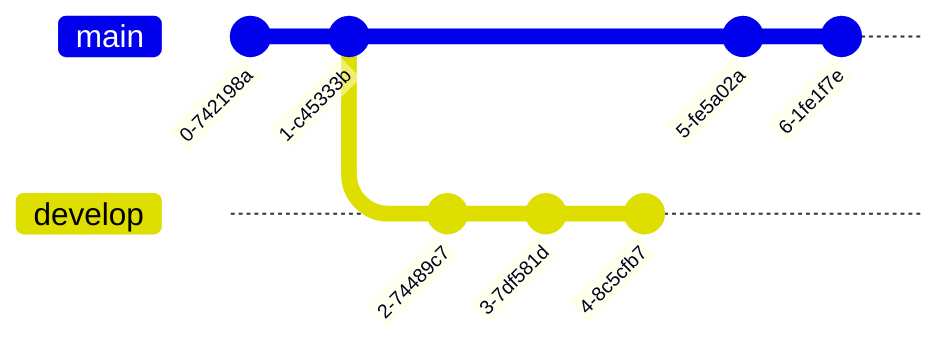
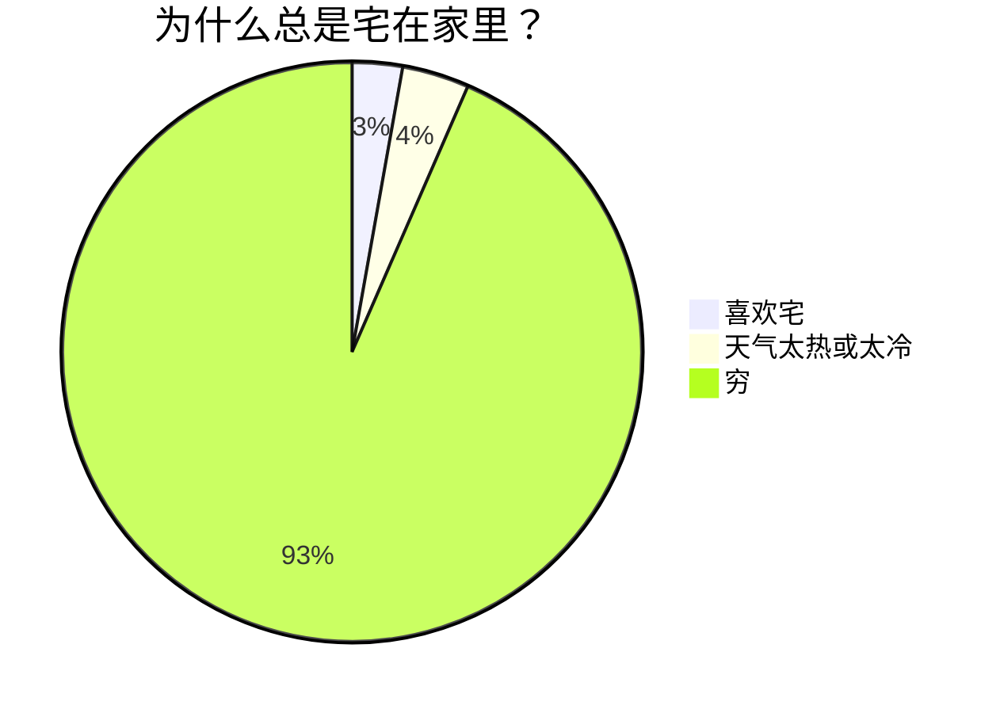

# Markdown

## 1. 标题

```md
# 111
## 222
...
###### 666666
```

## 2. 斜体

```md
*xieti*
```

## 3. 粗体

```md
**cuti**
```

### 粗斜体

```markdown
***cuxieti***
```

## 4. 插入链接

```md
[哔哩哔哩](http://www.bilibili.com "title") title可以省略
```

```md
<http://www.bilibili.com>
```

扩展用法：

```md
[哔哩哔哩][wangzhi1]
[wangzhi1]:http://www.bilibili.com "title")
```


## 5. 插入图片

```md
	网页图片
```

```md
![名称][tupian1]	
[tupian1]:链接 "title"
```

```md
	本地图片-当前目录

	本地图片-子目录
```


## 6. 脚注

```md
待解释文本[^er]

[^er]:jieshi
```

github中脚注：

```md
Bla bla <sup id="a1">[1](#f1)

<b id="f1">1 Footnote content here.</b> [?](#a1)
```

## 7. 引用

```md
> 123
>> 1234
>>> 12345
```

## 8. 代码块

```md
`daimakuai`

```daimakuai```

```

#### 代码区块

```md
    daima   //4个空格或一个tab
```

## 9. 分割线

```md
*-_ 
***
---
___
```

## 10. 上下标

```md
H<sub>2</sub>O
CO<sub>2</sub>
爆米<sup>TM</sup>
```

H<sub>2</sub>O

CO<sub>2</sub>

爆米<sup>TM</sup>


## 11. 插入空格、Tab

```md
&nbsp;
&ensp;
&emsp;
```

## 12. 删除线

```md
~~ABCDEFG~~
```

~~ABCDEFG~~

## 13. 下划线

```md
<u>下划线</u>
```

<u>下划线</u>

## 14. 合并单元格

```html
<table>
    <tr>
        <th>班级</th><th>课程</th><th>平均分</th>
    </tr>
    <tr>
        <td rowspan="3">1班</td><td>语文</td><td>100</td>
    </tr>
    <tr>
        <td>数学</td><td>100</td>
    </tr>
    <tr>
        <td>英语</td><td>100</td>
    </tr>
</table>
```

## 14. 自定义锚点

* 1、建立一个跳转的连接

```md
[说明文字](#jump)
```

* 2、标记要跳转到什么位置

**注意id要与之前（#）中的内容相同**

```html
<span id = "jump">跳转位置</span>
```

应用: 文章中的任意跳转

* 文章头部:


    ```html
    <span id = "Jump1" ></span>

    <!-- <sup><p align="right">[`END↓`](#Jump2)</p></sup> -->
    <sup>[`END↓`](#Jump2)</sup>
    ```

    <span id = "Jump1" ></span>

    <sup>[`END↓`](#Jump2)</sup>

* 文章任意处:

    ```html
    <sup>[`TOP↑`](#Jump1)</sup>

    <sup><p align="right">[`END↓`](#Jump2)</p></sup>
    ```

    <sup>[`TOP↑`](#Jump1)</sup> <sup>[`END↓`](#Jump2)</sup>

* 文章末尾:

    ```html
    <span id = "Jump2" ></span>

    <sup>[`TOP↑`](#Jump1)</sup>
    ```


    <span id = "Jump2" ></span>

    <sup>[`TOP↑`](#Jump1)</sup>


## 15. 标题/目录

### 1、利用标题实现页内跳转

```
* [标题](#标题)
```

### 2、HTML实现页内跳转

```html
<a href="#id">NAME</a>
```

其中的"NAME"可以随便填写, "id"需要填写跳转到的标题的内容

### 3 Github目录

Github md不支持 `[TOC]`, 不过其二级标题可这样写:

```md
## H2-1 ##
## H2-2 ##
```

然后在页面顶部按照 "标题" 写法, 写了1~2条以后, `ctrl+s`保存, 此时会自动生成所有标题组成的目录.


## 16. 颜色与字体

*  设置居中及右对齐

    对于标准的markdown文本, 是不支持居中对齐的。还好markdown支持html语言, 所以我们采用html语法格式即可。（有些markdown编辑器不支持）

    ```markdown
    <center>这一行需要居中</center>
    <div align = center>这一行需要居中</div>
    <div align = left>这一行需要靠左</div>
    <div align = right>这一行需要靠右</div>
    ```

    ```markdown
    <p align="right">右对齐</p>
    <p align="left">左对齐</p>
    ```

    <p align="right">右对齐</p>

    <p align="left">左对齐</p>


* 更换字体

    ```markdown
    <font face="黑体">我是黑体字</font>
    ```

    测试: 

    <font face="黑体">我是黑体字</font>

* 调整字体大小

    ```markdown
    <font face="黑体" size=10>我是黑体字</font>
    ```

    测试: 

    <font face="黑体" size=10>我是黑体字</font>

* 调整字体颜色

    ```markdown
    <font color=red size=2>注意！！！</font>
    <font color=orange size=4>注意！！！</font>
    <font color=#0000FF size=6>注意！！！</font>
    <font color=#FF00FF size=8>注意！！！</font>
    ```

    测试: 

    <font color=red size=2>注意！！！</font>

    <font color=orange size=4>注意！！！</font>

    <font color=#0000FF size=6>注意！！！</font>

    <font color=#FF00FF size=8>注意！！！</font>

## 17. 脚注

```md
<sup id="a1">[1](#f1)

<b id="f1">1 脚注内容 [?](#a1)
```

测试:

脚注1<sup id="a1">[1](#f1)</sup>, 脚注2<sup id="a2">[2](#f2)</sup>

---

<b id="f1">1 脚注内容 [?](#a1)

<b id="f2">2 脚注内容 [?](#a2)

## 18. Mermaid绘图

> [https://mermaid.js.org/intro/](https://mermaid.js.org/intro/)

### 18.1 简介

* 怎么使用Mermaid？
    * 使用特定的Mermaid渲染器；
    * 使用集成了Mermaid渲染功能的Markdown编辑器，如Typora。使用时，需要将代码块的语言选择为Mermaid。
    * VScode可以下载插件 `Markdown Preview Mermaid Support` 以支持 Mermaid

* Mermaid能绘制哪些图？
    * 饼状图：使用`pie`关键字，具体用法后文将详细介绍
    * 流程图：使用`graph`关键字，具体用法后文将详细介绍
    * 序列图：使用`sequenceDiagram`关键字
    * 甘特图：使用`gantt`关键字
    * 类图：使用`classDiagram`关键字
    * 状态图：使用`stateDiagram`关键字
    * 用户旅程图：使用`journey`关键字

* 示例：

    ```text
    graph LR
    emperor((朱八八))-.子.->朱五四-.子.->朱四九-.子.->朱百六


    朱雄英--长子-->朱标--长子-->emperor
    emperor2((朱允炆))--次子-->朱标
    朱樉--次子-->emperor
    朱棡--三子-->emperor
    emperor3((朱棣))--四子-->emperor
    emperor4((朱高炽))--长子-->emperor3
    ```

    ```mermaid
    graph LR
    emperor((朱八八))-.子.->朱五四-.子.->朱四九-.子.->朱百六


    朱雄英--长子-->朱标--长子-->emperor
    emperor2((朱允炆))--次子-->朱标
    朱樉--次子-->emperor
    朱棡--三子-->emperor
    emperor3((朱棣))--四子-->emperor
    emperor4((朱高炽))--长子-->emperor3
    ```

### Diagram Types

* Flowchart 流程图

    ```text
    graph TD;
        A-->B;
        A-->C;
        B-->D;
        C-->D;
    ```

    ```mermaid
    graph TD;
        A-->B;
        A-->C;
        B-->D;
        C-->D;
    ```

* Sequence diagram 时序图、顺序图

    ```text
    sequenceDiagram
        participant Alice
        participant Bob
        Alice->>John: Hello John, how are you?
        loop Healthcheck
            John->>John: Fight against hypochondria
        end
        Note right of John: Rational thoughts <br/>prevail!
        John-->>Alice: Great!
        John->>Bob: How about you?
        Bob-->>John: Jolly good!
    ```

    ```mermaid
    sequenceDiagram
        participant Alice
        participant Bob
        Alice->>John: Hello John, how are you?
        loop Healthcheck
            John->>John: Fight against hypochondria
        end
        Note right of John: Rational thoughts <br/>prevail!
        John-->>Alice: Great!
        John->>Bob: How about you?
        Bob-->>John: Jolly good!
    ```

* Gantt diagram 甘特图

    ```text
    gannty
    dateFormat  YYYY-MM-DD
    title Adding GANTT diagram to mermaid
    excludes weekdays 2014-01-10

    section A section
    Completed task            :done,    des1, 2014-01-06,2014-01-08
    Active task               :active,  des2, 2014-01-09, 3d
    Future task               :         des3, after des2, 5d
    Future task2               :         des4, after des3, 5d
    ```

    ```mermaid
    gantt
    dateFormat  YYYY-MM-DD
    title Adding GANTT diagram to mermaid
    excludes weekdays 2014-01-10

    section A section
    Completed task            :done,    des1, 2014-01-06,2014-01-08
    Active task               :active,  des2, 2014-01-09, 3d
    Future task               :         des3, after des2, 5d
    Future task2               :         des4, after des3, 5d
    ```

* Class diagram 

    ```text
    classDiagram
    Class01 <|-- AveryLongClass : Cool
    Class03 *-- Class04
    Class05 o-- Class06
    Class07 .. Class08
    Class09 --> C2 : Where am i?
    Class09 --* C3
    Class09 --|> Class07
    Class07 : equals()
    Class07 : Object[] elementData
    Class01 : size()
    Class01 : int chimp
    Class01 : int gorilla
    Class08 <--> C2: Cool label

    ```

    ```mermaid
    classDiagram
    Class01 <|-- AveryLongClass : Cool
    Class03 *-- Class04
    Class05 o-- Class06
    Class07 .. Class08
    Class09 --> C2 : Where am i?
    Class09 --* C3
    Class09 --|> Class07
    Class07 : equals()
    Class07 : Object[] elementData
    Class01 : size()
    Class01 : int chimp
    Class01 : int gorilla
    Class08 <--> C2: Cool label
    ```

* Git graph

```text
gitGraph
   commit
   commit
   branch develop
   commit
   commit
   commit
   checkout main
   commit
   commit
```



### 18.2 饼状图

* 语法
    * 从pie关键字开始图表
    * 使用title关键字及其在字符串中的值，为饼图赋予标题。（这是可选的）
    * 数据部分
        * 在`" "`内写上分区名。
        * 分区名后使用`:`作为分隔符
        * 分隔符后写上数值，最多支持2位小数——数据会以百分比的形式展示

* 示例

```text
pie
    title 为什么总是宅在家里？
    "喜欢宅" : 15
    "天气太热或太冷" : 20
    "穷" : 500
```




## 19 表格

### 普通表格

* 普通

    ```markdown
    项目     | Value
    -------- | -----
    电脑  | $1600
    手机  | $12
    导管  | $1
    ```

* 对齐：

    ```markdown
    | Column 1 | Column 2  |	Column 3 |
    |:--------| :---------:|--------:|
    | centered 文本居左 | right-aligned 文本居中 |right-aligned 文本居右|
    ```

* 竖线 `|`：单元格中的|用&#124;表示

* 表格内换行：`<br>`

### 合并表格

Markdown并没有单元格合并语法，但是Markdown是兼容HTML的，因此，我们可以通过HTML的方式实现单元格合并。

* 基础的html表格:

    ```html
    <table>
        <tr>
            <td>行1列1</td> 
            <td>行1列2</td> 
            <td>行1列3</td> 
        </tr>
        <tr>
            <td>行2列1</td> 
            <td>行2列2</td> 
            <td>行2列3</td> 
        </tr>
        <tr>
            <td>行3列1</td> 
            <td>行3列2</td> 
            <td>行3列3</td> 
        </tr>
    </table>
    ```

    其中 每对 `<tr>.....</tr>` 标签之间为一行，每对 `<td>....</td>` 标签之间为一列。

<table>
    <tr>
        <td>行1列1</td> 
        <td>行1列2</td> 
        <td>行1列3</td> 
</tr>
    <tr>
        <td>行2列1</td> 
        <td>行2列2</td> 
        <td>行2列3</td> 
    </tr>
    <tr>
        <td>行3列1</td> 
        <td>行3列2</td> 
        <td>行3列3</td> 
    </tr>
</table>

* 合并行

    `colspan`：规定单元格可纵跨的列数，即跨几列来合并行。
    
    ```html
    <table>
        <tr>
            <td>行/列</td> 
            <td>列2</td> 
            <td>列3</td> 
        </tr>
        <tr>
            <td>行2列1</td> 
            <td colspan="2">跨两列合并行</td>    
        </tr>
        <tr>
            <td colspan="3">跨三列合并行</td>    
        </tr>
    </table>
    ```

    要注意要少写几个 `<td>` 标签，如下所示，共三列，其中第二行合并第二列和第三列，只需要在前面再写一列即可，第三行跨三列，即已包括三列，不需要再写 `<td>`

<table>
    <tr>
        <td>行/列</td> 
        <td>列2</td> 
        <td>列3</td> 
    </tr>
    <tr>
        <td>行2列1</td> 
        <td colspan="2">跨两列合并行</td>    
    </tr>
    <tr>
        <td colspan="3">跨三列合并行</td>    
    </tr>
</table>

* 合并列

    `rowspan`：规定单元格可横跨的行数，跨几行来合并列。

    ```html
    <table>
        <tr>
            <td>行1列1</td> 
            <td>行1列2</td> 
            <td>行1列3</td> 
    </tr>
        <tr>
            <td rowspan="2">合并两列</td>    
            <td>行2列2</td> 
            <td>行2列3</td> 
        </tr>
        <tr>
            <td>行3列2</td> 
            <td>行3列3</td>    
        </tr>
    </table>
    ```

    在第一列合并了第二三行，则在第二行写合并，第三行就不用了再写第一列了。

<table>
    <tr>
        <td>行1列1</td> 
        <td>行1列2</td> 
        <td>行1列3</td> 
</tr>
    <tr>
        <td rowspan="2">合并两列</td>    
        <td>行2列2</td> 
        <td>行2列3</td> 
    </tr>
    <tr>
        <td>行3列2</td> 
        <td>行3列3</td>    
    </tr>
</table>

* 合并行列

    ```html
    <table>
        <tr>
            <td>列一</td> 
            <td>列二</td> 
       </tr>
       <tr>
            <td colspan="2">合并行</td>    
       </tr>
       <tr>
            <td>列一</td> 
            <td>列二</td> 
       </tr>
        <tr>
            <td rowspan="2">合并列</td>    
            <td >行二列二</td>  
        </tr>
        <tr>
            <td >行三列二</td>  
        </tr>
    </table>
    ```

<table>
    <tr>
        <td>列一</td> 
        <td>列二</td> 
   </tr>
   <tr>
        <td colspan="2">合并行</td>    
   </tr>
   <tr>
        <td>列一</td> 
        <td>列二</td> 
   </tr>
    <tr>
        <td rowspan="2">合并列</td>    
        <td >行二列二</td>  
    </tr>
    <tr>
        <td >行三列二</td>  
    </tr>
</table>

## 其他

* 注释

    ```markdown
    <!--注释-->
    ```

* 插入带空格路径

    ```markdown
    [aaa](<path to markdown file.md>)
    ```