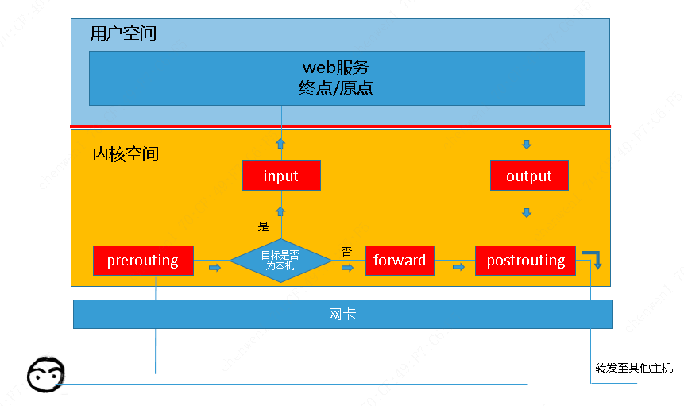

# Netfilter - iptables


语法:

```sh
iptables -t 表名 <-A/I/D/R> 规则链名 [规则号] <-i/o 网卡名> -p 协议名 <-s 源IP/源子网> --sport 源端口 <-d 目标IP/目标子网> --dport 目标端口 -j 动作
```

## 关于iptables

### 选项

- `-A` 将一个规则添加到链末尾
- `-D` num 将指定的链中删除规则
- `-F` 将指定的链中删除所有规则
- `-I` num 将在指定链的指定编号位置插入一个规则(默认首行)
- `-L` 列出指定链中所有规则
- `-t` nat -L 列出所有NAT链中所有规则
- `-n` 用数字输出
- `-N` 建立用户定义链
- `-X` 删除用户定义链
- `-P` 修改链的默认设置, 如将iptables -P INPUT DROP (将INPUT链设置为DROP)
- `-Z` 清空规则链中的数据包计算器和字节计数器

### 参数

- `--dport` 指定目标TCP/IP端口 如 `--dport 80`
- `--sport` 指定源TCP/IP端口 如 `–-sport 80`
- `-p tcp/icmp/udp` 指定协议为tcp/ICMP/UDP
- `-j ACCEPT/DROP/REJECT` 允许/丢弃/拒绝并向发出消息的计算机发一个消息
- `-j LOG` 在/var/log/messages中登记分组匹配的记录
- `-m mac --mac-source ADDRESS` 绑定MAC地址
- `-m limit --limit RATE[/second|/minute|/hour|/day]` 设置时间策列(默认是`3/hour`)
- `-m state --state INVALID|ESTABLISHED|NEW|RELATED`
- `-s 10.10.0.0`或`-s 10.10.0.0/16`指定源地址或地址段
- `-d 10.10.0.0`或`-d 10.10.0.0/16`指定目标地址或地址段
- `-s ! 10.10.0.0` 指定源地址以外的
- `-i 网络接口` 指定数据包进入本机的网络接口
- `-o 网络接口` 指定数据包离开本机的网络接口

### 启动/停止/从配置文件恢复

* CentOS 6: `service`
* CentOS 7: `systemctl` (安装了`iptables-services`)
* 不通过服务管理, 直接使用命令操作iptables规则:

    ```sh
    iptables-save > /etc/sysconfig/iptables  # 保存当前配置到文件
    iptables-restore /etc/sysconfig/iptables # 从文件恢复iptables规则
    ```

## 典型配置参考

* (1) 设定预设规则

    ```bash
    # 请求接入包 :丢失
    iptables -P INPUT DROP

    # 响应数据包: 接受
    iptables -P OUTPUT ACCEPT

    # 转发数据包: 丢失
    iptables -P FORWARD DROP
    ```

* (2) 开启SSH端口: 22

    ```bash
    # 允许所有IP进行SSH连接
    iptables -A INPUT -p tcp --dport 22 -j ACCEPT

    # 允许特定IP进行SSH连接
    iptables -A INPUT -s 192.168.0.3 -p tcp --dport 22 -j ACCEPT

    # 允许特定网段进行SSH连接
    iptables -A INPUT -s 192.168.0.0/24 -p tcp --dport 22 -j ACCEPT

    # 允许特定段IP进行SSH连接
    iptables -A INPUT -m iprange --src-range 192.168.55.1-192.168.55.10 -p tcp --dport 22 -j ACCEPT

    # 允许除某主机/网段以外的进行SSH连接
    iptables -A INPUT -s ! 192.168.0.3 -p tcp --dport 22 -j ACCEPT
    iptables -A INPUT -s ! 192.168.0.0/24 -p tcp --dport 22 -j ACCEPT

    # OUTPUT设置为DROP时, 需要添加以下对应项
    iptables -A OUTPUT -p tcp --sport 22 -j ACCEPT 
    iptables -A OUTPUT -d 192.168.0.3 -p tcp --sport 22 -j ACCEPT
    iptables -A OUTPUT -d 192.168.0.0/24 -p tcp --sport 22 -j ACCEPT
    ```

* (3) 允许ICMP流量进入(允许主机被Ping通)

    - iptables

        ```bash
        iptables -I INPUT -p icmp -j ACCEPT
        ```

    - 内核

        ```bash
        echo 0 > /proc/sys/net/ipv4/icmp_echo_ignore_all
        net.ipv4.icmp_echo_ignore_all=1

        # 0:允许, 1:禁止
        # 设置icmp_echo_ignore_all后, 主机也无法ping通其他主机
        ```

* (4) 允许所有已经建立的和相关的连接

    ```bash
    iptables -A INPUT -m state --state ESTABLISHED,RELATED -j ACCEPT
    ```

* (5) DORP非法连接

    ```bash
    iptables -A INPUT   -m state --state INVALID -j DROP
    iptables -A OUTPUT  -m state --state INVALID -j DROP
    iptables -A FORWARD -m state --state INVALID -j DROP
    ```

* (6) 允许loopback回环通信

    ```bash
    iptables -A INPUT -s 127.0.0.1/32 -j ACCEPT
    ```

    或

    ```bash
    iptables -A INPUT -i lo -p all -j ACCEPT
    ```

## 其他服务配置参考

* (1) DNS: 53/UDP

    ```bash
    iptables -A INPUT -p udp --dport 53 -j ACCEPT
    ```


* (2) NTP: 123/UCP 

    ```bash
    iptables -A INPUT -m state --state NEW -m udp -p udp --dport 123 -j ACCEPT
    ```

* (3) 邮件服务

    | 协议 | 端口 | 加密端口 |
    | -- | -- | -- |
    | `http` | 80 | 443 |
    | `smtp` | 25 | 465 |
    | `pop3` | 110 | 995 |
    | `imap` | 143 | 993 |


    ```bash
    iptables -A INPUT -p tcp -m multiport --dports 25,80,110,143,443,465,993,995 -j ACCEPT
    iptables -A INPUT -p udp -m multiport --dports 25,80,110,143,443,465,993,995 -j ACCEPT
    ```

* (4) vsftpd

    ```bash
    iptables -I INPUT -p tcp --dport 20:21 -j ACCEPT 
    iptables -I INPUT -p tcp --dport 50000:60000 -j ACCEPT
    ```

* (5) iscsi

    ```bash
    iptables -I INPUT -s 10.10.10.2/24 -p tcp --dport 3260 -j ACCEPT
    ```

* (6) it监控

    ```bash
    iptables -A INPUT -s 10.150.36.71,10.150.36.72,10.150.36.120,10.150.36.122,10.150.36.1 -t tcp -m multiport --dport 1918,63358 -j ACCEPT
    ```

* (7) 蓝鲸

    ```
    -A INPUT -m iprange --src-range 10.150.45.209-10.150.45.222 -j ACCEPT
    -A INPUT -s 127.0.0.1/32 -j ACCEP
    -A INPUT -s 10.150.45.134 -j ACCEP
    -A INPUT -s 10.150.32.243 -p tcp --dport 22 -j ACCEP
    -A INPUT -p tcp --dport 2181 -j ACCEP
    -A INPUT -p tcp --dport 48668 -j ACCEP
    -A INPUT -p tcp --dport 58935 -j ACCEP
    -A INPUT -m state --state RELATED,ESTABLISHED -j ACCEP
    -A INPUT -s 10.150.36.71,10.150.36.72,10.150.36.120,10.150.36.122,10.150.36.1 -t tcp -m multiport --dports 1918,63358 -j ACCEPT

    -A INPUT -p tcp -m multiport --dports 48668,58625,58725,58925,58930,10020,60020:60030 -j ACCEPT
    -A INPUT -p udp -m multiport --dports 10020,10030,60020:60030 -j ACCEPT
    ```

    ```
    /etc/hosts.allow

        sshd:10.150.45.222:allow
        sshd:10.150.45.134:allow
        sshd:10.150.45.214:allow
        sshd:10.150.45.219:allow
        sshd:10.150.45.220:allow
        sshd:all:deny
    ```

* (8) nfs

    ```bash
    firewall-cmd --add-service=nfs --permanent
    firewall-cmd --add-service=mountd --permanent 
    firewall-cmd --add-service=rpc-bind --permanent
    firewall-cmd --reload


    -A INPUT -p tcp -m multiport --dports 111,2049,20048 -j ACCEPT
    -A INPUT -p udp -m multiport --dports 111,2049,20048 -j ACCEPT
    ```


## 其他说明

### 注1：CentOS初始参考配置

```sh
~] cat /etc/sysconfig/iptables

# Generated by iptables-save v1.4.7 on Tue Dec 17 21:35:04 2019
*filter
:INPUT DROP [3:687]
:FORWARD DROP [0:0]
:OUTPUT ACCEPT [318:33304]
-A INPUT -p icmp -j ACCEPT 
-A INPUT -p tcp -m tcp --dport 22 -j ACCEPT 
-A INPUT -m state --state RELATED,ESTABLISHED -j ACCEPT 
-A INPUT -m state --state INVALID -j DROP 
-A INPUT -s 127.0.0.1/32 -j ACCEPT 
-A INPUT -p udp -m state --state NEW -m udp --dport 123 -j ACCEPT 
-A FORWARD -m state --state INVALID -j DROP 
-A OUTPUT -m state --state INVALID -j DROP 
COMMIT
# Completed on Tue Dec 17 21:35:04 2019
```

### 注2：`-m state --state`

- `NEW`  状态的数据包说明这个数据包是收到的第一个数据包。比如收到一个SYN数据包, 它是连接的第一个数据包, 就会匹配`NEW`状态。第一个包也可能不是SYN包, 但它仍会被认为是`NEW`状态。

- `ESTABLISHED`  只要发送并接到应答, 一个数据连接就从`NEW`变为`ESTABLISHED`,而且该状态会继续匹配这个连接后继数据包。

- `RELATED`  当一个连接和某个已处于`ESTABLISHED`状态的连接有关系时, 就被认为是`RELATED`, 也就是说, 一个连接想要是`RELATED`的, 首先要有个`ESTABLISHED`的连接, 这个`ESTABLISHED`连接再产生一个主连接之外的连接, 这个新的连接就是`RELATED`。

- `INVALID`  状态说明数据包不能被识别属于哪个连接或没有任何状态。


### 注3：`iptables`/`netfilter`的关系

`iptables`其实不是真正的防火墙, 我们可以把它理解成一个客户端代理, 用户通过`iptables`这个代理, 将用户的安全设定执行到对应的"安全框架"中, 这个"安全框架 防火墙, 这个框架的名字叫`netfilter`。

`netfilter`才是防火墙真正的安全框架（framework）, `netfilter`位于内核空间。

`iptables`其实是一个命令行工具, 位于用户空间, 我们用这个工具操作真正的框架。


### 注4：规则和工作原理

- 规则: 其实就是网络管理员预定义的条件, 规则一般的定义为"如果数据包头符合这样的条件, 就这样处理这个数据包"

- 规则存储在内核空间的信息包过滤表中, 这些规则分别指定了**源地址**、**目的地址**、**传输协议(如TCP、UDP、ICMP)** 和 **服务类型(如HTTP、FTP和SMTP)** 等

- 当数据包与规则匹配时, iptables就根据规则所定义的方法来处理这些数据包, 如 **放行(accept)**、**拒绝(reject)** 和 **丢弃(drop)** 等。配置防火墙的主要工作就是 **添加、修改和删除** 这些规则。


<!--  -->

```text
        +--------------------------------------------------------------------------------------------------------+
        |   User Space                                                                                           |
        |       +---------------------------------------------------------------------------------------+        |
        |       |                                  Web服务  终点/原点                                    |        |
        |       +-------------------------↑-------------------------------------------------↓-----------+        |
        |---------------------------------|-------------------------------------------------|--------------------|
        |   Kernel Space                  |                                                 |                    |
        |                                 ↑                                                 ↓                    |
        |                           +----------+                                      +----------+               |
        |                           |  iutput  |                                      |  output  |               |
        |                           +----------+                                      +----------+               |
        |                                 ↑                                                 |                    |
        |                                YES                                                ↓                    |
        |  +--------------+       +------ ↑ ------+          +-----------+          +-------------+              |
        |  |  prerouting  | +---> | Is localhost? --> NO --> |  forward  | +------> | postrouting | +-->--+      |
        |  +--------------+       +---------------+          +-----------+          +-------------+       |      |
        |         ↑                                                                                       |      |
        |         |                                                                                       ↓      |
        +---------|---------------------------------------------------------------------------------------|------+
                  ↑                                                                                       ↓
        +---------|---------------------------------------------------------------------------------------|------+
        |         ↑                                  Ethernet                                             ↓      |
        +---------|---------------------------------------------------------------------------------------|------+
 ?? ==>----->-----+                                                                                       +=====> Other Host
```

某些场景中的报文流向: 
- 1>到本机某进程的报文：PREROUTING --> INPUT
- 2>由本机转发的报文：PREROUTING --> FORWARD --> POSTROUTING
- 3>由本机的某进程发出的报文：OUTPUT --> POSTROUTING
