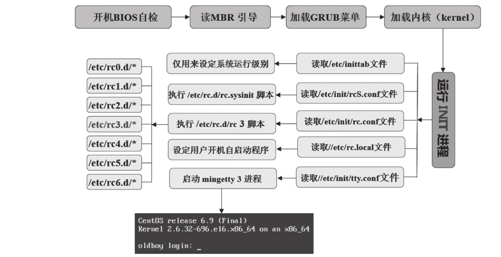
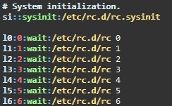
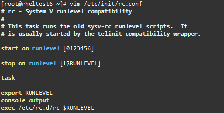
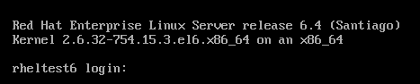
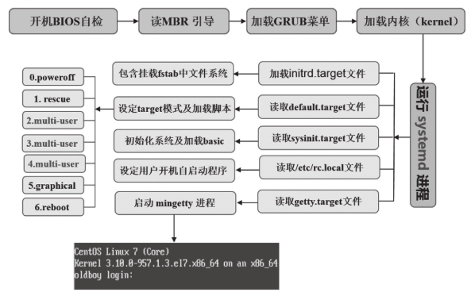
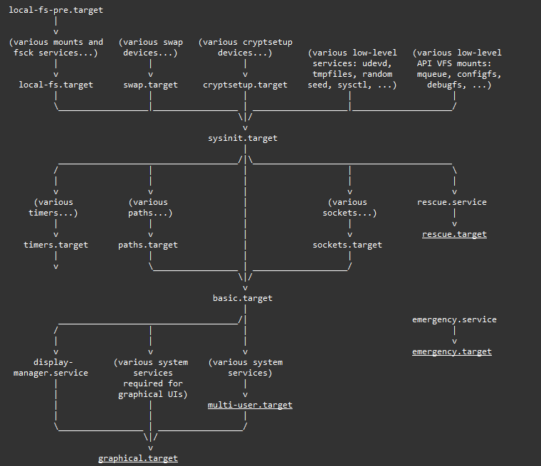
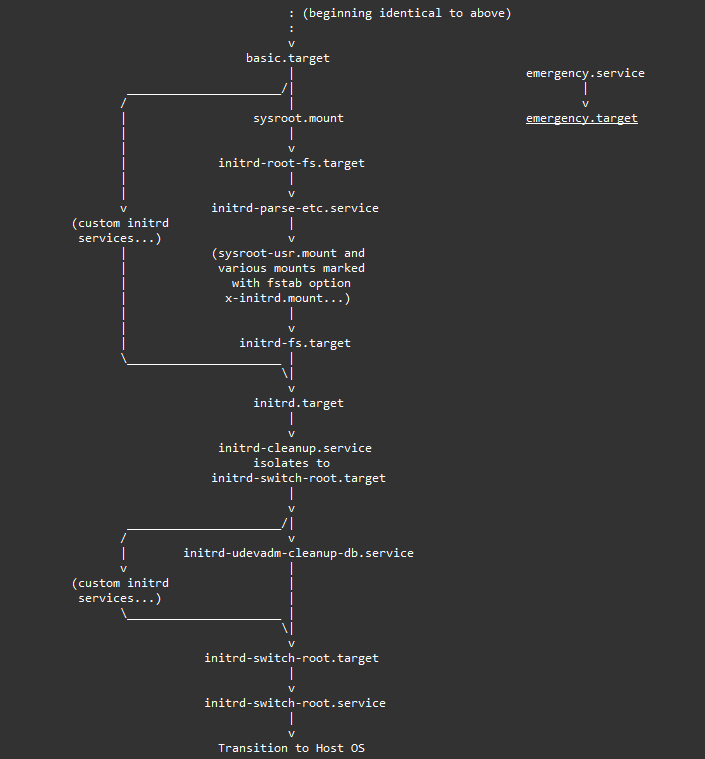
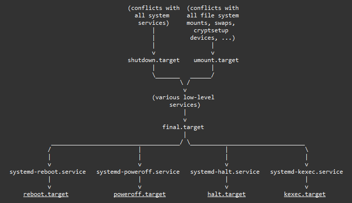
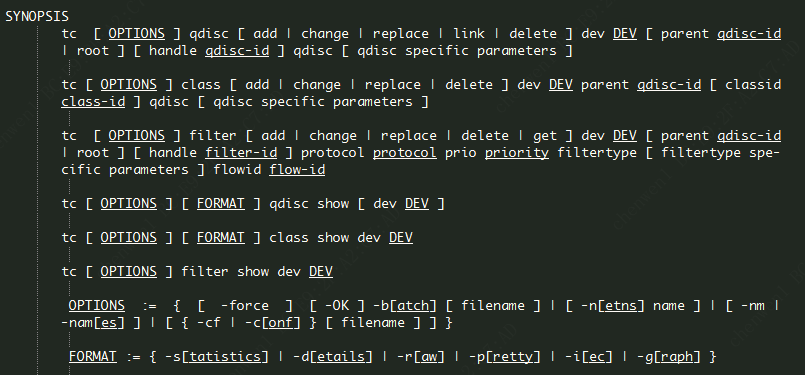

# 其他, 大杂烩


## 小数二进制表示

十进制的小数转换为二进制小数，主要是利用小数部分乘2，取整数部分，直至小数点后为0。

以 0.625 为例：

| 步骤 | 0.625 | 十进制转二进制 |
| -- | -- | -- |
| 1 | 0.625 * 2 = 1.25 | 整数部分取 1, 余 0.25 |
| 2 | 0.25 * 2 = 0.5 | 整数部分没有 0, 余 0.5 |
| 3 | 0.5 * 2 = 1.0 | 整数部分取 1, 余 0.0 |

需要注意的是，如果尾数不是 0 或 5（比如 9.624），就无法用一个二进制数来精确表达。因此一些编程语言/数据库中的 浮点类型数据 会有不准确的问题。

```sh
~] echo 'obase=2;0.625' | bc
.1010000000

~] echo 'obase=2;0.624' | bc
.1001111110
```


## `sshpass` 常见用法

```sh
sshpass -p123456 ssh-copy-id -i ~/.ssh/id_rsa.pub " root@172.16.1.$ip  -o StrictHostKeyChecking=no "
sshpass -p123qweQ ssh root@192.168.163.241 'ls /root'
sshpass -f ~/password ssh root@192.168.163.241 'ls /root'
sshpass -p123qweQ scp -o StrictHostKeyChecking=no root@192.168.1.12:/tmp/testfile /root/
sshpass -p123qweQ ssh -o StrictHostKeyChecking=no root@192.168.1.103 "lsblk "
```


## 红帽订阅管理

### 注册

```bash
# 将系统注册到rhn（输入用户名和密码）
subscription-manager register

# 列出系统所有可用的订阅，并记录你在系统激活的订阅池Id
subscription-manager list --available --all

# 使用订阅池id激活订阅
subscription-manager attach --pool=8a85f98154ef8eb40154f1b1d3620670

# 关闭系统所有仓库
subscription-manager repos --disable="*"

# 仅打开系统 server 仓库。
subscription-manager repos --enable=rhel-7-server-rpms

# 列出系统所有仓库。
yum repolist

# 如果需要重新注册，执行以下命令组
sudo subscription-manager remove --all
sudo subscription-manager unregister
sudo subscription-manager clean
sudo subscription-manager register
sudo subscription-manager refresh
sudo subscription-manager attach --auto
```

### 使用

* 用于正常安装软件、补丁等
* 同步补丁，用于搭建补丁源

    ```sh
    # 缓存少量指定包
    yum install ntp --downloadonly --downloaddir=/tmp/

    # 同步整个 repo
    # 7.x 及以下版本
    reposync --plugins --newest-only --delete --download_path=<download_path> --repoid=<repo_id>
    # 8.x 版本
    dnf reposync --newest-only --delete --download-metadata --download-path=<download_path> --repoid=<repo_id>
    ```


### 附: 关于repodata

* `repodata/` 目录下的文件信息

    执行 `createrepo` 会在当前目录下生成一个 `repodata` 的文件夹, 里面一般有以下几个文件:

    - `primary.xml.gz`: 包含所有rpm文件列表、依赖关系、软件包安装列表 
    - `filelists.xml.gz`: 包含所有rpm包的配置文件列表  
    - `other.xml.gz`: 包含软件包其他信息，比如更改记录  
    - `comps.xml`: 包含软件包组的列表，控制软件包 `group` 安装  
    - `repomd.xml`: 包含 `primary`/`filelist`/`other` 文件的时间戳、检验等等之类   

* `yum` 安装 rpm 包执行过程

    - (1) 在 `primary.xml` 里找到需要安装的包  
    - (2) 在 `primary.xml` 中获取到安装包完整名词和依赖包列表  
    - (3) 在 `primary.xml` 中根据 `<location href=xxx/>`获取安装包路径
    - (4) 在 `primary.xml` 中获取依赖包名和对应的 `pkgid`，并在 `filelists.xml` 中获取到配置文件
    - (5) 根据已有信息获取 rpm 包并安装  

* `repodata` 中的 "路径问题"

    首先，有以下三点说明:

    * `yum` 读取 `repodata/primary.xml` 中记录的 `<location href=/>` 时，是以 `repodata` 目录所在那一级目录为基准点的（相对路径），而执行 `createrepo` 命令生成 `repodata` 的所在目录以及 `primary.xml`，是由我们指定的路径决定的。

    * `createrepo` 默认在当前目录下生成 `repodata/` 目录, 可通过 `-o` 指定

    * yum 源 `repo` 文件中配置项 `baseurl` : Must be a URL to the directory where the yum repository's *repodata* directory lives. Can be an ++http://++, ++ftp://++ or ++file://++ URL.

    综上三点可知：

    * 执行 `yum` 安装 `rpm` 包时，获取实际 `rpm` 包的路径为

        ```
        "repo 文件中配置项 baseurl 的路径"/"primary.xml 中 <location href=xxx> 记录的路径"
        ```

        例如: 下面这种情况下，yum 安装 rpm 包时会以 `/media/t/tree-1.6.0-10.el7.x86_64.rpm` 这个路径下载 `tree`
        
        ```
        ~] cat /etc/yum.repos.d/media.repo
        ...
        baseurl=/media/
        ...

        ~] ls /media
        ...
        repodata/
        ...

        ~] cat /media/repodata/xxxxx...primary.xml
        ...
        <location href="t/tree-1.6.0-10.el7.x86_64.rpm">
        ...
        ```

* `createrepo` 的路径问题

    ```sh
    ~] tree /media/
    .
    └── Packages
        └── dir1
            ├── x1.rpm
            ├── ...
            └── xn.rpm
    ```
    
    * 情景一

        ```sh
        ~] cd /media
        ~] createrepo /media/Packages
        ~] tree /media
        .
        ├── Packages
        |   └── dir1
        |       ├── x1.rpm
        |       ├── ...
        |       └── xn.rpm
        └── repodata
            ├── ...primary.xml.gz
            ├── ...
            └── repomd.xml

        ~] gzip -d /media/repodata/primary.xml -c | grep 'location href'
        <location href="dir1/x1.rpm"/>
        <location href="dir1/x2.rpm"/>
        ...
        <location href="dir1/xn.rpm"/>
        ```

    * 情景二

        ```sh
        ~] cd /media
        ~] createrepo /media/
        ~] tree /media
        .
        ├── Packages
        |   └── dir1
        |       ├── x1.rpm
        |       ├── ...
        |       └── xn.rpm
        └── repodata
            ├── ...primary.xml.gz
            ├── ...
            └── repomd.xml

        ~] gzip -d /media/repodata/primary.xml -c | grep 'location href'
        <location href="Packages/dir1/x1.rpm"/>
        <location href="Packages/dir1/x2.rpm"/>
        ...
        <location href="Packages/dir1/xn.rpm"/>
        ```

    以上两种情景，repo 配置文件中 baseurl 都应该配置为 baseurl=file:///mnt，安装 x1.rpm 时，搜索路径为

    ```text
        情景一： /media/dir1/x1.rpm          # 异常
        情景一： /media/Packages/dir1/x1.rpm # 正常
    ```
    
    综上，使用 `createrepo` 的最佳实践为:  

    ```bash
    createrepo /path/of/package -o /path/of/package
    # 或
    createrepo .
    ```


## 系统启动过程

### CentOS6



* 1. 开机自检

    对硬件进行检查，正确检查以后进入下一步

* 2. 读取MBR

    **主引导记录**，共512bytes(**0柱面、0磁道、1扇区前512字节**)

    - 前446字节为 **引导记录区**，记录了哪些活动分区，用于找到活动的分区，并将活动分区的引导记录写入内存  
    - 后66字节记录 **磁盘的分区信息**，前 64字节 记录磁盘分区表信息，后2字节是分区的结束标志  

* 3. 加载GRUB菜单

    `bootloader` 被运行以后，读取 `/etc/grub.conf` ( `/boot/grub/menu.lst`, `/boot/grub/grub.conf` )

    ```text
    # grub.conf generated by anaconda
    #
    # Note that you do not have to rerun grub after making changes to this file
    # NOTICE:  You have a /boot partition.  This means that
    #          all kernel and initrd paths are relative to /boot/, eg.
    #          root (hd0,0)
    #          kernel /vmlinuz-version ro root=/dev/mapper/vg_rheltest6-lv_root
    #          initrd /initrd-[generic-]version.img
    #boot=/dev/sda
    default=0                                  #默认情况下如何加载系统，0表示加载菜单中对应的第一个名字
    timeout=5                                  #表示多少秒后开始加载默认系统
    splashimage=(hd0,0)/grub/splash.xpm.gz     #启动时显示的背景图片，(hd0,0)表示/boot分区
    hiddenmenu                                 #启动时默认会隐藏菜单信息，按默认设置启动系统；除非用户按键干预
    #password [-md5|-encrypted] STRING         #此项默认没有。编辑grub菜单需要认证
    title Red Hat Enterprise Linux Server (2.6.32-754.15.3.el6.x86_64)    #系统对应的名称，可按需修改
            root (hd0,0)                                                  #引导内核文件和内核所需驱动文件所在的分区，(hd0,0)表示/boot分区。hd0表示计算机的第一块磁盘，逗号后面的0表示第一个分区。
            kernel /vmlinuz-2.6.32-754.15.3.el6.x86_64 ro root=/dev/mapper/vg_rheltest6-lv_root rd_LVM_LV=vg_rheltest6/lv_root rd_NO_LUKS LANG=en_US.UTF-8 rd_NO_MD SYSFONT=latarcyrheb-sun16 crashkernel=auto  KEYBOARDTYPE=pc KEYTABLE=us rd_LVM_LV=vg_rheltest6/lv_swap rd_NO_DM rhgb quiet
                                                                          #位于boot分区的内核文件，以及一些可选内核参数
                                                                          #/vmlinuz-2.6.32-754.15.3.el6.x86_64为内核文件(/boot下)；root=/dev/mapper/vg_rheltest6-lv_root 表示根对应的设备信息(有时候也写成UUID)
            initrd /initramfs-2.6.32-754.15.3.el6.x86_64.img              #临时的初始根文件系统，init程序也在其中；内核启动所需的驱动文件，存在于boot区
    
    
    # Linux内核在初始化之后会执行init进程，而init进程会挂载我们的根文件系统，但由于init程序也是在根文件系统上的，所以这就有了悖论。
    # 2.6以前 initrd.img，2.6以后initramfs.img ；
    # initramfs 的工作方式：系统启动的时候加载内核和 initramfs 到内存执行，内核初始化之后，切换到用户态执行 initramfs 的程序/脚本，加载需要的驱动模块、必要配置等，然后加载 rootfs 切换到真正的 rootfs 上去执行后续的 init 过程
    ```
* 4. 加载内核

    根据 `GRUB` 设定的路径读取内核映像，运行解压缩，解压完成后输出 ***OK，booting the kernel*** 信息。

    其实是根据 `grub.conf` 中的 `kernel /vmlinuz-2.6.32-754.15.3.el6.x86_64 ro root=/dev/mapper/vg_rheltest6-lv_root xxxx` 的设定 **加载内核及相关参数**，同时还会**加载内核所需要的驱动程序文件**(`initrd /initramfs-xxxxxxx.img`)，进而挂载并读取根分区的信息，加载操作系统

* 5. 启动 `init` 进程

    内核初始化以后，`/sbin/init`进程首先启动，其PID为1

* 6. `init` 进程读取 `/etc/inittab` ，设定运行级别

    init 启动以后立刻读取 `/etc/inittab` 设定的系统的运行级别: `id:3:initdefault:`，从而影响后面运行哪部分的文件

* 7. 初始化系统、加载内核模块

    * 7.1 `init` 进程读取 `/etc/init/rcS.conf`，初始化系统

        关于`/etc/rc.d/rc.sysinit`:

        - CentOS6以前，init进程根据 `/etc/inittab` 中的设置加载 `/etc/rc.d/rc.sysinit`，进行初始化。系统设置包括但不限于：**设置主机名**、**设置欢迎信息**、**激活udev和selinux**、**加载`/etc/fstab`并挂载**、**设置时间**、**读取`/etc/sysctl.conf`设置内核参数**、**激活LVM及software raid设备**、**加载额外设备的驱动程序**、**各种清理动作**（如清理日志）等

        - CentOS6中，init进程不再通过读取 `/etc/inittab` 而加载 `/etc/rc.d/rc.sysinit`，而是读取 `/etc/init/rcS.conf` 文件加载 `/etc/rc.d/rc.sysinit`，然后对系统进行初始化系统设置

    * 7.2 `init` 进程加载内核相关模块

        CentOS6以前，init进程读取 `/etc/modules.conf` 文件或 `/etc/modules.d` 目录下的文件加载内核模块(centos6中已经没有这两个)

        CentOS6，加载 `/etc/sysconfig/modules/` 下的内核模块

* 8. `init` 进程运行对应运行级别的开机脚本

    运行以下目录下的脚本：

    ```sh
    /etc/rc0.d/ ~ /etc/rc6.d   # 指向/etc/rc.d/rc0.d/ -- /etc/rc.d/rc6.d
    ```

    CentOS6，`init` 进程不再通过读取 `/etc/inittab` 加载运行级别对应的脚本了，而是读取 `/etc/init/rc.conf` 加载指定运行级别对应目录的脚本:
	
    - centos 5.5 通过 `/etc/inittab` 调起 `/etc/rc.d/rc`，进而执行 `/etc/rcN.d/*`

        

    - centos 6中，`/etc/init/rc.conf` 最后一行会调起 `/etc/rc.d/rc $RUNLEVEL`。由 `/etc/rc.d/rc` 执行一部分设置，并调起 `/etc/rcN.d/` 下的脚本

        


* 9. 加载 `/etc/rc.local`

    ```sh
    /etc/rc.local # 指向/etc/rc.d/rc.local
    ```

    系统做好一切初始化工作以后，开始自动执行 `/etc/rc.local` 文件记录的开机执行命令

* 10. 启动 `mingetty`，进入登录前状态

    系统读取 `/etc/init/tty.conf` (早期也是读取 `/etc/inittab` 进行设置的)

    


### CentOS7



* 1. 启动进程变化

    CentOS7 和 CentOS6 的启动流程绝大部分还是相同的，但也有一些小区别。例如，CentOS6 下第一个启动的 `init` 进程被改为了 `systemd`（并行启动模式）

    **CentOS7 是并行启动，各个unit之间并无明显的先后顺序**

* 2. 文件的变化

    名称: grub => grub2

    |centos6 | centos7|
    |---     | ---    |
    |/etc/grub.conf	    |/etc/grub2.cfg|
    |/boot/grub/menu.lst	|/boot/grub2/grub.cfg|
    |/boot/grub/grub.conf| 	|
    | 	| /etc/default/grub|
    |	| /etc/grub.d/|

* 3. grub2 启动引导阶段

    | 文件 | 作用 |
    | -- | -- |
    | `boot.img` | 唯一作用是在系统启动时装载core.img |
    | `core.img` | grub2的核心映像文件 |
    | `*.mod` 	| 可动态加载的模块 |
    | `grub.cfg` | 核心配置文件 |

* 4. 加载内核和initramfs

    从磁盘加载到ram。

    `initramfs`是cpio的归档文件，**包含必要的kernel模块以及初始化脚本等**

* 5. 启动systemd进程

    从initramfs启动systemd的工作副本（`/sbin/systemd`, pid=0）

* 6. 加载 `initrd.target` (`/usr/lib/systemd/system/initrd.target`)所有单元，包括 `/etc/fstab`

    完成以后，控制权会移交给root文件系统的systemd实例

* 7. 加载 `default.target`，设定运行级别

* 8. 加载sysinit.target，初始化系统及加载basic.target

* 9. 启动对应运行级别(如multi-user.target)下的服务程序

    ```sh
    /etc/systemd/system/
    /usr/lib/systemd/system/
    ```

* 10. 读取并执行/etc/rc.d/rc.local

* 11. 加载getty.target

* 12. 启动graphical所需服务（图形桌面）


### 附: systemd

```sh
man bootup           # systemd启动
man systemd.special  # 查看各个systemd的unit含义
```

**SYSTEM MANAGER BOOTUP**

&emsp;The following chart is a structural overview of these well-known units and their position in the boot-up logic. The arrows describe which units are pulled in and ordered before which other units. Units near the top are started before units nearer to the bottom of the chart.



**BOOTUP IN THE INITIAL RAM DISK (INITRD)**

&emsp;The default target in the initrd is initrd.target. The bootup process begins identical to the system manager bootup (see above) until it reaches basic.target. From there, systemd approaches the special target initrd.target.   

&emsp;If the root device can be mounted at /sysroot, the sysroot.mount unit becomes active and initrd-root-fs.target is reached.   
&emsp;The service initrd-parse-etc.service scans /sysroot/etc/fstab for a possible /usr mount point and additional entries marked with the x-initrd.mount option. All entries found are mounted below /sysroot, and initrd-fs.target is reached.   
&emsp;The service initrd-cleanup.service isolates to the initrd-switch-root.target, where cleanup services can run. As the very last step, the initrd-switch-root.service is activated, which will cause the system to switch its root to /sysroot.



**SYSTEM MANAGER SHUTDOWN**

&emsp;System shutdown with systemd also consists of various target units with some minimal ordering structure applied




## Netem - 网络流量控制 (待验证)

### 概念

Netem 是 Linux 2.6 及以上内核版本提供的一个网络模拟功能模块。该功能模块可以用来在性能良好的局域网中，模拟出复杂的互联网传输性能，诸如低带宽、传输延迟、丢包等等情况。使用 Linux 2.6 (或以上) 版本内核的很多发行版 Linux 都开启了该内核功能，比如Fedora、Ubuntu、Redhat、OpenSuse、CentOS、Debian等等。tc 是 Linux 系统中的一个工具，全名为traffic control（流量控制）。tc 可以用来控制 netem 的工作模式，也就是说，如果想使用 netem ，需要至少两个条件，一个是内核中的 netem 功能被包含，另一个是要有 tc 。

```bash
SYNOPSIS
tc [ OPTIONS ] qdisc  [ add | change | replace | link | delete ] dev DEV [ parent qdisc-id | root ] [ handle qdisc-id ] qdisc [ qdisc specific parameters ]
tc [ OPTIONS ] class  [ add | change | replace | delete ] dev DEV parent qdisc-id [ classid class-id ] qdisc [ qdisc specific parameters ]
tc [ OPTIONS ] filter [ add | change | replace | delete ] dev DEV [ parent qdisc-id | root ] protocol protocol prio priority filtertype [ filtertype specific parameters ] flowid flow-id
tc [ OPTIONS ] [ FORMAT ] qdisc show [ dev DEV ]
tc [ OPTIONS ] [ FORMAT ] class show dev DEV
tc [ OPTIONS ] filter show dev DEV

OPTIONS := { [ -force ] [ -OK ] -b[atch] [ filename ] | [ -n[etns] name ] | [ -nm | -nam[es] ] | [ { -cf | -c[onf] } [ filename ] ] }
FORMAT := { -s[tatistics] | -d[etails] | -r[aw] | -p[retty] | -i[ec] | -g[raph]}
```



### 原理

`tc` 用于Linux内核的流量控制，主要是通过在输出端口处建立一个队列来实现流量控制。

接收包从输入接口（Input Interface）进来后，经过流量限制（Ingress Policing）丢弃不符合规定的数据包，再由输入多路分配器（Input De-Multiplexing）进行判断选择：
如果接收包的目的是本主机，那么将该包送给上层处理；否则需要进行转发，将接收包交到转发块（Forwarding Block）处理。

转发块同时也接收本主机上层（TCP、UDP等）产生的包。转发块通过查看路由表，决定所处理包的下一跳。然后，对包进行排列以便将它们传送到输出接口（Output Interface）。一般我们只能限制网卡发送的数据包，不能限制网卡接收的数据包，所以我们可以通过改变发送次序来控制传输速率。Linux流量控制主要是在输出接口排列时进行处理和实现的。

### 应用

可完成如下功能：（故障模拟）模拟时延，丢包，重复包，乱序。

* 1、模拟延迟传输

    **将 eth0 网卡的传输设置为延迟100毫秒发送**

    ```sh
    tc qdisc add dev eth0 root netem delay 100ms
    ```

    更真实的情况下，延迟值不会这么精确，会有一定的波动：**将eth0网卡的传输设置为延迟 100±10 ms(90~110ms之间的任意值)发送**

    ```sh
    tc qdisc add dev eth0 root netem delay 100ms 10ms
    ```

    更进一步加强这种波动的随机性：**将eth0网卡的传输设置为100ms ，同时大约有30%的包会延迟±10ms发送**

    ```sh
    tc qdisc add dev eth0 root netem delay 100ms 10ms 30%
    ```


* 2、模拟网络丢包

    **将eth0网卡的传输设置为随机丢掉1%的数据包**

    ```sh
    tc qdisc add dev eth0 root netem loss 1%
    ```

    也可以设置丢包的成功率：**将eth0网卡的传输设置为随机丢掉1%的数据包，成功率为30%**

    ```sh
    tc qdisc add dev eth0 root netem loss 1% 30%
    ```

* 3、模拟包重复

    **将eth0网卡的传输设置为随机产生 1% 的重复数据包**   

    ```sh
    tc qdisc add dev eth0 root netem duplicate 1%
    ```

* 4、模拟包损坏

    **将 eth0 网卡的传输设置为随机产生 0.2% 的损坏的数据包(内核版本需在2.6.16以上)**

    ```sh
    tc qdisc add dev eth0 root netem corrupt 0.2% 
    ```

* 5、模拟包乱序

    **将eth0网卡的传输设置为: 有 25% 的数据包 (50%相关) 会被立即发送，其他的延迟 10 秒**

    ```sh
    tc qdisc change dev eth0 root netem delay 10ms reorder 25% 50%
    ```

    新版本中，如下命令也会在一定程度上打乱发包的次序:  

    ```sh
    tc qdisc add dev eth0 root netem delay 100ms 10ms
    ```

## dir,popd,pushd

`pushd` 和 `popd` 在linux中可以用来方便地在多个目录之间切换。

`pushd` 和 `popd` 是对一个目录栈进行操作，而 `dirs` 是显示目录栈的内容。

目录栈的栈顶永远存放的是当前目录。如果当前目录发生变化，那么目录栈的栈顶元素肯定也变了；反过来，如果栈顶元素发生变化，那么当前目录肯定也变了。

* dirs -- Display directory stack

    ```text
    -c 清空目录栈
    -l 列出栈中所有Index
    -p 列出栈中所有Index(每行一条Index)
    -v 列出栈中所有Index(每行一条Index, 且每行前带序号)

    +N 显示序号为N的Index
    -N 显示序号为N的Index(倒序)
    ```

* pushd -- Add directories to stack.

    ```text
    不带任何参数时 切换回上一次的目录(即序号为1的Index)
    -n 仅操作堆栈, 不切换当前目录(即栈顶不发生改变)

    +N  栈顶切换到序号为N的Index, 如果该Index的目录不存在, 该Index会被修改成当前目录
    -N  栈顶切换到序号为N的Index(倒序)
    DIR 目录切换到DIR, 并将DIR添加到栈顶
    ```

* popd -- Remove directories from stack.

    ```text
    不带任何参数时 弹出栈顶Index
    -n 仅操作堆栈
        不带 +N/-N时，从栈底开始弹出Index
        +N 弹出序号为N的Index，如果Index为栈顶，则N+1
        -N 弹出序号为N的Index(倒序)，如果Index为栈顶，则N-1

    +N 弹出序号为N的Index
    -N 弹出序号为N的Index(倒序)
    ```


## 断开用户连接

```sh
fuser -k /dev/pty/1
# or
pkill -kill -t pts/2
```