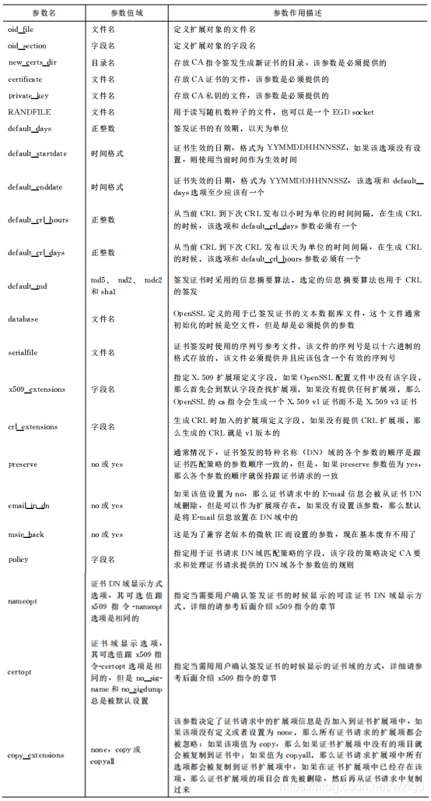

# CA, 证书

## 搭建 CA

本章主要阐述 Linux 搭建 CA 服务器

> [https://www.jianshu.com/p/9142d9d186e2](https://www.jianshu.com/p/9142d9d186e2)

### CA 架构


* 根 CA 进行签署自证证书; 

* 子 CA 向根 CA 申请证书; 根 CA 签署证书后子 CA 就可以向其他申请者发放证书; 

* 子 CA 服务器相对于根服务器来说是申请者, 相对于 web 服务器申请者是签署者, 所以子 CA 是两个身份, 既是申请者又是签署者

### 配置文件及目录结构

* 配置文件: `/etc/pki/tls/openssl.cnf`

    文件中定义 CA 工作目录和认证证书的目录等信息

    ```sh
    ~] cat /etc/pki/tls/openssl.cnf

    ####################################################################
    [ ca ]
    default_ca      = CA_default             # 默认的CA配置；CA_default指向下面配置块

    ####################################################################
    [ CA_default ]

    dir             = /etc/pki/CA            # CA的默认工作目录
    certs           = $dir/certs             # 认证证书的目录
    crl_dir         = $dir/crl               # 证书吊销列表的路径
    database        = $dir/index.txt         # 数据库的索引文件

    new_certs_dir   = $dir/newcerts          # 新颁发证书的默认路径

    certificate     = $dir/cacert.pem        # 此服务认证证书, 如果此服务器为根 CA 那么这里为自颁发证书
    serial          = $dir/serial            # 下一个证书的证书编号
    crlnumber       = $dir/crlnumber         # 下一个吊销的证书编号

    crl             = $dir/crl.pem           # The current CRL
    private_key     = $dir/private/cakey.pem # CA的私钥
    RANDFILE        = $dir/private/.rand     # 随机数文件

    x509_extensions = usr_cert               # The extentions to add to the cert

    name_opt        = ca_default             # 命名方式, 以ca_default定义为准
    cert_opt        = ca_default             # 证书参数, 以ca_default定义为准

    default_days    = 365                    # 证书默认有效期
    default_crl_days= 30                     # CRl的有效期
    default_md      = sha256                 # 加密算法
    preserve        = no                     # keep passed DN ordering

    policy          = policy_match           # policy_match策略生效

    # For the CA policy
    [ policy_match ]
    countryName             = match          # 国家；match表示申请者的申请信息必须与此一致
    stateOrProvinceName     = match          # 州、省
    organizationName        = match          # 组织名、公司名
    organizationalUnitName  = optional       # 部门名称；optional表示申请者可以的信息与此可以不一致
    commonName              = supplied
    emailAddress            = optional

    # For the 'anything' policy
    # At this point in time, you must list all acceptable 'object'
    # types.
    [ policy_anything ]                      # 由于定义了policy_match策略生效, 所以此策略暂未生效
    countryName             = optional
    stateOrProvinceName     = optional
    localityName            = optional
    organizationName        = optional
    organizationalUnitName  = optional
    commonName              = supplied
    emailAddress            = optional
    ...
    ```

    下面详细展开：

* 证书请求配置字段

    * `[ req ]` - 证书请求主配置字段
        
        On startup, the `openssl req` command reads the `[ req ]` section of openssl.cnf for default values that are not specified as arguments or options to the `req` command.

        ```conf
        [ req ]
        default_bits        = 2048
        default_keyfile     = privkey.pem
        distinguished_name  = req_distinguished_name
        attributes          = req_attributes
        x509_extensions     = v3_ca    # The extensions to add to the self signed cert

        # Passwords for private keys if not present they will be prompted for
        # input_password = secret
        # output_password = secret

        # This sets a mask for permitted string types. There are several options.
        # default: PrintableString, T61String, BMPString.
        # pkix     : PrintableString, BMPString (PKIX recommendation before 2004)
        # utf8only: only UTF8Strings (PKIX recommendation after 2004).
        # nombstr : PrintableString, T61String (no BMPStrings or UTF8Strings).
        # MASK:XXXX a literal mask value.
        # WARNING: ancient versions of Netscape crash on BMPStrings or UTF8Strings.
        string_mask = utf8only

        # req_extensions = v3_req # The extensions to add to a certificate request
        ```

        

    * `[ req_distinguished_name ]` - 特征名称字段
        
        由 `[ req ]` 字段中的 `distinguished_name` 指定，包含了用户主要信息，包括国家、省份、城市、组织及名字等信息，该字段所有信息总和称为“**特征名称**”

        ```conf
        [ req_distinguished_name ]
        countryName             = Country Name (2 letter code)
        countryName_default     = AU
        countryName_min         = 2
        countryName_max         = 2

        stateOrProvinceName         = State or Province Name (full name)
        stateOrProvinceName_default = Some-State

        localityName            = Locality Name (eg, city)

        0.organizationName      = Organization Name (eg, company)
        0.organizationName_default  = Internet Widgits Pty Ltd

        # we can do this but it is not needed normally :-)
        #1.organizationName      = Second Organization Name (eg, company)
        #1.organizationName_default  = World Wide Web Pty Ltd

        organizationalUnitName        = Organizational Unit Name (eg, section)
        #organizationalUnitName_default    =

        commonName              = Common Name (e.g. server FQDN or YOUR name)
        commonName_max          = 64

        emailAddress            = Email Address
        emailAddress_max        = 64

        # SET-ex3               = SET extension number 3
        ```

        * `[ req_attributes ]` - 证书请求属性字

            由 `[ req ]` 字段中的 `rattributes` 指定，定义了CA签发的时候可能用到的属性

            ```conf
            [ req_attributes ]
            challengePassword       = A challenge password
            challengePassword_min   = 4
            challengePassword_max   = 20

            unstructuredName        = An optional company name
            ```

        * `[ v3_req ]` - 证书请求扩展字段

            由 `[ req ]` 的 `req_extensions` 字段指定


            ```conf
            [ v3_req ]

            # Extensions to add to a certificate request

            basicConstraints = CA:FALSE
            keyUsage = nonRepudiation, digitalSignature, keyEncipherment
            ```

* 证书签发配置

    * `[ ca ]`, `[ CA_default ]` - 证书签发主配置

        ```conf
        [ ca ]
        default_ca	= CA_default    # The default ca section

        ####################################################################
        [ CA_default ]
        dir         = ./demoCA    # Where everything is kept
        certs       = $dir/certs    # Where the issued certs are kept
        crl_dir     = $dir/crl    # Where the issued crl are kept
        database	= $dir/index.txt	# database index file.
        #unique_subject	= no    	# Set to 'no' to allow creation of
                            # several certs with same subject.
        new_certs_dir	= $dir/newcerts    # default place for new certs.

        certificate	= $dir/cacert.pem 	# The CA certificate
        serial      = $dir/serial     # The current serial number
        crlnumber	= $dir/crlnumber	# the current crl number
                            # must be commented out to leave a V1 CRL
        crl         = $dir/crl.pem     # The current CRL
        private_key	= $dir/private/cakey.pem # The private key

        x509_extensions	= usr_cert    # The extensions to add to the cert

        # Comment out the following two lines for the "traditional"
        # (and highly broken) format.
        name_opt 	= ca_default    # Subject Name options
        cert_opt 	= ca_default    # Certificate field options

        # Extension copying option: use with caution.
        # copy_extensions = copy

        # Extensions to add to a CRL. Note: Netscape communicator chokes on V2 CRLs
        # so this is commented out by default to leave a V1 CRL.
        # crlnumber must also be commented out to leave a V1 CRL.
        # crl_extensions	= crl_ext

        default_days	    = 365    	# how long to certify for
        default_crl_days    = 30    	# how long before next CRL
        default_md	        = default   # use public key default MD
        preserve	        = no    	# keep passed DN ordering

        # A few difference way of specifying how similar the request should look
        # For type CA, the listed attributes must be the same, and the optional
        # and supplied fields are just that :-)
        policy    = policy_match
        ```

        

        

    * `[ policy_match ]` - 请求信息匹配策略字段

        由 CA 主配置字段 `policy` 参数指定，该字段包含了跟证书特征名称（DN）域相关的名称。变量值可能为match、optional、supplied。

        ```conf
        # For the CA policy
        [ policy_match ]
        countryName             = match
        stateOrProvinceName	    = match
        organizationName	    = match
        organizationalUnitName	= optional
        commonName              = supplied
        emailAddress            = optional

        # For the 'anything' policy
        # At this point in time, you must list all acceptable 'object' types.
        [ policy_anything ]
        countryName             = optional
        stateOrProvinceName	    = optional
        localityName            = optional
        organizationName	    = optional
        organizationalUnitName	= optional
        commonName              = supplied
        emailAddress            = optional
        ```

    * 扩展字段项目

        ```conf
        [ CA_default ]
        ...
        x509_extensions	= usr_cert  # The extensions to add to the cert
        ...

        [ usr_cert ]
        # These extensions are added when 'ca' signs a request.

        # This goes against PKIX guidelines but some CAs do it and some software
        # requires this to avoid interpreting an end user certificate as a CA.
        basicConstraints=CA:FALSE

        # This is typical in keyUsage for a client certificate.
        # keyUsage = nonRepudiation, digitalSignature, keyEncipherment

        # PKIX recommendations harmless if included in all certificates.
        subjectKeyIdentifier=hash
        authorityKeyIdentifier=keyid,issuer

        # This stuff is for subjectAltName and issuerAltname.
        # Import the email address.
        # subjectAltName=email:copy
        # An alternative to produce certificates that aren't
        # deprecated according to PKIX.
        # subjectAltName=email:move

        # Copy subject details
        # issuerAltName=issuer:copy

        # This is required for TSA certificates.
        # extendedKeyUsage = critical,timeStamping
        ```

* X.509 v3扩展项

    


* 目录结构

    * 根 CA 服务器：因为只有 CA 服务器的角色, 所以用到的目录只有 `/etc/pki/CA`:

        ```sh
        ~] tree /etc/pki/CA
        /etc/pki/CA/
        ├── certs    # 已签署证书(.crt) + 未签署证书(.csr)
        ├── crl      # 证书吊销列表的路径
        ├── newcerts # 新颁发证书的默认路径
        └── private  # 密钥存放
        ```

    * 客户端服务器：只是证书申请者的角色, 所以用到的目录(不同应用程序存放位置不同, 此处只介绍默认位置)只有 `/etc/pki/tls`:

        ```sh
        ~] tree /etc/pki/tls/
        /etc/pki/tls/
        ├── certs    # 已签署证书(.crt) + 未签署证书(.csr)
        ├── misc
        ├── openssl.cnf
        └── private  # 密钥存放
        ```

    * 子 CA 服务器：因为既充当证书签署者, 又充当证书申请者的角色。所以两个目录都有用到


### 搭建根 CA

* 创建根 CA 相关文件

    ```sh
    mkdir -p /etc/pki/CA/{certs,crl,newcerts,private}
    touch /etc/pki/CA/index.txt   # 生成证书索引数据库文件
    echo 01 > /etc/pki/CA/serial  # 指定第一个颁发证书的序列号
    ```

* 创建根 CA 密钥

    在根 CA 服务器上创建密钥, 密钥的位置必须为 `/etc/pki/CA/private/cakey.pem` (与 `openssl.cnf` 文件指定的路径匹配即可)

    ```sh
    ( umask 066; openssl genrsa -out /etc/pki/CA/private/cakey.pem 2048)
    ```

* 创建根 CA 自签名证书

    CA 证书需要放 `/etc/pki/CA/cacert.pem` (与`openssl.cnf`文件指定的路径匹配即可)

    ```sh
    openssl req -new -x509 -key /etc/pki/CA/private/cakey.pem -days 36500 -out /etc/pki/CA/cacert.pem
    #  -new      : 生成新证书签署请求
    #  -x509     : 专用于CA生成自签证书
    #  -key      : 生成请求时用到的私钥文件
    #  -days N   ：证书的有效期限
    #  -out PATH : 证书的保存路径


    ~] openssl req -new -x509 -key /etc/pki/CA/private/cakey.pem -days 36500 -out /etc/pki/CA/cacert.pem
    You are about to be asked to enter information that will be incorporated
    into your certificate request.
    What you are about to enter is what is called a Distinguished Name or a DN.
    There are quite a few fields but you can leave some blank
    For some fields there will be a default value,
    If you enter '.', the field will be left blank.
    -----
    Country Name (2 letter code) [XX]:CN                          # <= CN
    State or Province Name (full name) []:GuangDong               # <= GuangDong
    Locality Name (eg, city) [Default City]:ShenZhen              # <= ShenZhen
    Organization Name (eg, company) [Default Company Ltd]:XTPTS   # <= XTPTS
    Organizational Unit Name (eg, section) []:
    Common Name (eg, your name or your server s hostname) []:ca.root.com  # <= ca.root.com
    Email Address []:

    # 也可以直接使用一条命令填充所有信息
    ~] openssl req -new -x509 -key /etc/pki/CA/private/cakey.pem -days 36500 -out /etc/pki/CA/cacert.pem -subj "/C=CN/ST=GuangDong/L=ShenZhen/O=XTPTS/CN=ca.root.com"
    ```

    `/etc/pki/CA/cacert.pem` 就是生成的自签名证书文件, 导入到 Windows 中安装此证书到 "*受信任的根证书颁发机构*"

### 搭建子 CA

* 创建子 CA 密钥

    ```sh
    (umask 066; openssl genrsa -out /etc/pki/tls/private/ca.second.com.key 2048)
    ```

* 创建子 CA 证书请求文件

    ```sh
    ~] openssl req -new -key /etc/pki/tls/private/ca.second.com.key -out /etc/pki/tls/ca.second.com.csr

    You are about to be asked to enter information that will be incorporated
    into your certificate request.
    What you are about to enter is what is called a Distinguished Name or a DN.
    There are quite a few fields but you can leave some blank
    For some fields there will be a default value,
    If you enter '.', the field will be left blank.
    -----
    Country Name (2 letter code) [XX]:CN                          # <= CN
    State or Province Name (full name) []:GuangDong               # <= GuangDong
    Locality Name (eg, city) [Default City]:ShenZhen              # <= ShenZhen
    Organization Name (eg, company) [Default Company Ltd]:XTPTS   # <= XTPTS
    Organizational Unit Name (eg, section) []:CW
    Common Name (eg, your name or your server s hostname) []:ca.second.com  # <= ca.second.com
    Email Address []:

    Please enter the following 'extra' attributes
    to be sent with your certificate request
    A challenge password []:
    An optional company name []:
    ```

* 根 CA 签署证书

    将子 CA 的证书请求文件 `/etc/pki/tls/ca.second.com.csr` 发送给根 CA 放到 `/etc/pki/CA/certs/`, 由根 CA 签署

    ```sh
    ca.root.com ~] ls -l /etc/pki/CA/certs/

    ...
    -rw------- 1 root root 1005 Mar  1 15:41 ca.second.com.csr
    ...

    ca.root.com ~] openssl ca -in /etc/pki/CA/certs/ca.second.com.csr -out /etc/pki/CA/certs/ca.second.com.crt -days 36500 

    Using configuration from /etc/pki/tls/openssl.cnf
    Check that the request matches the signature
    Signature ok
    Certificate Details:
            Serial Number: 1 (0x1)
            Validity
                Not Before: Mar  1 07:43:16 2022 GMT
                Not After : Feb  5 07:43:16 2122 GMT
            Subject:
                countryName               = CN
                stateOrProvinceName       = GuangDong
                organizationName          = XTPTS
                organizationalUnitName    = CW
                commonName                = ca.second.com
            X509v3 extensions:
                X509v3 Basic Constraints: 
                    CA:FALSE
                Netscape Comment: 
                    OpenSSL Generated Certificate
                X509v3 Subject Key Identifier: 
                    4E:5E:04:4B:E2:17:63:EE:EB:A4:A1:AC:07:2E:0C:35:7E:42:E6:1A
                X509v3 Authority Key Identifier: 
                    keyid:86:06:66:54:23:17:49:D9:C2:B0:1C:86:8D:8E:45:95:1D:C1:CA:63

    Certificate is to be certified until Feb  5 07:43:16 2122 GMT (36500 days)
    Sign the certificate? [y/n]:y                               # <= y


    1 out of 1 certificate requests certified, commit? [y/n]y   # <= y
    Write out database with 1 new entries
    Data Base Updated
    ```

* 子 CA 上文件配置

    * 从根 CA 上取得签署过的证书, 做相应的修改:

        ```sh
        ca.second.com ~] ls -l /etc/pki/CA/
        ...
        -rw-------. 1 root root 4433 Mar  1 15:52 /etc/pki/CA/ca.second.com.crt
        ...
        ```

        作为CA服务器, 同样需要 CA 证书和密钥, 路径和名称按照本地 `/etc/pki/tls/openssl.cnf` 文件指定的路径匹配即可

        ```sh
        ca.second.com ~] install -m 0644 /etc/pki/CA/ca.second.com.crt /etc/pki/CA/cacert.pem
        ca.second.com ~] install -m 0400 /etc/pki/tls/private/ca.second.com.key /etc/pki/CA/private/cakey.pem
        ```

    * CA 配置

        ```sh
        touch /etc/pki/CA/index.txt        # 生成证书索引数据库文件
        echo 01 > /etc/pki/CA/serial       # 指定第一个颁发证书的序列号
        ```

    从子 CA 上下载 `/etc/pki/CA/cacert.pem` 或者 `/etc/pki/CA/ca.second.com.crt`, 如果已经安装根 CA 证书, 在Windows上查看则会显示正常可用; 安装时, 需要导入到 "*中间证书颁发机构*"。


### 通过 CA 签名证书

CA 向客户端颁发证书:

1. 客户端生成密钥, 通过密钥生成证书请求
2. CA 服务器对证书请求进行核实, 签发
3. 客户端收到经 CA 签名的证书
4. 客户端安装 CA 证书至指定位置, 完成

注意: 

1. 服务器证书生成后, 便可以在web服务器上进行配置
2. 为HTTPS准备的证书需要注意, 创建的签名请求的 `CN必须与域名完全一致`, 否则无法通过浏览器验证


关于CommonName(CN)写法:

```sh
poftut.com
www.poftut.com
*.poftut.com
```


示例:

* Web 服务器生成密钥

    ```sh
    (umask 066; openssl genrsa -out /etc/pki/tls/private/notes.wengerchan.com.key 2048)
    ```

* Web 服务器生成请求文件

    ```sh
    ~] openssl req -new -key /etc/pki/tls/private/notes.wengerchan.com.key -out /etc/pki/tls/notes.wengerchan.com.csr

    ...
    For some fields there will be a default value,
    If you enter '.', the field will be left blank.
    -----
    Country Name (2 letter code) [XX]:CN                              # <= CN         需要与CA相同
    State or Province Name (full name) []:GuangDong                   # <= GuangDong  需要与CA相同
    Locality Name (eg, city) [Default City]:ShenZhen                  # <= ShenZhen   此处与CA不同, 后面会报错
    Organization Name (eg, company) [Default Company Ltd]:WengerChan  # <= WengerChan
    Organizational Unit Name (eg, section) []:  
    Common Name (eg, your name or your server s hostname) []:notes.wengerchan.com  # <= notes.wengerchan.com
    Email Address []:

    Please enter the following 'extra' attributes
    to be sent with your certificate request
    A challenge password []:
    An optional company name []:
    ```

* CA 签署证书

    * 根 CA 签发

        ```sh
        ~] openssl ca -in /etc/pki/CA/certs/notes.wengerchan.com.csr -out /etc/pki/CA/certs/notes.wengerchan.com.crt -days 3650

        Using configuration from /etc/pki/tls/openssl.cnf
        Check that the request matches the signature
        Signature ok
        The organizationName field needed to be the same in the
        CA certificate (XTPTS) and the request (WengerChan)       # 此处提示请求文件中的 OrganizationName 和CA中的不一致, 签发未完成
        ```

        发生 "*`The organizationName field needed to be the same in the CA certificate (XTPTS) and the request (WengerChan)`*" 报错, 检查 `/etc/pki/tls/openssl.cnf`, 发现有以下配置:
            
        ```text
        # A few difference way of specifying how similar the request should look
        # For type CA, the listed attributes must be the same, and the optional
        # and supplied fields are just that :-)
        policy          = policy_match

        # For the CA policy
        [ policy_match ]
        countryName             = match      <=
        stateOrProvinceName     = match      <=
        organizationName        = match      <=
        organizationalUnitName  = optional
        commonName              = supplied
        emailAddress            = optional

        # For the 'anything' policy
        # At this point in time, you must list all acceptable 'object'
        # types.
        [ policy_anything ]
        countryName             = optional   <=
        ...
        ```

        说明:

        * `policy          = policy_match`: 使用 `policy_match` 配置块
        * `organizationName        = match` : `organizationName` 需要匹配才行

        找到报错的问题点, 有以下解决两种办法:

        * 方法一: 重新生成请求文件, 保证 `organizationName` 和CA一样, 都是 `XTPTS`
        * 方法二: 修改为 `organizationName        = optional`

        修改后重新签名:

        ```sh
        ~] openssl ca -in /etc/pki/CA/certs/notes.wengerchan.com.csr -out /etc/pki/CA/certs/notes.wengerchan.com.crt -days 3650

        Using configuration from /etc/pki/tls/openssl.cnf
        Check that the request matches the signature
        Signature ok
        Certificate Details:
                Serial Number: 2 (0x2)
                Validity
                    Not Before: Mar  1 08:52:45 2022 GMT
                    Not After : Feb 27 08:52:45 2032 GMT
                Subject:
                    countryName               = CN
                    stateOrProvinceName       = GuangDong
                    organizationName          = WengerChan
                    commonName                = notes.wengerchan.com
                X509v3 extensions:
                    X509v3 Basic Constraints: 
                        CA:FALSE
                    Netscape Comment: 
                        OpenSSL Generated Certificate
                    X509v3 Subject Key Identifier: 
                        25:C2:34:38:03:7E:16:5E:77:FC:15:45:DF:84:CE:A7:31:ED:07:AD
                    X509v3 Authority Key Identifier: 
                        keyid:86:06:66:54:23:17:49:D9:C2:B0:1C:86:8D:8E:45:95:1D:C1:CA:63

        Certificate is to be certified until Feb 27 08:52:45 2032 GMT (3650 days)
        Sign the certificate? [y/n]:y


        1 out of 1 certificate requests certified, commit? [y/n]y
        Write out database with 1 new entries
        Data Base Updated
        ```

    * 子 CA 签发

        同样会报错, 相应修改即可

* Web 服务器安装 CA 证书

    * 如果是向根 CA 直接申请, 只需安装根 CA 的证书, (位置: `/etc/pki/CA/cacert.pem`)

    * 如果是向子 CA 申请证书, 需要先安装根 CA 的证书, 然后安装子 CA 的证书

        * Windows安装证书
            
            根 CA 证书 -> *受信任的根证书颁发机构*

            子 CA 证书 -> *中间证书颁发机构*

        * Linux<sup>CentOS/RHEL</sup>安装证书:

            * 相关目录

                高优先级: `/etc/pki/ca-trust/source/`

                ```sh
                ~] tree -F /etc/pki/ca-trust/
                /etc/pki/ca-trust/
                ├── ca-legacy.conf
                ├── extracted/        # update-ca-trust extract 命令整合和自动生成的配置文件
                │   ├── java/
                │   │   ├── cacerts
                │   │   └── README
                │   ├── openssl/
                │   │   ├── ca-bundle.trust.crt
                │   │   └── README
                │   ├── pem/
                │   │   ├── email-ca-bundle.pem
                │   │   ├── objsign-ca-bundle.pem
                │   │   ├── README
                │   │   └── tls-ca-bundle.pem
                │   └── README
                ├── README
                └── source/            # 扩展格式目录, 此目录下可安装各种类型的文件
                    ├── anchors/       # 受信任证书目录, 仅可使用 .DER 和 .PEM 格式证书文件
                    ├── blacklist/     # 黑名单证书目录(不受信任), 仅可使用 .DER 和 .PEM 格式证书文件
                    ├── ca-bundle.legacy.crt -> /usr/share/pki/ca-trust-legacy/ca-bundle.legacy.default.crt
                    └── README
                ```

                低优先级: `/usr/share/pki/ca-trust-source/`

                ```sh
                ~] tree -F /usr/share/pki/ca-trust-source/
                /usr/share/pki/ca-trust-source/  # 扩展格式目录, 此目录下可安装各种类型的文件
                ├── anchors/        # 受信任证书目录, 仅可使用 .DER 和 .PEM 格式证书文件
                ├── blacklist/      # 黑名单证书目录(不受信任), 仅可使用 .DER 和 .PEM 格式证书文件
                ├── ca-bundle.trust.p11-kit
                └── README
                ```

            * *QUICK HELP 1*: To add a certificate in the simple <u>*PEM or DER file*</u> formats to the list of CAs trusted on the system:

                * add it as a new file to directory `/etc/pki/ca-trust/source/anchors/`

                * run `update-ca-trust extract`

            * *QUICK HELP 2*: If your certificate is in the <u>*extended BEGIN TRUSTED file*</u> format (which may contain `distrust/blacklist` trust flags, or `trust` flags for usages other than TLS) then:

                * add it as a new file to directory `/etc/pki/ca-trust/source/`

                * run `update-ca-trust extract`

            * 手动写入文件

                `/etc/pki/tls/certs/ca-bundle.crt`: 记录用于 TLS 服务器身份认证的 CA 证书信任记录,  由 `BEGIN CERTIFICATE`/`END CERTIFICATE` 标识

                ```sh
                ~] ls -l /etc/pki/tls/certs/ca-bundle.crt
                lrwxrwxrwx. 1 root root 49 Jan 23  2021 /etc/pki/tls/certs/ca-bundle.crt -> /etc/pki/ca-trust/extracted/pem/tls-ca-bundle.pem

                ~] ls -l /etc/pki/tls/cert.pem
                lrwxrwxrwx. 1 root root 49 Jan 23  2021 /etc/pki/tls/cert.pem -> /etc/pki/ca-trust/extracted/pem/tls-ca-bundle.pem
                ```

                `/etc/pki/tls/certs/ca-bundle.trust.crt`: 记录 CA 证书列表, 包含 "是否信任" 标识, 如 `BEGIN TRUSTED CERTIFICATE`/`END TRUSTED CERTIFICATE`

                ```sh
                ~] ls -l /etc/pki/tls/certs/ca-bundle.trust.crt 
                lrwxrwxrwx. 1 root root 55 Jan 23  2021 /etc/pki/tls/certs/ca-bundle.trust.crt -> /etc/pki/ca-trust/extracted/openssl/ca-bundle.trust.crt
                ```


## 自签名证书

* 示例1

    server:

    ```sh
    openssl genrsa -out /var/lib/yum/server.key 2048
    openssl req -new -x509 -text -key /var/lib/yum/server.key -out /var/lib/yum/server.cert
    chmod 600 /var/lib/yum/server.key
    ```

    client:

    ```sh
    cp server.cert /etc/pki/ca-trust/source/anchors/
    update-ca-trust extract
    ```

* 示例2

    ```sh
    # vsftpd SSL： Key 和 Cert 放在一个文件中
    openssl req -new -x509 -days 3650 -out /etc/pki/tls/private/vsftpd.pem -keyout /etc/pki/tls/private/vsftpd.pem

    # vsftpd SSL： Key 和 Cert 分开
    (umask 066; openssl genrsa -out /etc/pki/tls/private/vsftpd.key 2048)
    openssl req -new -x509 -days 3650 -key /etc/pki/tls/private/vsftpd.key -out /etc/pki/tls/private/vsftpd.cert
    ```


## 自签名证书

* 示例1

    server:

    ```sh
    openssl genrsa -out /var/lib/yum/server.key 2048
    openssl req -new -x509 -text -key /var/lib/yum/server.key -out /var/lib/yum/server.cert
    chmod 600 /var/lib/yum/server.key
    ```

    client:

    ```sh
    cp server.cert /etc/pki/ca-trust/source/anchors/
    update-ca-trust extract
    ```

* 示例2

    ```sh
    # vsftpd SSL： Key 和 Cert 放在一个文件中
    openssl req -new -x509 -days 3650 -out /etc/pki/tls/private/vsftpd.pem -keyout /etc/pki/tls/private/vsftpd.pem

    # vsftpd SSL： Key 和 Cert 分开
    (umask 066; openssl genrsa -out /etc/pki/tls/private/vsftpd.key 2048)
    openssl req -new -x509 -days 3650 -key /etc/pki/tls/private/vsftpd.key -out /etc/pki/tls/private/vsftpd.cert
    ```
