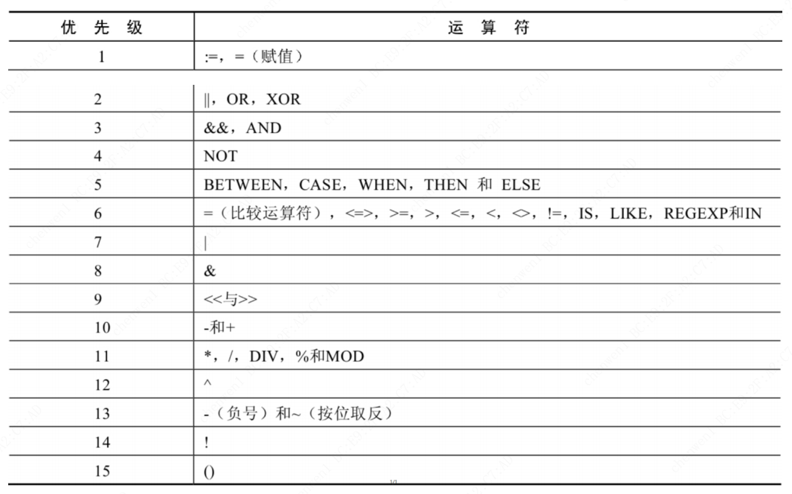
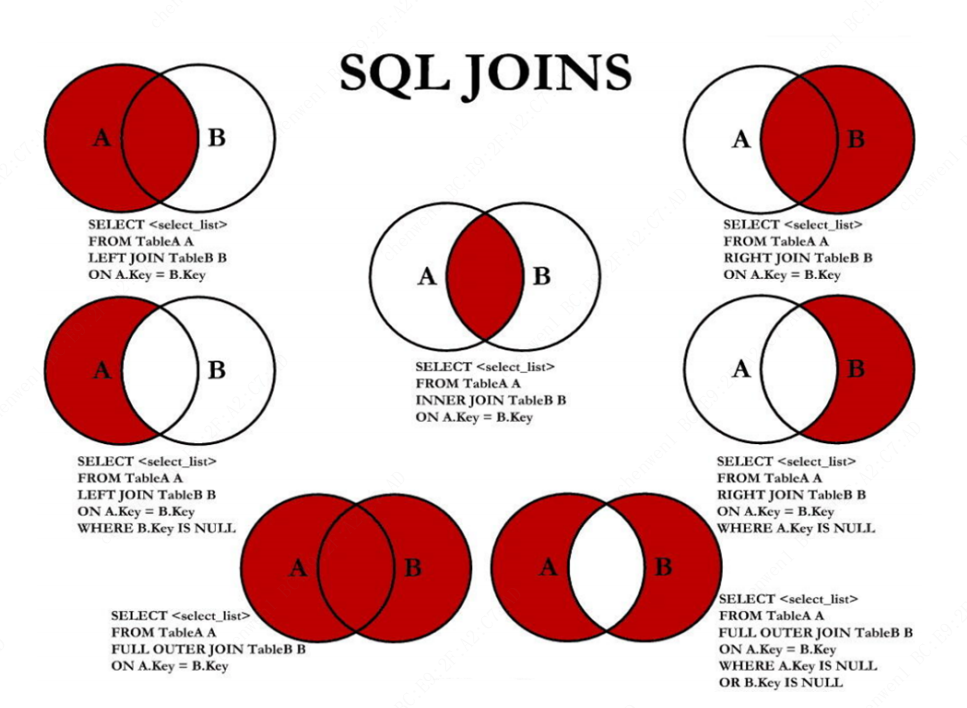

# MySQL

## 一、MySQL数据库基础篇

### 1. 数据库概述与MySQL安装篇

#### 第01章：数据库概述

* 为什么要使用数据库？

    持久化存储数据

* 数据库、数据库管理系统、SQL

    DB-数据库， 本质是一个文件系统，它保存了一系列有组织的数据
    
    DBMS-数据库管理系统，是操纵和管理数据的软件
    
    SQL-结构化查询语言（Structured Query Language）

* 关系型数据库和非关系型数据库

    * 关系型数据库RDBMS 以 行(row) 和 列(column) 的形式存储数据，以便于用户理解。这一系列的行和列被称为 表(table) ，一组表组成了一个库(database)。

    * 优势:

        复杂查询 可以用SQL语句方便的在一个表以及多个表之间做非常复杂的数据查询。

        事务支持 使得对于安全性能很高的数据访问要求得以实现
    
    * 非关系型数据库

        键值型数据库, 典型使用场景是作为内存缓存, redis
        
        文档型数据库, MongoDB, Couch DB

        搜索引擎数据库, Solr, Elasticsearch, Splunk
        
        列式数据库, HBase
        
        图形数据库, Neo4J, InfoGrid

* 数据库设计规则

    E-R（entity-relationship，实体-联系）模型中有三个主要概念是： 实体集、 属性、 联系集。

    一个实体集（class）对应于数据库中的一个表（table）
    
    一个实体（instance）则对应于数据库表中的一行（row），也称为一条记录（record）
    
    一个属性（attribute）对应于数据库表中的一列（column），也称为一个字段（field）。

* 表的关联关系

    
    一对一
    
    一对多: 在从表(多方)创建一个字段，字段作为外键指向主表(一方)的主键
    
    多对多: 要表示多对多关系，必须创建第三个表，该表通常称为 联接表，它将多对多关系划分为两个一对多关系，将这两个表的主键都插入到第三个表中
    
    自我引用: 


#### 第02章：MySQL环境搭建

* 登录方式

    * MySQL 自带客户端
    
    * 命令行

        ```sh
        mysql -h 主机名 -P 端口号 -u 用户名 -p密码

        # mysql -h localhost -P 3306 -u root -pabc123
        ```

* 修改编码

    在MySQL 8.0版本之前，默认字符集为 `latin1` ，utf8 字符集指向的是 `utf8mb3` 。

    从MySQL 8.0开始，数据库的默认编码改为 `utf8mb4` ，从而避免了上述的乱码问题

    * 步骤1：查看编码命令

        ```sh
        show variables like 'character_%';
        show variables like 'collation_%';
        ```

    * 步骤2：修改mysql的数据目录下的 my.ini 配置文件

        ```sh
        [mysql]
        ...
        default-character-set=utf8
        [mysqld]
        ...
        character-set-server=utf8
        collation-server=utf8_general_ci
        ```

    * 重启服务

* 查看目录信息

    ```sql
    mysql> SELECT @@basedir,@@datadir FROM DUAL;

    -- +---------------------------------------------+------------------------------------------+
    -- | @@datadir                                   | @@basedir                                |
    -- +---------------------------------------------+------------------------------------------+
    -- | C:\ProgramData\MySQL\MySQL Server 5.7\Data\ | C:\Program Files\MySQL\MySQL Server 5.7\ |
    -- +---------------------------------------------+------------------------------------------+

    mysql> SHOW VARIABLES LIKE '%dir%';
    ```

* 忘记root密码

    * 1 关闭mysqld进程
    
    * 2 执行命令手动启动mysql: `mysqld --defaults-file="xxxx/my.ini" --skip-grant-tables`
    
    * 3 连接到mysql: `mysql -uroot`
    
    * 4 修改密码

        ```sql
        use mysql;
        update user set authentication_string=password('password') where user='root' and Host='localhost';
        flush privileges;
        ```
    * 5 重启mysql服务, 此时不需要添加 `--skip-grant-tables` 参数

* 连接报错："Authentication plugin 'caching_sha2_password' cannot be loaded"

    出现这个原因是 MySQL8 之前的版本中加密规则是 `mysql_native_password`，而在MySQL8之后，加密规则是 `caching_sha2_password`。
    
    解决问题方法有两种，第一种是升级图形界面工具版本，第二种是把 MySQL8 用户登录密码加密规则还原成 `mysql_native_password`

    ```sql
    -- 使用mysql数据库
    USE mysql;
    
    -- 修改'root'@'localhost'用户的密码规则和密码
    ALTER USER 'root'@'localhost' IDENTIFIED WITH mysql_native_password BY 'abc123';
    
    -- 刷新权限
    FLUSH PRIVILEGE
    ```

* MySQL Workbench 报错："Could not acquire managementaccess for administrationRuntimeError"

    打开 `C:\Program Files\MySQL\MySQL Workbench 8.0\workbench`, 编辑 `os_utils`, 将 `encoding="utf-8"` 修改成 `encoding="gbk"`

    ```python
    # process = subprocess.Popen(command, stdin = subprocess.PIPE, encoding="utf-8", stdout = subprocess.PIPE, stderr = subprocess.STDOUT, shell=True)
    process = subprocess.Popen(command, stdin = subprocess.PIPE, encoding="gbk", stdout = subprocess.PIPE, stderr = subprocess.STDOUT, shell=True)
    ```


### 2. SQL之SELECT使用篇

#### 第03章：基本的SELECT语句

* SQL 分类

    DDL（Data Definition Languages、数据定义语言）: 定义了不同的数据库、表、视图、索引等数据库对象，还可以用来创建、删除、修改数据库和数据表的结构

    DML（Data Manipulation Language、数据操作语言）: 用于添加、删除、更新和查询数据库记录，并检查数据完整性

    DCL（Data Control Language、数据控制语言）: 用于定义数据库、表、字段、用户的访问权限和安全级别


    | 类型 | 关键字 |
    | -- | :-- |
    | DDL | CREATE, DROP, ALTER |
    | DML | INSERT, DELETE, UPDATE, SELECT |
    | DCL | GRANT, REVOKE,COMMIT, ROLLBACK, SAVEPOINT |

* SQL基本规则

    * SQL 可以写在一行或者多行。为了提高可读性，各子句分行写，必要时使用缩进

    * 每条命令以 `;` 或 `\g` 或 `\G` 结束

    * 关键字不能被缩写也不能分行

    * 关于标点符号
        
        * 必须保证所有的 `()`、单引号、双引号是 **成对** 结束的
        
        * 必须使用英文状态下的 **半角** 输入方式
        
        * 字符串型和日期时间类型的数据可以使用单引号 `''` 表示
        
        * 列的别名，尽量使用双引号 `""`，而且不建议省略 `as`

    * 大小写规范

        * 建议 数据库名、表名、表别名、字段名、字段别名等都小写
        * 建议 SQL 关键字、函数名、绑定变量等都大写

    * 注释

        * 单行注释：`# 注释文字` (MySQL特有的方式)

        * 单行注释：`-- 注释文字`(--后面必须包含一个空格。)

        * 多行注释：`/* 注释文字 */`

* 去除重复行: `DISTINCT`

    ```sql
    SELECT DISTINCT department_id
    FROM employees;
    ```

* 查询常数

    ```sql
    mysql> SELECT 'DaA' AS corporation, last_name
        -> FROM employees;

    -- +-------------+-----------+
    -- | corporation | last_name |
    -- +-------------+-----------+
    -- | DaA         | King      |
    -- | DaA         | Kochhar   |
    -- | DaA         | De Haan   |
    -- | DaA         | Hunold    |
    -- | DaA         | Ernst     |
    -- +-------------+-----------+
    ```

* 显示表结构: `DESC`/`DESCRIBE`


#### 第04章：运算符


* 算术运算符

    | 运算符 | 作用 |
    | -- | :-- |
    | + | 加, 计算和 |
    | - | 减, 计算差 |
    | * | 乘, 计算乘积 |
    | / 或 DIV | 除, 计算商 |
    | % 或 MOD | 求模/求余, 计算余数 |

    ```sql
    mysql> SELECT 100, 100 + 0, 100 - 0, 100 + 50, 100 + 50 -30, 100 + 35.5, 100 - 35.5
        -> FROM DUAL;

    -- +-----+---------+---------+----------+--------------+------------+------------+
    -- | 100 | 100 + 0 | 100 - 0 | 100 + 50 | 100 + 50 -30 | 100 + 35.5 | 100 - 35.5 |
    -- +-----+---------+---------+----------+--------------+------------+------------+
    -- | 100 |     100 |     100 |      150 |          120 |      135.5 |       64.5 |
    -- +-----+---------+---------+----------+--------------+------------+------------+
    -- 1 row in set (0.02 sec)
    ```

    一个整数类型的值对整数进行加法和减法操作，结果还是一个整数；一个整数类型的值对浮点数进行加法和减法操作，结果是一个浮点数。


    ```sql
    mysql> SELECT 100, 100 * 1, 100 * 1.0, 100 / 1.0, 100 / 2,100 + 2 * 5 / 2,100 /3, 100 DIV 0 
        -> FROM DUAL;

    -- +-----+---------+-----------+-----------+---------+-----------------+---------+-----------+
    -- | 100 | 100 * 1 | 100 * 1.0 | 100 / 1.0 | 100 / 2 | 100 + 2 * 5 / 2 | 100 /3  | 100 DIV 0 |
    -- +-----+---------+-----------+-----------+---------+-----------------+---------+-----------+
    -- | 100 |     100 |     100.0 |  100.0000 | 50.0000 |        105.0000 | 33.3333 |      NULL |
    -- +-----+---------+-----------+-----------+---------+-----------------+---------+-----------+
    -- 1 row in set (0.00 sec)


    mysql> SELECT employee_id, salary, salary * 12 AS annual_sal
        -> FROM employees LIMIT 0,5;

    -- +-------------+----------+------------+
    -- | employee_id | salary   | annual_sal |
    -- +-------------+----------+------------+
    -- |         100 | 24000.00 |  288000.00 |
    -- |         101 | 17000.00 |  204000.00 |
    -- |         102 | 17000.00 |  204000.00 |
    -- |         103 |  9000.00 |  108000.00 |
    -- |         104 |  6000.00 |   72000.00 |
    -- +-------------+----------+------------+
    -- 5 rows in set (0.00 sec)
    ```
    
    一个数乘以整数1和除以整数1后仍得原数；
    
    一个数乘以浮点数1和除以浮点数1后变成浮点数，数值与原数相等；
    
    一个数除以整数后，不管是否能除尽，结果都为一个浮点数；
    
    一个数除以另一个数，除不尽时，结果为一个浮点数，并保留到小数点后4位；
    
    乘法和除法的优先级相同，进行先乘后除操作与先除后乘操作，得出的结果相同。
    
    在数学运算中，0不能用作除数，在MySQL中，一个数除以0为NULL。


    ```sql
    mysql> SELECT 12 % 3, 12 MOD 5
        -> FROM DUAL;

    -- +--------+----------+
    -- | 12 % 3 | 12 mod 5 |
    -- +--------+----------+
    -- |      0 |        2 |
    -- +--------+----------+
    -- 1 row in set (0.05 sec)
    ```


* 比较运算符

    比较运算符用来对表达式左边的操作数和右边的操作数进行比较，比较的结果为真则返回1，比较的结果为假则返回0，其他情况则返回NULL。


    | 运算符 | 作用 |
    | -- | :-- |
    | = | 等于, 比较值,字符串,表达式是否相等 |
    | <=> | 等于, 可以对 NULL 值比较 |
    | <>,!= | 不等于 |
    | < | 小于 |
    | <= | 小于等于 |
    | > | 大于 |
    | >= | 大于等于 |

    非符号类型的运算符:

    | 运算符 | 作用 |
    | -- | :-- |
    | `IS NULL` | 为空 |
    | `ISNULL` | 为空 |
    | `IS NOT NULL` | 不为空 |
    | `LEAST` | 最小值, 在多个值中返回最小值 |
    | `GREATEST` | 最大值, 在多个值中返回最大值 |
    | `BETWEEN AND` | 两值之间, `[90,100]` |
    | `IN` | 属于, IN (A, B, ...) |
    | `NOT IN` | 不属于, NOT IN (A, B, ...) |
    | `LIKE` | 模糊匹配, `%`:任意个任意字符, `_`: 1个任意字符, `\`:转义字符 |
    | `REGEXP` | 正则表达式 |
    | `RELIKE` | 正则表达式 |

    ```sql
    SELECT job_id 
    FROM jobs 
    WHERE job_id LIKE 'IT$_%' ESCAPE '$'  -- 自定义转义字符
    ```

* 逻辑运算符

    | 运算符 | 作用 |
    | -- | :-- |
    | AND, && | 逻辑与 |
    | OR, \|\| | 逻辑或 |
    | NOT, ! | 逻辑非 |
    | XOR |  逻辑异或 | 


    ```sql
    mysql> SELECT NOT 1, NOT 0, NOT (1+1), NOT !1, NOT NULL;

    -- +-------+-------+-----------+--------+----------+
    -- | NOT 1 | NOT 0 | NOT (1+1) | NOT !1 | NOT NULL |
    -- +-------+-------+-----------+--------+----------+
    -- |     0 |     1 |         0 |      1 |     NULL |
    -- +-------+-------+-----------+--------+----------+
    -- 1 row in set (0.00 sec)


    mysql> SELECT 1 AND -1, 1 AND 0, 0 AND NULL, 1 AND NULL, -1 AND NULL;

    -- +----------+---------+------------+------------+-------------+
    -- | 1 AND -1 | 1 AND 0 | 0 AND NULL | 1 AND NULL | -1 AND NULL |
    -- +----------+---------+------------+------------+-------------+
    -- |        1 |       0 |          0 |       NULL |        NULL |
    -- +----------+---------+------------+------------+-------------+
    -- 1 row in set (0.01 sec)


    mysql> SELECT 1 OR -1, 1 OR 0, 0 OR NULL, 1 OR NULL, -1 OR NULL, NULL OR 1;
    
    -- +---------+--------+-----------+-----------+------------+-----------+
    -- | 1 OR -1 | 1 OR 0 | 0 OR NULL | 1 OR NULL | -1 OR NULL | NULL OR 1 |
    -- +---------+--------+-----------+-----------+------------+-----------+
    -- |       1 |      1 |      NULL |         1 |          1 |         1 |
    -- +---------+--------+-----------+-----------+------------+-----------+
    -- 1 row in set (0.01 sec)

    -- OR可以和AND一起使用，但是在使用时要注意两者的优先级，由于AND的优先级高于OR，因此先对AND两边的操作数进行操作，再与OR中的操作数结合。


    mysql> SELECT 0 XOR 0, 1 XOR -1, 1 XOR 0, 0 XOR NULL, 1 XOR NULL, -1 XOR NULL, NULL XOR 1;

    -- +---------+----------+---------+------------+------------+-------------+------------+
    -- | 0 XOR 0 | 1 XOR -1 | 1 XOR 0 | 0 XOR NULL | 1 XOR NULL | -1 XOR NULL | NULL XOR 1 |
    -- +---------+----------+---------+------------+------------+-------------+------------+
    -- |       0 |        0 |       1 |       NULL |       NULL |        NULL |       NULL |
    -- +---------+----------+---------+------------+------------+-------------+------------+
    -- 1 row in set (0.00 sec)

    -- 逻辑异或（XOR）运算符是当给定的值中任意一个值为NULL时，则返回NULL；如果两个非NULL的值都是0或者都不等于0时，则返回0；如果一个值为0，另一个值不为0时，则返回1。
    ```

* 位运算符

    | 运算符 | 作用 |
    | -- | :-- |
    | & | 按位与 |
    | \| | 按位或 |
    | ^ | 按位异或 |
    | ~ | 按位取反 |
    | >> | 按位右移 |
    | << | 按位左移 |

    按位右移运算符 按位右移（>>）运算符将给定的值的二进制数的所有位右移指定的位数。右移指定的位数后，右边低位的数值被移出并丢弃，左边高位空出的位置用0补齐

    按位左移运算符 按位左移（<<）运算符将给定的值的二进制数的所有位左移指定的位数。左移指定的位数后，左边高位的数值被移出并丢弃，右边低位空出的位置用0补齐。


* 运算符的优先级

    


#### 第05章：排序与分页

* 排序数据 `ORDER BY`
 
    ASC（ascend）: 升序

    DESC（descend）: 降序


    ```sql
    -- 单列排序
    SELECT last_name, job_id, department_id, hire_date
    FROM employees
    ORDER BY salary;  -- 可以使用 select 未选中的字段

    -- 多列排序
    SELECT last_name, job_id, department_id, hire_date
    FROM employees
    ORDER BY last_name, hire_date;

    -- 默认使用升序排列, 可使用 ASC 和 DESC 进行设置
    -- 使用 ASC 时, NULL值在最前面
    -- 使用 DESC 时, NULL值在最后面
    SELECT last_name, job_id, department_id, hire_date
    FROM employees
    ORDER BY last_name DESC, hire_date ASC;
    ```

* 分页

    ```sql
    SELECT ...
    FROM ...
    WHERE ...
    ORDER BY ...
    LIMIT [位置偏移量,] 行数 -- 位置偏移量省略时, 等同于设置为 0
    ```

    假设要设置每页显示 item_num 条记录, 则要显示第 x 页时:

    ```sql
    LIMIT (x-1)*item_num, item_num
    ```

    其他语言使用分页:

    ```sql
    --LIMIT: MySQL, PGSQL, SQLite
    SELECT last_name, job_id FROM employees LIMIT 10,5;

    --LIMIT ... OFFSET ...: MySQL 8.0
    SELECT last_name, job_id FROM employees LIMIT 5 OFFSET 10;

    -- TOP: SQL Server, Access
    SELECT TOP 5 name, hp_max FROM heros ORDER BY hp_max DESC;

    -- FETCH FIRST 5 ROWS ONLY
    SELECT name, hp_max FROM heros ORDER BY hp_max DESC FETCH FIRST 5 ROWS ONLY;

    -- rownum: Oracle 的 rownum 是个隐藏字段, 记录数据编号
    SELECT rownum,last_name,salary FROM employees WHERE rownum < 5 ORDER BY salary DESC;
    ```

#### 第06章：多表查询

多表查询，也称为关联查询，指两个或更多个表一起完成查询操作

前提条件：这些一起查询的表之间是有关系的（一对一、一对多），它们之间一定是有关联字段，这个关联字段可能建立了外键，也可能没有建立外键。比如：员工表和部门表，这两个表依靠“部门编号”进行关联。

* 笛卡尔积（交叉连接）

    CROSS JOIN

* 等值连接 VS 非等值连接

    ```sql
    -- 等值连接
    SELECT employees.employee_id, employees.last_name, employees.department_id, employees.department_id, departments.location_id
    FROM employees, departments
    WHERE employees.department_id = departments.department_id;

    -- 等值连接, 表别名
    SELECT e.employee_id, e.last_name, e.department_id, e.department_id, d.location_id
    FROM employees e, departments d
    WHERE e.department_id = d.department_id;

    -- 非等值连接: emlpoyees 表中的列工资在job_grades表中最高和最低工资之间的
    SELECT e.last_name, e.salary, j.grade_level
    FROM employees e, job_grades j
    WHERE e.salary BETWEEN j.lowest_sal AND j.highest_sal;
    ```

    总结：连接 n个表,至少需要n-1个连接条件。

* 自连接 vs 非自连接

    ```sql
    -- 查询employees表，返回“Xxx works for Xxx”
    SELECT CONCAT(emp.last_name, ' works for ', mgr.last_name)
    FROM employees emp, employees mgr
    WHERE emp.manager_id = mgr.employee_id;

    -- 查询出last_name为 ‘Chen’ 的员工的 manager 的信息
    SELECT mgr.*
    FROM employees emp, employees mgr
    WHERE emp.manager_id = mgr.employee_id
    AND emp.last_name = 'Chen';
    ```

* 内连接 vs 外连接

    * 内连接: 合并具有同一列的两个以上的表的行, 结果集中不包含一个表与另一个表不匹配的行

    * 外连接: 两个表在连接过程中除了返回满足连接条件的行以外还返回左（或右）表中不满足条件的行 ，这种连接称为左（或右） 外连接。没有匹配的行时, 结果表中相应的列为空(NULL)

        如果是左外连接，则连接条件中左边的表也称为 主表 ，右边的表称为 从表 。

        如果是右外连接，则连接条件中右边的表也称为 主表 ，左边的表称为 从表 。

    * 满外连接的结果: 左右表匹配的数据 + 左表没有匹配到的数据 + 右表没有匹配到的数据。

    ```sql
    -- SQL92 语法: 在 SQL92 中采用（+）代表从表所在的位置;  SQL92 没有全(满)外连接
    SELECT last_name,department_name
    FROM employees ,departments
    WHERE employees.department_id = departments.department_id(+);  -- 左外连接

    SELECT last_name,department_name
    FROM employees ,departments
    WHERE employees.department_id(+) = departments.department_id;  -- 右外连接

    -- SQL99 语法: JOIN, LEFT OUTER JOIN, RIGHT OUTER JOIN, FULL OUTER JOIN(MySql 不支持)
    SELECT employee_id, city, department_name
    FROM employees e
    JOIN departments d
    ON d.department_id = e.department_id
    JOIN locations l
    ON d.location_id = l.location_id;

    SELECT e.last_name, e.department_id, d.department_name
    FROM employees e
    LEFT OUTER JOIN departments d
    ON e.department_id = d.department_id;
    ```

* UNION 关键字: 合并查询结果

    `UNION`: 去掉重复记录

    `UNION ALL`: 对于重复的记录, 不去重

* 七种 `SQL JOINS`

    

    ```sql
    -- 中图：内连接 A∩B
    SELECT employee_id,last_name,department_name
    FROM employees e JOIN departments d
    ON e.`department_id` = d.`department_id`;

    -- 左上图：左外连接
    SELECT employee_id,last_name,department_name
    FROM employees e LEFT JOIN departments d
    ON e.`department_id` = d.`department_id`;

    -- 右上图：右外连接
    SELECT employee_id,last_name,department_name
    FROM employees e RIGHT JOIN departments d
    ON e.`department_id` = d.`department_id`;

    -- 左中图：A - A∩B
    SELECT employee_id,last_name,department_name
    FROM employees e LEFT JOIN departments d
    ON e.`department_id` = d.`department_id`
    WHERE d.`department_id` IS NULL

    -- 右中图：B - A∩B
    SELECT employee_id,last_name,department_name
    FROM employees e RIGHT JOIN departments d
    ON e.`department_id` = d.`department_id`
    WHERE e.`department_id` IS NULL

    -- 左下图：满外连接 = 左中图 + 右上图 A∪B 或 左上图 + 右中图
    SELECT employee_id,last_name,department_name
    FROM employees e LEFT JOIN departments d
    ON e.`department_id` = d.`department_id`
    WHERE d.`department_id` IS NULL
    UNION ALL  -- 没有去重操作，效率高
    SELECT employee_id,last_name,department_name
    FROM employees e RIGHT JOIN departments d
    ON e.`department_id` = d.`department_id`;

    SELECT employee_id,last_name,department_name
    FROM employees e LEFT JOIN departments d
    ON e.`department_id` = d.`department_id`
    UNION ON
    SELECT employee_id,last_name,department_name
    FROM employees e RIGHT JOIN departments d
    ON e.`department_id` = d.`department_id`
    WHERE e.`department_id` IS NULL

    -- 右下图: 左中图 + 右中图 A∪B - A∩B 或者 (A - A∩B) ∪ （B - A∩B）
    SELECT employee_id,last_name,department_name
    FROM employees e LEFT JOIN departments d
    ON e.`department_id` = d.`department_id`
    WHERE d.`department_id` IS NULL
    UNION ALL
    SELECT employee_id,last_name,department_name
    FROM employees e RIGHT JOIN departments d
    ON e.`department_id` = d.`department_id`
    WHERE e.`department_id` IS NULL
    ```

* SQL99 新特性

    * 自然连接: `NATUAL JOIN` 自动查询所有相同的字段, 进行等值连接

        ```sql
        SELECT employee_id,last_name,department_name
        FROM employees e NATURAL JOIN departments d;
        ```
    * `USING` 连接: 指定数据表里的 同名字段 进行等值连接

        ```sql
        SELECT employee_id,last_name,department_name
        FROM employees e JOIN departments d
        USING (department_id);
        ```

* `SQL92` 和 `SQL99` 是经典的 SQL 标准，也分别叫做 `SQL-2` 和 `SQL-3` 标准。

#### 第07章：单行函数

#### 第08章：聚合函数

#### 第09章：子查询

### 3. SQL之DDL、DML、DCL使用篇

#### 第10章：创建和管理表

#### 第11章：数据处理之增删改

#### 第12章：MySQL数据类型精讲

#### 第13章：约束

### 4. 其它数据库对象篇

#### 第14章：视图

#### 第15章：存储过程与函数

#### 第16章：变量、流程控制与游标

#### 第17章：触发器


### 5. MySQL8 新特性篇

#### 第18章：MySQL8其它新特性


## 二、MySQL高级特性篇

### 1. MySQL架构篇

#### 第01章：Linux下MySQL的安装与使用

#### 第02章：MySQL的数据目录

#### 第03章：用户与权限管理

#### 第04章：逻辑架构

#### 第05章：存储引擎

#### 第06章：InnoDB数据页结构

### 2. 索引及调优篇
#### 第07章：索引

#### 第08章：性能分析工具的使用

#### 第09章：索引优化与SQL优化

#### 第10章：数据库的设计规范

#### 第11章：数据库其他调优策略
### 3. 事务篇

#### 第12章：事务基础知识

#### 第13章：MySQL事务日志
#### 第14章：锁

#### 第15章：多版本并发控制(MVCC)

### 4. 日志与备份篇

#### 第16章：其它数据库日志

#### 第17章：主从复制

#### 第18章：数据库备份与恢复