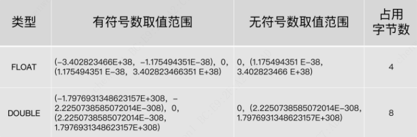

# MySQL

## 一、MySQL数据库基础篇

### 1. 数据库概述与MySQL安装篇

#### 第01章：数据库概述

* 为什么要使用数据库？

    持久化存储数据

* 数据库、数据库管理系统、SQL

    DB-数据库， 本质是一个文件系统，它保存了一系列有组织的数据
    
    DBMS-数据库管理系统，是操纵和管理数据的软件
    
    SQL-结构化查询语言（Structured Query Language）

* 关系型数据库和非关系型数据库

    * 关系型数据库RDBMS 以 行(row) 和 列(column) 的形式存储数据，以便于用户理解。这一系列的行和列被称为 表(table) ，一组表组成了一个库(database)。

    * 优势:

        复杂查询 可以用SQL语句方便的在一个表以及多个表之间做非常复杂的数据查询。

        事务支持 使得对于安全性能很高的数据访问要求得以实现
    
    * 非关系型数据库

        键值型数据库, 典型使用场景是作为内存缓存, redis
        
        文档型数据库, MongoDB, Couch DB

        搜索引擎数据库, Solr, Elasticsearch, Splunk
        
        列式数据库, HBase
        
        图形数据库, Neo4J, InfoGrid

* 数据库设计规则

    E-R（entity-relationship，实体-联系）模型中有三个主要概念是： 实体集、 属性、 联系集。

    一个实体集（class）对应于数据库中的一个表（table）
    
    一个实体（instance）则对应于数据库表中的一行（row），也称为一条记录（record）
    
    一个属性（attribute）对应于数据库表中的一列（column），也称为一个字段（field）。

* 表的关联关系

    
    一对一
    
    一对多: 在从表(多方)创建一个字段，字段作为外键指向主表(一方)的主键
    
    多对多: 要表示多对多关系，必须创建第三个表，该表通常称为 联接表，它将多对多关系划分为两个一对多关系，将这两个表的主键都插入到第三个表中
    
    自我引用: 


#### 第02章：MySQL环境搭建

* 登录方式

    * MySQL 自带客户端
    
    * 命令行

        ```sh
        mysql -h 主机名 -P 端口号 -u 用户名 -p密码

        # mysql -h localhost -P 3306 -u root -pabc123
        ```

* 修改编码

    在MySQL 8.0版本之前，默认字符集为 `latin1` ，utf8 字符集指向的是 `utf8mb3` 。

    从MySQL 8.0开始，数据库的默认编码改为 `utf8mb4` ，从而避免了上述的乱码问题

    * 步骤1：查看编码命令

        ```sh
        show variables like 'character_%';
        show variables like 'collation_%';
        ```

    * 步骤2：修改mysql的数据目录下的 my.ini 配置文件

        ```sh
        [mysql]
        ...
        default-character-set=utf8
        [mysqld]
        ...
        character-set-server=utf8
        collation-server=utf8_general_ci
        ```

    * 重启服务

* 查看目录信息

    ```sql
    mysql> SELECT @@basedir,@@datadir FROM DUAL;

    +---------------------------------------------+------------------------------------------+
    | @@datadir                                   | @@basedir                                |
    +---------------------------------------------+------------------------------------------+
    | C:\ProgramData\MySQL\MySQL Server 5.7\Data\ | C:\Program Files\MySQL\MySQL Server 5.7\ |
    +---------------------------------------------+------------------------------------------+

    mysql> SHOW VARIABLES LIKE '%dir%';
    ```

* 忘记root密码

    * 1 关闭mysqld进程
    
    * 2 执行命令手动启动mysql: `mysqld --defaults-file="xxxx/my.ini" --skip-grant-tables`
    
    * 3 连接到mysql: `mysql -uroot`
    
    * 4 修改密码

        ```sql
        use mysql;
        update user set authentication_string=password('password') where user='root' and Host='localhost';
        flush privileges;
        ```

    * 5 重启mysql服务, 此时不需要添加 `--skip-grant-tables` 参数

* 连接报错："Authentication plugin 'caching_sha2_password' cannot be loaded"

    出现这个原因是 MySQL8 之前的版本中加密规则是 `mysql_native_password`，而在MySQL8之后，加密规则是 `caching_sha2_password`。
    
    解决问题方法有两种，第一种是升级图形界面工具版本，第二种是把 MySQL8 用户登录密码加密规则还原成 `mysql_native_password`

    ```sql
    -- 使用mysql数据库
    USE mysql;
    
    -- 修改'root'@'localhost'用户的密码规则和密码
    ALTER USER 'root'@'localhost' IDENTIFIED WITH mysql_native_password BY 'abc123';
    
    -- 刷新权限
    FLUSH PRIVILEGE
    ```

* MySQL Workbench 报错："Could not acquire managementaccess for administrationRuntimeError"

    打开 `C:\Program Files\MySQL\MySQL Workbench 8.0\workbench`, 编辑 `os_utils`, 将 `encoding="utf-8"` 修改成 `encoding="gbk"`

    ```python
    # process = subprocess.Popen(command, stdin = subprocess.PIPE, encoding="utf-8", stdout = subprocess.PIPE, stderr = subprocess.STDOUT, shell=True)
    process = subprocess.Popen(command, stdin = subprocess.PIPE, encoding="gbk", stdout = subprocess.PIPE, stderr = subprocess.STDOUT, shell=True)
    ```


### 2. SQL之SELECT使用篇

#### 第03章：基本的SELECT语句

* SQL 分类

    DDL（Data Definition Languages、数据定义语言）: 定义了不同的数据库、表、视图、索引等数据库对象，还可以用来创建、删除、修改数据库和数据表的结构

    DML（Data Manipulation Language、数据操作语言）: 用于添加、删除、更新和查询数据库记录，并检查数据完整性

    DCL（Data Control Language、数据控制语言）: 用于定义数据库、表、字段、用户的访问权限和安全级别


    | 类型 | 关键字                                     |
    | ---- | :----------------------------------------- |
    | DDL  | CREATE, DROP, ALTER, RENAME, TRUNCATE      |
    | DML  | INSERT, DELETE, UPDATE, SELECT             |
    | DCL  | GRANT, REVOKE, COMMIT, ROLLBACK, SAVEPOINT |

* SQL基本规则

    * SQL 可以写在一行或者多行。为了提高可读性，各子句分行写，必要时使用缩进

    * 每条命令以 `;` 或 `\g` 或 `\G` 结束

    * 关键字不能被缩写也不能分行

    * 关于标点符号
        
        * 必须保证所有的 `()`、单引号、双引号是 **成对** 结束的
        
        * 必须使用英文状态下的 **半角** 输入方式
        
        * 字符串型和日期时间类型的数据可以使用单引号 `''` 表示
        
        * 列的别名，尽量使用双引号 `""`，而且不建议省略 `as`

    * 大小写规范

        * 建议 数据库名、表名、表别名、字段名、字段别名等都小写
        * 建议 SQL 关键字、函数名、绑定变量等都大写

    * 注释

        * 单行注释：`# 注释文字` (MySQL特有的方式)

        * 单行注释：`-- 注释文字`(--后面必须包含一个空格。)

        * 多行注释：`/* 注释文字 */`

* 去除重复行: `DISTINCT`

    ```sql
    SELECT DISTINCT department_id
    FROM employees;
    ```

* 查询常数

    ```sql
    mysql> SELECT 'DaA' AS corporation, last_name
        -> FROM employees;

    +-------------+-----------+
    | corporation | last_name |
    +-------------+-----------+
    | DaA         | King      |
    | DaA         | Kochhar   |
    | DaA         | De Haan   |
    | DaA         | Hunold    |
    | DaA         | Ernst     |
    +-------------+-----------+
    ```

* 显示表结构: `DESC`/`DESCRIBE`


#### 第04章：运算符


* 算术运算符

    | 运算符   | 作用                |
    | -------- | :------------------ |
    | +        | 加, 计算和          |
    | -        | 减, 计算差          |
    | *        | 乘, 计算乘积        |
    | / 或 DIV | 除, 计算商          |
    | % 或 MOD | 求模/求余, 计算余数 |

    ```sql
    mysql> SELECT 100, 100 + 0, 100 - 0, 100 + 50, 100 + 50 -30, 100 + 35.5, 100 - 35.5
        -> FROM DUAL;

    +-----+---------+---------+----------+--------------+------------+------------+
    | 100 | 100 + 0 | 100 - 0 | 100 + 50 | 100 + 50 -30 | 100 + 35.5 | 100 - 35.5 |
    +-----+---------+---------+----------+--------------+------------+------------+
    | 100 |     100 |     100 |      150 |          120 |      135.5 |       64.5 |
    +-----+---------+---------+----------+--------------+------------+------------+
    1 row in set (0.02 sec)
    ```

    一个整数类型的值对整数进行加法和减法操作，结果还是一个整数；一个整数类型的值对浮点数进行加法和减法操作，结果是一个浮点数。


    ```sql
    mysql> SELECT 100, 100 * 1, 100 * 1.0, 100 / 1.0, 100 / 2,100 + 2 * 5 / 2,100 /3, 100 DIV 0 
        -> FROM DUAL;

    +-----+---------+-----------+-----------+---------+-----------------+---------+-----------+
    | 100 | 100 * 1 | 100 * 1.0 | 100 / 1.0 | 100 / 2 | 100 + 2 * 5 / 2 | 100 /3  | 100 DIV 0 |
    +-----+---------+-----------+-----------+---------+-----------------+---------+-----------+
    | 100 |     100 |     100.0 |  100.0000 | 50.0000 |        105.0000 | 33.3333 |      NULL |
    +-----+---------+-----------+-----------+---------+-----------------+---------+-----------+
    1 row in set (0.00 sec)


    mysql> SELECT employee_id, salary, salary * 12 AS annual_sal
        -> FROM employees LIMIT 0,5;

    +-------------+----------+------------+
    | employee_id | salary   | annual_sal |
    +-------------+----------+------------+
    |         100 | 24000.00 |  288000.00 |
    |         101 | 17000.00 |  204000.00 |
    |         102 | 17000.00 |  204000.00 |
    |         103 |  9000.00 |  108000.00 |
    |         104 |  6000.00 |   72000.00 |
    +-------------+----------+------------+
    5 rows in set (0.00 sec)
    ```
    
    一个数乘以整数1和除以整数1后仍得原数；
    
    一个数乘以浮点数1和除以浮点数1后变成浮点数，数值与原数相等；
    
    一个数除以整数后，不管是否能除尽，结果都为一个浮点数；
    
    一个数除以另一个数，除不尽时，结果为一个浮点数，并保留到小数点后4位；
    
    乘法和除法的优先级相同，进行先乘后除操作与先除后乘操作，得出的结果相同。
    
    在数学运算中，0不能用作除数，在MySQL中，一个数除以0为NULL。


    ```sql
    mysql> SELECT 12 % 3, 12 MOD 5
        -> FROM DUAL;

    +--------+----------+
    | 12 % 3 | 12 mod 5 |
    +--------+----------+
    |      0 |        2 |
    +--------+----------+
    1 row in set (0.05 sec)
    ```


* 比较运算符

    比较运算符用来对表达式左边的操作数和右边的操作数进行比较，比较的结果为真则返回1，比较的结果为假则返回0，其他情况则返回NULL。


    | 运算符 | 作用                               |
    | ------ | :--------------------------------- |
    | =      | 等于, 比较值,字符串,表达式是否相等 |
    | <=>    | 等于, 可以对 NULL 值比较           |
    | <>,!=  | 不等于                             |
    | <      | 小于                               |
    | <=     | 小于等于                           |
    | >      | 大于                               |
    | >=     | 大于等于                           |

    非符号类型的运算符:

    | 运算符        | 作用                                                         |
    | ------------- | :----------------------------------------------------------- |
    | `IS NULL`     | 为空                                                         |
    | `ISNULL`      | 为空                                                         |
    | `IS NOT NULL` | 不为空                                                       |
    | `LEAST`       | 最小值, 在多个值中返回最小值                                 |
    | `GREATEST`    | 最大值, 在多个值中返回最大值                                 |
    | `BETWEEN AND` | 两值之间, `[90,100]`                                         |
    | `IN`          | 属于, IN (A, B, ...)                                         |
    | `NOT IN`      | 不属于, NOT IN (A, B, ...)                                   |
    | `LIKE`        | 模糊匹配, `%`:任意个任意字符, `_`: 1个任意字符, `\`:转义字符 |
    | `REGEXP`      | 正则表达式                                                   |
    | `RELIKE`      | 正则表达式                                                   |

    ```sql
    SELECT job_id 
    FROM jobs 
    WHERE job_id LIKE 'IT$_%' ESCAPE '$'  -- 自定义转义字符
    ```

* 逻辑运算符

    | 运算符   | 作用     |
    | -------- | :------- |
    | AND, &&  | 逻辑与   |
    | OR, \|\| | 逻辑或   |
    | NOT, !   | 逻辑非   |
    | XOR      | 逻辑异或 |


    ```sql
    mysql> SELECT NOT 1, NOT 0, NOT (1+1), NOT !1, NOT NULL;

    +-------+-------+-----------+--------+----------+
    | NOT 1 | NOT 0 | NOT (1+1) | NOT !1 | NOT NULL |
    +-------+-------+-----------+--------+----------+
    |     0 |     1 |         0 |      1 |     NULL |
    +-------+-------+-----------+--------+----------+
    1 row in set (0.00 sec)


    mysql> SELECT 1 AND -1, 1 AND 0, 0 AND NULL, 1 AND NULL, -1 AND NULL;

    +----------+---------+------------+------------+-------------+
    | 1 AND -1 | 1 AND 0 | 0 AND NULL | 1 AND NULL | -1 AND NULL |
    +----------+---------+------------+------------+-------------+
    |        1 |       0 |          0 |       NULL |        NULL |
    +----------+---------+------------+------------+-------------+
    1 row in set (0.01 sec)


    mysql> SELECT 1 OR -1, 1 OR 0, 0 OR NULL, 1 OR NULL, -1 OR NULL, NULL OR 1;
    
    +---------+--------+-----------+-----------+------------+-----------+
    | 1 OR -1 | 1 OR 0 | 0 OR NULL | 1 OR NULL | -1 OR NULL | NULL OR 1 |
    +---------+--------+-----------+-----------+------------+-----------+
    |       1 |      1 |      NULL |         1 |          1 |         1 |
    +---------+--------+-----------+-----------+------------+-----------+
    1 row in set (0.01 sec)

    -- OR可以和AND一起使用，但是在使用时要注意两者的优先级，由于AND的优先级高于OR，因此先对AND两边的操作数进行操作，再与OR中的操作数结合。


    mysql> SELECT 0 XOR 0, 1 XOR -1, 1 XOR 0, 0 XOR NULL, 1 XOR NULL, -1 XOR NULL, NULL XOR 1;

    +---------+----------+---------+------------+------------+-------------+------------+
    | 0 XOR 0 | 1 XOR -1 | 1 XOR 0 | 0 XOR NULL | 1 XOR NULL | -1 XOR NULL | NULL XOR 1 |
    +---------+----------+---------+------------+------------+-------------+------------+
    |       0 |        0 |       1 |       NULL |       NULL |        NULL |       NULL |
    +---------+----------+---------+------------+------------+-------------+------------+
    1 row in set (0.00 sec)

    -- 逻辑异或（XOR）运算符是当给定的值中任意一个值为NULL时，则返回NULL；如果两个非NULL的值都是0或者都不等于0时，则返回0；如果一个值为0，另一个值不为0时，则返回1。
    ```

* 位运算符

    | 运算符 | 作用     |
    | ------ | :------- |
    | &      | 按位与   |
    | \|     | 按位或   |
    | ^      | 按位异或 |
    | ~      | 按位取反 |
    | >>     | 按位右移 |
    | <<     | 按位左移 |

    按位右移运算符 按位右移（>>）运算符将给定的值的二进制数的所有位右移指定的位数。右移指定的位数后，右边低位的数值被移出并丢弃，左边高位空出的位置用0补齐

    按位左移运算符 按位左移（<<）运算符将给定的值的二进制数的所有位左移指定的位数。左移指定的位数后，左边高位的数值被移出并丢弃，右边低位空出的位置用0补齐。


* 运算符的优先级

    


#### 第05章：排序与分页

* 排序数据 `ORDER BY`
 
    ASC（ascend）: 升序

    DESC（descend）: 降序


    ```sql
    -- 单列排序
    SELECT last_name, job_id, department_id, hire_date
    FROM employees
    ORDER BY salary;  -- 可以使用 select 未选中的字段

    -- 多列排序
    SELECT last_name, job_id, department_id, hire_date
    FROM employees
    ORDER BY last_name, hire_date;

    -- 默认使用升序排列, 可使用 ASC 和 DESC 进行设置
    -- 使用 ASC 时, NULL值在最前面
    -- 使用 DESC 时, NULL值在最后面
    SELECT last_name, job_id, department_id, hire_date
    FROM employees
    ORDER BY last_name DESC, hire_date ASC;
    ```

* 分页

    ```sql
    SELECT ...
    FROM ...
    WHERE ...
    ORDER BY ...
    LIMIT [位置偏移量,] 行数 -- 位置偏移量省略时, 等同于设置为 0
    ```

    假设要设置每页显示 item_num 条记录, 则要显示第 x 页时:

    ```sql
    LIMIT (x-1)*item_num, item_num
    ```

    其他语言使用分页:

    ```sql
    --LIMIT: MySQL, PGSQL, SQLite
    SELECT last_name, job_id FROM employees LIMIT 10,5;

    --LIMIT ... OFFSET ...: MySQL 8.0
    SELECT last_name, job_id FROM employees LIMIT 5 OFFSET 10;

    -- TOP: SQL Server, Access
    SELECT TOP 5 name, hp_max FROM heros ORDER BY hp_max DESC;

    -- FETCH FIRST 5 ROWS ONLY
    SELECT name, hp_max FROM heros ORDER BY hp_max DESC FETCH FIRST 5 ROWS ONLY;

    -- rownum: Oracle 的 rownum 是个隐藏字段, 记录数据编号
    SELECT rownum,last_name,salary FROM employees WHERE rownum < 5 ORDER BY salary DESC;
    ```

#### 第06章：多表查询

多表查询，也称为关联查询，指两个或更多个表一起完成查询操作

前提条件：这些一起查询的表之间是有关系的（一对一、一对多），它们之间一定是有关联字段，这个关联字段可能建立了外键，也可能没有建立外键。比如：员工表和部门表，这两个表依靠“部门编号”进行关联。

* 笛卡尔积（交叉连接）

    CROSS JOIN

* 等值连接 VS 非等值连接

    ```sql
    -- 等值连接
    SELECT employees.employee_id, employees.last_name, employees.department_id, employees.department_id, departments.location_id
    FROM employees, departments
    WHERE employees.department_id = departments.department_id;

    -- 等值连接, 表别名
    SELECT e.employee_id, e.last_name, e.department_id, e.department_id, d.location_id
    FROM employees e, departments d
    WHERE e.department_id = d.department_id;

    -- 非等值连接: emlpoyees 表中的列工资在job_grades表中最高和最低工资之间的
    SELECT e.last_name, e.salary, j.grade_level
    FROM employees e, job_grades j
    WHERE e.salary BETWEEN j.lowest_sal AND j.highest_sal;
    ```

    总结：连接 n个表,至少需要n-1个连接条件。

* 自连接 vs 非自连接

    ```sql
    -- 查询employees表，返回“Xxx works for Xxx”
    SELECT CONCAT(emp.last_name, ' works for ', mgr.last_name)
    FROM employees emp, employees mgr
    WHERE emp.manager_id = mgr.employee_id;

    -- 查询出last_name为 ‘Chen’ 的员工的 manager 的信息
    SELECT mgr.*
    FROM employees emp, employees mgr
    WHERE emp.manager_id = mgr.employee_id
    AND emp.last_name = 'Chen';
    ```

* 内连接 vs 外连接

    * 内连接: 合并具有同一列的两个以上的表的行, 结果集中不包含一个表与另一个表不匹配的行

    * 外连接: 两个表在连接过程中除了返回满足连接条件的行以外还返回左（或右）表中不满足条件的行 ，这种连接称为左（或右） 外连接。没有匹配的行时, 结果表中相应的列为空(NULL)

        如果是左外连接，则连接条件中左边的表也称为 主表 ，右边的表称为 从表 。

        如果是右外连接，则连接条件中右边的表也称为 主表 ，左边的表称为 从表 。

    * 满外连接的结果: 左右表匹配的数据 + 左表没有匹配到的数据 + 右表没有匹配到的数据。

    ```sql
    -- SQL92 语法: 在 SQL92 中采用（+）代表从表所在的位置;  SQL92 没有全(满)外连接
    SELECT last_name,department_name
    FROM employees ,departments
    WHERE employees.department_id = departments.department_id(+);  -- 左外连接

    SELECT last_name,department_name
    FROM employees ,departments
    WHERE employees.department_id(+) = departments.department_id;  -- 右外连接

    -- SQL99 语法: JOIN, LEFT OUTER JOIN, RIGHT OUTER JOIN, FULL OUTER JOIN(MySql 不支持)
    SELECT employee_id, city, department_name
    FROM employees e
    JOIN departments d
    ON d.department_id = e.department_id
    JOIN locations l
    ON d.location_id = l.location_id;

    SELECT e.last_name, e.department_id, d.department_name
    FROM employees e
    LEFT OUTER JOIN departments d
    ON e.department_id = d.department_id;
    ```

* UNION 关键字: 合并查询结果

    `UNION`: 去掉重复记录

    `UNION ALL`: 对于重复的记录, 不去重

* 七种 `SQL JOINS`

    

    ```sql
    -- 中图：内连接 A∩B
    SELECT employee_id,last_name,department_name
    FROM employees e JOIN departments d
    ON e.`department_id` = d.`department_id`;

    -- 左上图：左外连接
    SELECT employee_id,last_name,department_name
    FROM employees e LEFT JOIN departments d
    ON e.`department_id` = d.`department_id`;

    -- 右上图：右外连接
    SELECT employee_id,last_name,department_name
    FROM employees e RIGHT JOIN departments d
    ON e.`department_id` = d.`department_id`;

    -- 左中图：A - A∩B
    SELECT employee_id,last_name,department_name
    FROM employees e LEFT JOIN departments d
    ON e.`department_id` = d.`department_id`
    WHERE d.`department_id` IS NULL

    -- 右中图：B - A∩B
    SELECT employee_id,last_name,department_name
    FROM employees e RIGHT JOIN departments d
    ON e.`department_id` = d.`department_id`
    WHERE e.`department_id` IS NULL

    -- 左下图：满外连接 = 左中图 + 右上图 A∪B 或 左上图 + 右中图
    SELECT employee_id,last_name,department_name
    FROM employees e LEFT JOIN departments d
    ON e.`department_id` = d.`department_id`
    WHERE d.`department_id` IS NULL
    UNION ALL  -- 没有去重操作，效率高
    SELECT employee_id,last_name,department_name
    FROM employees e RIGHT JOIN departments d
    ON e.`department_id` = d.`department_id`;

    SELECT employee_id,last_name,department_name
    FROM employees e LEFT JOIN departments d
    ON e.`department_id` = d.`department_id`
    UNION ON
    SELECT employee_id,last_name,department_name
    FROM employees e RIGHT JOIN departments d
    ON e.`department_id` = d.`department_id`
    WHERE e.`department_id` IS NULL

    -- 右下图: 左中图 + 右中图 A∪B - A∩B 或者 (A - A∩B) ∪ （B - A∩B）
    SELECT employee_id,last_name,department_name
    FROM employees e LEFT JOIN departments d
    ON e.`department_id` = d.`department_id`
    WHERE d.`department_id` IS NULL
    UNION ALL
    SELECT employee_id,last_name,department_name
    FROM employees e RIGHT JOIN departments d
    ON e.`department_id` = d.`department_id`
    WHERE e.`department_id` IS NULL
    ```

* SQL99 新特性

    * 自然连接: `NATUAL JOIN` 自动查询所有相同的字段, 进行等值连接

        ```sql
        SELECT employee_id,last_name,department_name
        FROM employees e NATURAL JOIN departments d;
        ```
    * `USING` 连接: 指定数据表里的 同名字段 进行等值连接

        ```sql
        SELECT employee_id,last_name,department_name
        FROM employees e JOIN departments d
        USING (department_id);
        ```

* `SQL92` 和 `SQL99` 是经典的 SQL 标准，也分别叫做 `SQL-2` 和 `SQL-3` 标准。

#### 第07章：单行函数


从 *实现的功能角度* 可以分为数值函数、字符串函数、日期和时间函数、流程控制函数、加密与解密函数、获取MySQL信息函数、聚合函数等。

这些丰富的内置函数又可以分为两类： 单行函数 、 聚合函数（或分组函数）


```text
     +----------------------+     
-->  | Single-line function |  --> 
     +----------------------+     

-->  +----------------------+          
-->  |  Aggregate function  |  -->     
-->  +----------------------+          
```


##### 数值函数

* 基本函数

    | 函数                    | 作用                                                                    |
    | ----------------------- | :---------------------------------------------------------------------- |
    | `ABS(x)`                | 返回 x 的绝对值                                                         |
    | `SIGN(x)`               | 返回 x 的符号: 正数返回 1, 负数返回 -1, 0 返回 0                        |
    | `PI()`                  | 返回圆周率的值                                                          |
    | `CEIL(x)`, `CEILING(x)` | 返回大于或等于某个值的最小整数                                          |
    | `FLOOR(x)`              | 返回小于或等于某个值的最大整数                                          |
    | `LEAST(e1,e2,e3…)`      | 返回列表中的最小值                                                      |
    | `GREATEST(e1,e2,e3…)`   | 返回列表中的最大值                                                      |
    | `MOD(x,y)`              | 返回 x 除以 y 后的余数                                                  |
    | `RAND()`                | 返回 0~1 的随机值                                                       |
    | `RAND(x)`               | 返回 0~1 的随机值, 其中 x 的值用作种子值, 相同的 x 值会产生相同的随机数 |
    | `ROUND(x)`              | 返回一个对 x 的值进行四舍五入后，最接近于 x 的整数                      |
    | `ROUND(x,y)`            | 返回一个对 x 的值进行四舍五入后最接近 x 的值，并保留到小数点后面 y 位   |
    | `TRUNCATE(x,y)`         | 返回数字 x 截断为 y 位小数的结果                                        |
    | `SQRT(x)`               | 返回 x 的平方根; 当 x 的值为负数时, 返回 NULL                           |

    ```sql
    mysql> SELECT CEIL(3.33), FLOOR(3.33), LEAST(1,1.0,3,5,5.0), GREATEST(1,1.0,3,5,5.0,"a");

    +------------+-------------+----------------------+-----------------------------+
    | CEIL(3.33) | FLOOR(3.33) | LEAST(1,1.0,3,5,5.0) | GREATEST(1,1.0,3,5,5.0,"a") |
    +------------+-------------+----------------------+-----------------------------+
    |          4 |           3 | 1.0                  | a                           |
    +------------+-------------+----------------------+-----------------------------+
    1 row in set (0.06 sec)

    mysql> SELECT MOD(10,3), RAND(), RAND(1), RAND(1), RAND(2);

    +-----------+--------------------+---------------------+---------------------+--------------------+
    | MOD(10,3) | RAND()             | RAND(1)             | RAND(1)             | RAND(2)            |
    +-----------+--------------------+---------------------+---------------------+--------------------+
    |         1 | 0.8114012673603382 | 0.40540353712197724 | 0.40540353712197724 | 0.6555866465490187 |
    +-----------+--------------------+---------------------+---------------------+--------------------+
    1 row in set (0.04 sec)

    mysql> SELECT ROUND(3.33), ROUND(-3.33), ROUND(3.53), TRUNCATE(3.33335,4), TRUNCATE(3, 3), SQRT(4), SQRT(-4);

    +-------------+--------------+-------------+---------------------+----------------+---------+----------+
    | ROUND(3.33) | ROUND(-3.33) | ROUND(3.53) | TRUNCATE(3.33335,4) | TRUNCATE(3, 3) | SQRT(4) | SQRT(-4) |
    +-------------+--------------+-------------+---------------------+----------------+---------+----------+
    | 3           | -3           | 4           | 3.3333              |              3 |       2 | NULL     |
    +-------------+--------------+-------------+---------------------+----------------+---------+----------+
    1 row in set (0.04 sec)
    ```

* 2 角度与弧度互换函数

    | 函数         | 用法                                  |
    | ------------ | :------------------------------------ |
    | `RADIANS(x)` | 将角度转化为弧度，其中，参数x为角度值 |
    | `DEGREES(x)` | 将弧度转化为角度，其中，参数x为弧度值 |

    ```sql
    mysql> SELECT RADIANS(30),RADIANS(60),RADIANS(90),DEGREES(2*PI()),DEGREES(RADIANS(90)) FROM DUAL;

    +--------------------+--------------------+--------------------+-----------------+----------------------+
    | RADIANS(30)        | RADIANS(60)        | RADIANS(90)        | DEGREES(2*PI()) | DEGREES(RADIANS(90)) |
    +--------------------+--------------------+--------------------+-----------------+----------------------+
    | 0.5235987755982988 | 1.0471975511965976 | 1.5707963267948966 |             360 |                   90 |
    +--------------------+--------------------+--------------------+-----------------+----------------------+
    1 row in set (0.07 sec)
    ```

* 3 三角函数

    | 函数         | 用法                                                                   |
    | ------------ | :--------------------------------------------------------------------- |
    | `SIN(x)`     | 返回x的正弦值，其中，参数x为弧度值                                     |
    | `ASIN(x)`    | 返回x的反正弦值，即获取正弦为x的值。如果x的值不在-1到1之间，则返回NULL |
    | `COS(x)`     | 返回x的余弦值，其中，参数x为弧度值                                     |
    | `ACOS(x)`    | 返回x的反余弦值，即获取余弦为x的值。如果x的值不在-1到1之间，则返回NULL |
    | `TAN(x)`     | 返回x的正切值，其中，参数x为弧度值                                     |
    | `ATAN(x)`    | 返回x的反正切值，即返回正切值为x的值                                   |
    | `ATAN2(m,n)` | 返回两个参数的反正切值                                                 |
    | `COT(x)`     | 返回x的余切值，其中，X为弧度值                                         |


    `ATAN2(M,N)` 函数返回两个参数的反正切值。 与 `ATAN(X)` 函数相比，`ATAN2(M,N)` 需要两个参数，例如有两个点 `point(x1,y1)` 和 `point(x2,y2)`，使用 `ATAN(X)` 函数计算反正切值为`ATAN((y2-y1)/(x2-x1))`，使用 `ATAN2(M,N)` 计算反正切值则为 `ATAN2(y2-y1,x2-x1)`。由使用方式可以看出，当 `x2-x1` 等于0时，`ATAN(X)` 函数会报错，而 `ATAN2(M,N)` 函数则仍然可以计算。

    ```sql
    mysql> SELECT PI()/2, SIN(PI()/2), ASIN(1), COS(PI()), COS(0), TAN(RADIANS(45)), TAN(PI()/4);

    +--------------+-------------+--------------------+-----------+--------+--------------------+--------------------+
    | PI()/2       | SIN(PI()/2) | ASIN(1)            | COS(PI()) | COS(0) | TAN(RADIANS(45))   | TAN(PI()/4)        |
    +--------------+-------------+--------------------+-----------+--------+--------------------+--------------------+
    | 1.5707963268 |           1 | 1.5707963267948966 |        -1 |      1 | 0.9999999999999999 | 0.9999999999999999 |
    +--------------+-------------+--------------------+-----------+--------+--------------------+--------------------+
    1 row in set (0.06 sec)

    mysql> SELECT ATAN(1), DEGREES(ATAN(1)), DEGREES(ATAN(1, 0));

    +--------------------+------------------+---------------------+
    | ATAN(1)            | DEGREES(ATAN(1)) | DEGREES(ATAN(1, 0)) |
    +--------------------+------------------+---------------------+
    | 0.7853981633974483 |               45 |                  90 |
    +--------------------+------------------+---------------------+
    1 row in set (0.05 sec)
    ```

* 4 指数与对数

    | 函数                   | 用法                                                 |
    | ---------------------- | ---------------------------------------------------- |
    | `POW(x,y)，POWER(X,Y)` | 返回x的y次方                                         |
    | `EXP(X)`               | 返回e的X次方，其中e是一个常数，2.718281828459045     |
    | `LN(X)，LOG(X)`        | 返回以e为底的X的对数，当X <= 0 时，返回的结果为NULL  |
    | `LOG10(X)`             | 返回以10为底的X的对数，当X <= 0 时，返回的结果为NULL |
    | `LOG2(X)`              | 返回以2为底的X的对数，当X <= 0 时，返回NULL          |

    ```sql
    mysql> SELECT POW(2,10), EXP(2), LN(EXP(2)),LOG10(100), LOG2(1024);

    +-----------+------------------+------------+------------+------------+
    | POW(2,10) | EXP(2)           | LN(EXP(2)) | LOG10(100) | LOG2(1024) |
    +-----------+------------------+------------+------------+------------+
    |      1024 | 7.38905609893065 |          2 |          2 |         10 |
    +-----------+------------------+------------+------------+------------+
    1 row in set (0.05 sec)
    ```

* 5 进制间转换

    | 函数            | 用法                     |
    | --------------- | :----------------------- |
    | `BIN(x)`        | 返回x的二进制编码        |
    | `HEX(x)`        | 返回x的十六进制编码      |
    | `OCT(x)`        | 返回x的八进制编码        |
    | `CONV(x,f1,f2)` | 返回f1进制数变成f2进制数 |

    ```sql
    mysql> SELECT BIN(10),HEX(10),OCT(10),CONV(10,2,8);

    +---------+---------+---------+--------------+
    | BIN(10) | HEX(10) | OCT(10) | CONV(10,2,8) |
    +---------+---------+---------+--------------+
    | 1010    | A       | 12      | 2            |
    +---------+---------+---------+--------------+
    1 row in set (0.04 sec)
    ```


#####  字符串函数

| 函数                                | 用法                                                                                                                  |
| ----------------------------------- | :-------------------------------------------------------------------------------------------------------------------- |
| `ASCII(S)`                          | 返回字符串S中的第一个字符的ASCII码值                                                                                  |
| `CHAR_LENGTH(s)`                    | 返回字符串s的字符数。作用与 `CHARACTER_LENGTH(s)` 相同                                                                |
| `LENGTH(s)`                         | 返回字符串s的字节数，和字符集有关                                                                                     |
| `CONCAT(s1,s2,......,sn)`           | 连接 s1,s2,......,sn 为一个字符串                                                                                     |
| `CONCAT_WS(x, s1,s2,......,sn)`     | 同 `CONCAT(s1,s2,...)` 函数，但是每个字符串之间要加上 x                                                               |
| `INSERT(str, idx, len, replacestr)` | 将字符串str从第idx位置开始、len个字符长的子串替换为字符串 replacestr                                                  |
| `REPLACE(str, a, b)`                | 用字符串b替换字符串str中所有出现的字符串a                                                                             |
| `UPPER(s)`, `UCASE(s)`              | 将字符串s的所有字母转成大写字母                                                                                       |
| `LOWER(s)`, `LCASE(s)`              | 将字符串s的所有字母转成小写字母                                                                                       |
| `LEFT(str,n)`                       | 返回字符串str最左边的n个字符                                                                                          |
| `RIGHT(str,n)`                      | 返回字符串str最右边的n个字符                                                                                          |
| `LPAD(str, len, pad)`               | 用字符串pad对str最左边进行填充，直到str的长度为len个字符                                                              |
| `RPAD(str ,len, pad)`               | 用字符串pad对str最右边进行填充，直到str的长度为len个字符                                                              |
| `LTRIM(s)`                          | 去掉字符串s左侧的空格                                                                                                 |
| `RTRIM(s)`                          | 去掉字符串s右侧的空格                                                                                                 |
| `TRIM(s)`                           | 去掉字符串s开始与结尾的空格                                                                                           |
| `TRIM(s1 FROM s)`                   | 去掉字符串s开始与结尾的s1                                                                                             |
| `TRIM(LEADING s1 FROM s)`           | 去掉字符串s开始处的s1                                                                                                 |
| `TRIM(TRAILING s1 FROM s)`          | 去掉字符串s结尾处的s1                                                                                                 |
| `REPEAT(str, n)`                    | 返回str重复n次的结果                                                                                                  |
| `SPACE(n)`                          | 返回n个空格                                                                                                           |
| `STRCMP(s1,s2)`                     | 比较字符串s1,s2的ASCII码值的大小                                                                                      |
| `SUBSTR(s,index,len)`               | 返回从字符串s的index位置其len个字符<br>作用与 `SUBSTRING(s,n,len)`、 `MID(s,n,len)`相同                               |
| `LOCATE(substr,str)`                | 返回字符串substr在字符串str中首次出现的位置，未找到返回0<br>作用与 `POSITION(substr IN str)`、`INSTR(str,substr)`相同 |
| `ELT(m,s1,s2,…,sn)`                 | 返回指定位置的字符串，如果m=1，则返回s1，如果m=2，则返回s2，如果m=n，则返回sn                                         |
| `FIELD(s,s1,s2,…,sn)`               | 返回字符串s在字符串列表中第一次出现的位置                                                                             |
| `FIND_IN_SET(s1,s2)`                | 返回字符串s1在字符串s2中出现的位置。其中，字符串s2是一个以逗号分隔的字符串                                            |
| `REVERSE(s)`                        | 返回s反转后的字符串                                                                                                   |
| `NULLIF(value1,value2)`             | 比较两个字符串，如果value1与value2相等，则返回NULL，否则返回value1                                                    |

> 注意：MySQL中，字符串的位置是从1开始的。


##### 日期和时间函数

* 获取时间和日期

    | 函数                                                                           | 用法                           |
    | ------------------------------------------------------------------------------ | :----------------------------- |
    | `CURDATE()`, `CURRENT_DATE()`                                                  | 返回当前日期，只包含年、月、日 |
    | `CURTIME()`, `CURRENT_TIME()`                                                  | 返回当前时间，只包含时、分、秒 |
    | `NOW()`, `SYSDATE()`, `CURRENT_TIMESTAMP()`, `LOCALTIME()`, `LOCALTIMESTAMP()` | 返回当前系统日期和时间         |
    | `UTC_DATE()`                                                                   | 返回UTC（世界标准时间）日期    |
    | `UTC_TIME()`                                                                   | 返回UTC（世界标准时间）时间    |

    ```sql
    mysql> SELECT CURDATE(),CURTIME(),NOW(),SYSDATE(),SYSDATE()+0,UTC_DATE(),UTC_DATE()+0,UTC_TIME(),UTC_TIME()+0 FROM DUAL;
    +------------+-----------+---------------------+---------------------+----------------+------------+--------------+------------+--------------+
    | CURDATE()  | CURTIME() | NOW()               | SYSDATE()           | SYSDATE()+0    | UTC_DATE() | UTC_DATE()+0 | UTC_TIME() | UTC_TIME()+0 |
    +------------+-----------+---------------------+---------------------+----------------+------------+--------------+------------+--------------+
    | 2022-08-24 | 10:41:23  | 2022-08-24 10:41:23 | 2022-08-24 10:41:23 | 20220824104123 | 2022-08-24 |     20220824 | 02:41:23   |        24123 |
    +------------+-----------+---------------------+---------------------+----------------+------------+--------------+------------+--------------+
    1 row in set (0.06 sec)
    ```

* 日期与时间戳的转换

    | 函数                       | 用法                                   |
    | -------------------------- | :------------------------------------- |
    | `UNIX_TIMESTAMP()`         | 以UNIX时间戳的形式返回当前时间         |
    | `UNIX_TIMESTAMP(date)`     | 将时间date以UNIX时间戳的形式返回       |
    | `FROM_UNIXTIME(timestamp)` | 将UNIX时间戳的时间转换为普通格式的时间 |

    ```sql
    mysql> SELECT UNIX_TIMESTAMP(), UNIX_TIMESTAMP(NOW()), UNIX_TIMESTAMP('2022-08-24 12:00:00'), FROM_UNIXTIME(1661309121);
    +------------------+-----------------------+---------------------------------------+---------------------------+
    | UNIX_TIMESTAMP() | UNIX_TIMESTAMP(NOW()) | UNIX_TIMESTAMP('2022-08-24 12:00:00') | FROM_UNIXTIME(1661309121) |
    +------------------+-----------------------+---------------------------------------+---------------------------+
    |       1661309188 |            1661309188 |                            1661313600 | 2022-08-24 10:45:21       |
    +------------------+-----------------------+---------------------------------------+---------------------------+
    1 row in set (0.05 sec)
    ```


*  获取月份、星期、星期数、天数等函数

    | 函数                                         | 用法                                            |
    | -------------------------------------------- | :---------------------------------------------- |
    | `YEAR(date)`, `MONTH(date)`, `DAY(date)`     | 返回具体的日期值                                |
    | `HOUR(time)`, `MINUTE(time)`, `SECOND(time)` | 返回具体的时间值                                |
    | `MONTHNAME(date)`                            | 返回月份：January，...                          |
    | `DAYNAME(date)`                              | 返回星期几：MONDAY，TUESDAY.....SUNDAY          |
    | `WEEKDAY(date)`                              | 返回周几，注意，周1是0，周2是1，。。。周日是6   |
    | `QUARTER(date)`                              | 返回日期对应的季度，范围为1～4                  |
    | `WEEK(date)`, `WEEKOFYEAR(date)`             | 返回一年中的第几周                              |
    | `DAYOFYEAR(date)`                            | 返回日期是一年中的第几天                        |
    | `DAYOFMONTH(date)`                           | 返回日期位于所在月份的第几天                    |
    | `DAYOFWEEK(date)`                            | 返回周几，注意：周日是1，周一是2，。。。周六是7 |

    ```sql
    mysql> SELECT DAYNAME(CURDATE()),WEEKDAY(CURDATE()),DAYOFWEEK(CURDATE()),DAYOFYEAR(CURDATE());
    +--------------------+--------------------+----------------------+----------------------+
    | DAYNAME(CURDATE()) | WEEKDAY(CURDATE()) | DAYOFWEEK(CURDATE()) | DAYOFYEAR(CURDATE()) |
    +--------------------+--------------------+----------------------+----------------------+
    | Wednesday          |                  2 |                    4 |                  236 |
    +--------------------+--------------------+----------------------+----------------------+
    1 row in set (0.06 sec)
    ```


* 日期的操作函数

    | 函数                      | 用法                                       |
    | ------------------------- | :----------------------------------------- |
    | `EXTRACT(type FROM date)` | 返回指定日期中特定的部分，type指定返回的值 |

    type:

    | type取值             | 含义                         |
    | -------------------- | :--------------------------- |
    | `MICROSECOND`        | 返回毫秒数                   |
    | `SECOND`             | 返回秒数                     |
    | `MINUTE`             | 返回分钟数                   |
    | `HOUR`               | 返回小时数                   |
    | `DAY`                | 返回天数                     |
    | `WEEK`               | 返回日期在一年中的第几个星期 |
    | `MONTH`              | 返回日期在一年中的第几个月   |
    | `QUARTER`            | 返回日期在一年中的第几个季度 |
    | `YEAR`               | 返回日期的年份               |
    | `SECOND_MICROSECOND` | 返回秒和毫秒值               |
    | `MINUTE_MICROSECOND` | 返回分钟和毫秒值             |
    | `HOUR_MICROSECOND`   | 返回小时和毫秒值             |
    | `DAY_MICROSECOND`    | 返回天和毫秒值               |
    | `MINUTE_SECOND`      | 返回分钟和秒值               |
    | `HOUR_SECOND`        | 返回小时和秒值               |
    | `DAY_SECOND`         | 返回天和秒值                 |
    | `HOUR_MINUTE`        | 返回小时和分钟值             |
    | `DAY_MINUTE`         | 返回天和分钟值               |
    | `DAY_HOUR`           | 返回天和小时                 |
    | `YEAR_MONTH`         | 返回年和月                   |

    ```sql
    SELECT EXTRACT(MINUTE FROM NOW()),EXTRACT( WEEK FROM NOW()), EXTRACT( QUARTER FROM NOW()),EXTRACT( MINUTE_SECOND FROM NOW()) FROM DUAL;
    ```

* 时间和秒钟转换的函数

    | 函数                   | 用法                                                                     |
    | ---------------------- | :----------------------------------------------------------------------- |
    | `TIME_TO_SEC(time)`    | 将 time 转化为秒并返回结果值。转化的公式为： `小时*3600 + 分钟*60 + 秒 ` |
    | `SEC_TO_TIME(seconds)` | 将 seconds 描述转化为包含小时、分钟和秒的时间                            |

    ```sql
    mysql> SELECT TIME_TO_SEC(NOW());
    +--------------------+
    | TIME_TO_SEC(NOW()) |
    +--------------------+
    |              39969 |
    +--------------------+
    1 row in set (0.05 sec)

    mysql> SELECT SEC_TO_TIME(39950);
    +--------------------+
    | SEC_TO_TIME(39950) |
    +--------------------+
    | 11:05:50           |
    +--------------------+
    1 row in set (0.04 sec)
    ```


* 计算日期和时间的函数

    * 第一组

        | 函数                                                                         | 用法                                           |
        | ---------------------------------------------------------------------------- | :--------------------------------------------- |
        | `DATE_ADD(datetime, INTERVAL expr type)`, `ADDDATE(date,INTERVAL expr type)` | 返回与给定日期时间相差INTERVAL时间段的日期时间 |
        | `DATE_SUB(date,INTERVAL expr type)`, `SUBDATE(date,INTERVAL expr type)`      | 返回与date相差INTERVAL时间间隔的日期           |

        | 间隔类型        | 含义       |
        | --------------- | :--------- |
        | `HOUR`          | 小时       |
        | `MINUTE`        | 分钟       |
        | `SECOND`        | 秒         |
        | `YEAR`          | 年         |
        | `MONTH`         | 月         |
        | `DAY`           | 日         |
        | `YEAR_MONTH`    | 年和月     |
        | `DAY_HOUR`      | 日和小时   |
        | `DAY_MINUTE`    | 日和分钟   |
        | `DAY_SECOND`    | 日和秒     |
        | `HOUR_MINUTE`   | 小时和分钟 |
        | `HOUR_SECOND`   | 小时和秒   |
        | `MINUTE_SECOND` | 分钟和秒   |


    * 第二组

        | 函数                           | 用法                                                                     |
        | ------------------------------ | :----------------------------------------------------------------------- |
        | `ADDTIME(time1,time2)`         | 返回 `time1 + time2` 的时间。当time2为一个数字时，代表的是秒，可以为负数 |
        | `SUBTIME(time1,time2)`         | 返回 `time1 - time2` 的时间。当time2为一个数字时，代表的是秒，可以为负数 |
        | `DATEDIFF(date1,date2)`        | 返回 `date1 - date2` 的日期间隔天数                                      |
        | `TIMEDIFF(time1, time2)`       | 返回 `time1 - time2` 的时间间隔                                          |
        | `FROM_DAYS(N)`                 | 返回从0000年1月1日起，N天以后的日期                                      |
        | `TO_DAYS(date)`                | 返回日期date距离0000年1月1日的天数                                       |
        | `LAST_DAY(date)`               | 返回date所在月份的最后一天的日期                                         |
        | `MAKEDATE(year,n)`             | 针对给定年份与所在年份中的天数返回一个日期                               |
        | `MAKETIME(hour,minute,second)` | 将给定的小时、分钟和秒组合成时间并返回                                   |
        | `PERIOD_ADD(time,n)`           | 返回time加上n后的时间                                                    |

        ```sql
        mysql> SELECT ADDTIME(NOW(),20),
        SUBTIME(NOW(),30),SUBTIME(NOW(),'1:1:3'),
        DATEDIFF(NOW(),'2021-10- 01'), TIMEDIFF(NOW(),'2021-10-25 22:10:10'),
        FROM_DAYS(366),TO_DAYS('0000-12-25'),
        LAST_DAY(NOW()),
        MAKEDATE(YEAR(NOW()),12),MAKETIME(10,21,23),
        PERIOD_ADD(20200101010101, 10) 
        FROM DUAL;
        +---------------------+---------------------+------------------------+-------------------------------+---------------------------------------+
        | ADDTIME(NOW(),20)   | SUBTIME(NOW(),30)   | SUBTIME(NOW(),'1:1:3') | DATEDIFF(NOW(),'2021-10- 01') | TIMEDIFF(NOW(),'2021-10-25 22:10:10') |
        +---------------------+---------------------+------------------------+-------------------------------+---------------------------------------+
        | 2022-08-24 13:08:16 | 2022-08-24 13:07:26 | 2022-08-24 12:06:53    | NULL                          | 838:59:59                             |
        +---------------------+---------------------+------------------------+-------------------------------+---------------------------------------+
        +----------------+-----------------------+-----------------+--------------------------+--------------------+--------------------------------+
        | FROM_DAYS(366) | TO_DAYS('0000-12-25') | LAST_DAY(NOW()) | MAKEDATE(YEAR(NOW()),12) | MAKETIME(10,21,23) | PERIOD_ADD(20200101010101, 10) |
        +----------------+-----------------------+-----------------+--------------------------+--------------------+--------------------------------+
        | 0001-01-01     |                   359 | 2022-08-31      | 2022-01-12               | 10:21:23           |                 20200101010111 |
        +----------------+-----------------------+-----------------+--------------------------+--------------------+--------------------------------+
        1 row in set (0.07 sec)
        ```


* 日期的格式化与解析

    | 函数                                | 用法                                       |
    | ----------------------------------- | :----------------------------------------- |
    | `DATE_FORMAT(date,fmt)`             | 按照字符串fmt格式化日期date值              |
    | `TIME_FORMAT(time,fmt)`             | 按照字符串fmt格式化时间time值              |
    | `GET_FORMAT(date_type,format_type)` | 返回日期字符串的显示格式                   |
    | `STR_TO_DATE(str, fmt)`             | 按照字符串fmt对str进行解析，解析为一个日期 |

    `fmt` 说明:

    | 格式符 | 说明                                                        | 格式符    | 说明                                                        |
    | ------ | :---------------------------------------------------------- | --------- | :---------------------------------------------------------- |
    | `%Y`   | 4位数字表示年份                                             | `%y`      | 表示两位数字表示年份                                        |
    | `%M`   | 月名表示月份（January,....）                                | ` %m`     | 两位数字表示月份（01,02,03。。。）                          |
    | `%b`   | 缩写的月名（Jan.，Feb.，....）                              | `%c`      | 数字表示月份（1,2,3,...）                                   |
    | `%D`   | 英文后缀表示月中的天数（1st,2nd,3rd,...）                   | `%d`      | 两位数字表示月中的天数(01,02...)                            |
    | `%e`   | 数字形式表示月中的天数（1,2,3,4,5.....）                    |           |                                                             |
    | `%H`   | 两位数字表示小数，24小时制（01,02..）                       | `%h`,`%I` | 两位数字表示小时，12小时制（01,02..）                       |
    | `%k`   | 数字形式的小时，24小时制(1,2,3)                             | `%l`      | 数字形式表示小时，12小时制（1,2,3,4....）                   |
    | `%i`   | 两位数字表示分钟（00,01,02）                                | `%S`,`%s` | 两位数字表示秒(00,01,02...)                                 |
    | `%W`   | 一周中的星期名称（Sunday...）                               | `%a`      | 一周中的星期缩写（Sun.， Mon.,Tues.，..）                   |
    | `%w`   | 以数字表示周中的天数(0=Sunday,1=Monday....)                 |           |                                                             |
    | `%j`   | 以3位数字表示年中的天数(001,002...)                         |           |                                                             |
    | `%u`   | 以数字表示年中的第几周，（1,2,3。。）其中Monday为周中第一天 | `%U`      | 以数字表示年中的第几周，（1,2,3。。）其中Sunday为周中第一天 |
    | `%T`   | 24小时制                                                    | `%r`      | 12小时制                                                    |
    | `%p`   | AM或PM                                                      | `%%`      | 表示%                                                       |

    `format_type` 说明:

    | 日期类型 | 格式化类型 | 返回的格式化字符串  |
    | -------- | ---------- | :------------------ |
    | DATE     | UAS        | `%m.%d.%Y`          |
    | DATE     | JIS        | `%Y-%m-%d`          |
    | DATE     | ISO        | `%Y-%m-%d`          |
    | DATE     | EUR        | `%d.%m.%Y`          |
    | DATE     | INTERNAL   | `%Y%m%d`            |
    | TIME     | UAS        | `%h:%i:%s %p`       |
    | TIME     | JIS        | `%H:%i:%s`          |
    | TIME     | ISO        | `%H:%i:%s`          |
    | TIME     | EUR        | `%H.%i.%s`          |
    | TIME     | INTERNAL   | `%H%i%s`            |
    | DATETIME | UAS        | `%Y-%m-%d %H.%i.%s` |
    | DATETIME | JIS        | `%Y-%m-%d %H:%i:%s` |
    | DATETIME | ISO        | `%Y-%m-%d %H:%i:%s` |
    | DATETIME | EUR        | `%Y-%m-%d %H.%i.%s` |
    | DATETIME | INTERNAL   | `%Y%m%d%H%i%s`      |

    ```sql
    mysql> SELECT DATE_FORMAT(NOW(), '%H:%i:%s');
    +--------------------------------+
    | DATE_FORMAT(NOW(), '%H:%i:%s') |
    +--------------------------------+
    | 13:54:42                       |
    +--------------------------------+
    1 row in set (0.07 sec)
    ```

    ```sql
    mysql> SELECT STR_TO_DATE('09/01/2009','%m/%d/%Y') FROM DUAL; 
    mysql> SELECT STR_TO_DATE('20140422154706','%Y%m%d%H%i%s') FROM DUAL; 
    mysql> SELECT STR_TO_DATE('2014-04-22 15:47:06','%Y-%m-%d %H:%i:%s') FROM DUAL;

    +--------------------------------------+
    | STR_TO_DATE('09/01/2009','%m/%d/%Y') |
    +--------------------------------------+
    | 2009-09-01                           |
    +--------------------------------------+
    1 row in set (0.05 sec)

    +----------------------------------------------+
    | STR_TO_DATE('20140422154706','%Y%m%d%H%i%s') |
    +----------------------------------------------+
    | 2014-04-22 15:47:06                          |
    +----------------------------------------------+
    1 row in set (0.04 sec)

    +--------------------------------------------------------+
    | STR_TO_DATE('2014-04-22 15:47:06','%Y-%m-%d %H:%i:%s') |
    +--------------------------------------------------------+
    | 2014-04-22 15:47:06                                    |
    +--------------------------------------------------------+
    1 row in set (0.04 sec)
    ```


    ```sql
    mysql>  SELECT GET_FORMAT(DATE, 'USA');
    +-------------------------+
    | GET_FORMAT(DATE, 'USA') |
    +-------------------------+
    | %m.%d.%Y                |
    +-------------------------+
    1 row in set (0.04 sec)
    ```

    ```sql
    mysql> SELECT STR_TO_DATE('2020-01-01 00:00:00','%Y-%m-%d');
    +-----------------------------------------------+
    | STR_TO_DATE('2020-01-01 00:00:00','%Y-%m-%d') |
    +-----------------------------------------------+
    | 2020-01-01                                    |
    +-----------------------------------------------+
    1 row in set (0.06 sec)
    ```

##### 流程控制函数

| 函数                                                             | 用法                                                     |
| ---------------------------------------------------------------- | :------------------------------------------------------- |
| `IF(value,value1,value2)`                                        | 如果value的值为TRUE，返回value1，否则返回value2          |
| `IFNULL(value1, value2)`                                         | 如果value1不为NULL，返回value1，否则返回value2           |
| `CASE WHEN 条件1 THEN 结果1 WHEN 条件2 THEN 结果2 .... END `     | [ELSE resultn] END 相当于Java的 `if...else if...else...` |
| `CASE expr WHEN 常量值1 THEN 值1 WHEN 常量值1 THEN 值1 .... END` | [ELSE 值n] END 相当于Java的 `switch...case...`           |


##### 加密与解密函数

| 函数                          | 用法                                                                                             |
| ----------------------------- | :----------------------------------------------------------------------------------------------- |
| `PASSWORD(str)`               | 返回字符串str的加密版本，41位长的字符串。加密结果不可逆，常用于用户的密码加密                    |
| `MD5(str)`                    | 返回字符串str的md5加密后的值，也是一种加密方式。若参数为NULL，则会返回NULL                       |
| `SHA(str)`                    | 从原明文密码str计算并返回加密后的密码字符串，当参数为NULL时，返回NULL。 SHA加密算法比MD5更加安全 |
| `ENCODE(value,password_seed)` | 返回使用password_seed作为加密密码加密value                                                       |
| `DECODE(value,password_seed)` | 返回使用password_seed作为加密密码解密value                                                       |


```sql
mysql> SELECT PASSWORD('123qweQ.'), PASSWORD(NULL);
+-------------------------------------------+----------------+
| PASSWORD('123qweQ.')                      | PASSWORD(NULL) |
+-------------------------------------------+----------------+
| *72B5A801E03A3AFA691E8D3CAF408AE1754556E0 |                |
+-------------------------------------------+----------------+
1 row in set, 1 warning (0.01 sec)

mysql> SELECT MD5('123qweQ.'), MD5(NULL);
+----------------------------------+-----------+
| MD5('123qweQ.')                  | MD5(NULL) |
+----------------------------------+-----------+
| 1baf552968e601886430572ec3c555ed | NULL      |
+----------------------------------+-----------+
1 row in set (0.02 sec)

mysql> SELECT SHA('123qweQ.'), SHA(NULL);
+------------------------------------------+-----------+
| SHA('123qweQ.')                          | SHA(NULL) |
+------------------------------------------+-----------+
| 3b7fd58445a1c52a5170c6c406c4fd18794ef8d1 | NULL      |
+------------------------------------------+-----------+
1 row in set (0.01 sec)

mysql> SELECT ENCODE('123qweQ.','thisisased');  -- 命令行执行才生效
+---------------------------------+
| ENCODE('123qweQ.','thisisased') |
+---------------------------------+
| �;Լ:>�g                        |
+---------------------------------+
1 row in set, 1 warning (0.00 sec)

mysql> SELECT DECODE(ENCODE('123qweQ.','thisisased'), 'thisisased');
+-------------------------------------------------------+
| DECODE(ENCODE('123qweQ.','thisisased'), 'thisisased') |
+-------------------------------------------------------+
| 123qweQ.                                              |
+-------------------------------------------------------+
1 row in set, 2 warnings (0.00 sec)
```


##### MySQL信息函数

| 函数                                                       | 用法                                                                                                   |
| ---------------------------------------------------------- | :----------------------------------------------------------------------------------------------------- |
| `VERSION()`                                                | 返回当前MySQL的版本号                                                                                  |
| `CONNECTION_ID()`                                          | 返回当前MySQL服务器的连接ID                                                                            |
| `DATABASE()`,`SCHEMA()`                                    | 返回MySQL命令行当前所在的数据库                                                                        |
| `USER()`,`CURRENT_USER()`,`SYSTEM_USER()`,`SESSION_USER()` | 返回当前连接MySQL的用户名，返回结果格式为 “主机名@用户名” CHARSET(value) 返回字符串value自变量的字符集 |
| `COLLATION(value)`                                         | 返回字符串value的比较规则                                                                              |

##### 其他函数

| 函数                             | 用法                                                                      |
| -------------------------------- | :------------------------------------------------------------------------ |
| `FORMAT(value,n)`                | 返回对数字value进行格式化后的结果数据。n表示 四舍五入 后保留到小数点后n位 |
| `CONV(value,from,to)`            | 将value的值进行不同进制之间的转换                                         |
| `INET_ATON(ipvalue)`             | 将以点分隔的IP地址转化为一个数字                                          |
| `INET_NTOA(value)`               | 将数字形式的IP地址转化为以点分隔的IP地址                                  |
| `BENCHMARK(n,expr)`              | 将表达式expr重复执行n次。用于测试MySQL处理expr表达式所耗费的时间          |
| `CONVERT(value USING char_code)` | 将value所使用的字符编码修改为char_code                                    |


#### 第08章：聚合函数
 
* 什么是聚合函数?

聚合函数作用于一组数据，并对一组数据返回一个值。

* 聚合函数类型
    * `AVG()` - 数值型数据
    * `SUM()` - 数值型数据
    * `MAX()` - 任意数据类型
    * `MIN()` - 任意数据类型
    * `COUNT()` - 任意数据类型

* 语法

    ```sql
    SELECT [column,] group_function(column), ...
    FROM  table
    [WHERE condition]
    [GROUP BY column]
    [ORDER BY column]
    ```

    聚合函数不能嵌套调用。比如不能出现类似 `AVG(SUM(字段名称))` 形式的调用

* COUNT()

    * COUNT(*) - 返回总记录数
    * COUNT(column) - 返回 column 不为空的记录数
    * 问题：用 `count(*)`，`count(1)`，`count(列名)`谁好呢?
        * 对于 MyISAM 引擎的表是没有区别的。这种引擎内部有一计数器在维护着行数。
        * Innodb 引擎的表用 `count(*)`, `count(1)` 直接读行数，复杂度是 O(n)，因为 innodb 真的要去数一遍。但好于具体的count(列名)。

* GROUP BY - 分组

    * 在 SELECT 列表中所有未包含在组函数中的列都应该包含在 GROUP BY子句中, 不然显示会有问题

        ```sql
        SELECT last_name, department_id, AVG(salary)
        FROM employees
        GROUP BY department_id;
        ```

    * 包含在 GROUP BY 子句中的列不必包含在 SELECT 列表中

        ```sql
        SELECT AVG(salary)
        FROM employees
        GROUP BY department_id;
        ```     

    * 使用多个列分组

        ```sql
        SELECT department_id, job_id, AVG(salary)
        FROM employees
        GROUP BY department_id, job_id;
        ```

    * 使用 `WITH ROLLUP`

        查询结果最后一行出现汇总结果; 和 `ORDER BY` 一起使用时无效(无法确定哪行是汇总结果)

* HAVING - 过滤分组

    * 使用
        1. 行已经被分组。
        2. 使用了聚合函数
        3. 满足 HAVING 子句中条件的分组将被显示
        4. HAVING 不能单独使用，必须要跟 GROUP BY 一起使用

        ```sql
        SELECT [column,] group_function(column), ...
        FROM  table
        [WHERE condition]
        [GROUP BY column]
        [HAVING group_conditon]
        [ORDER BY column]
        ```

    * 有了 WHERE 为什么还需要 HAVING ?

        因为不能在 WHERE 子句中使用聚合函数，在查询语法结构中，WHERE 在 GROUP BY 之前执行，所以无法对分组结果进行筛选。

    |          | 优点                         | 缺点                                   |
    | -------- | :--------------------------- | :------------------------------------- |
    | `WHERE`  | 先筛选数据再关联，执行效率高 | 不能使用分组中的计算函数进行筛选       |
    | `HAVING` | 可以使用分组中的计算函数     | 在最后的结果集中进行筛选，执行效率较低 |


* SELECT 语句的执行顺序

    ```sql
    FROM -> WHERE -> GROUP BY -> HAVING -> SELECT 的字段 -> DISTINCT -> ORDER BY -> LIMIT

    FROM <left_table>
    ON <join_condition>
    <join_type> JOIN <right_table> 
    WHERE <where_condition>
    GROUP BY <group_by_list>
    HAVING <having_condition>
    SELECT 
    DISTINCT <select_list>
    ORDER BY <order_by_condition>
    LIMIT <limit_number>
    ```

* SELECT 语句执行原理

    SELECT 是先执行 FROM 这一步的。在这个阶段，如果是多张表联查，还会经历下面的几个步骤：

    1. 首先先通过 `CROSS JOIN` 求笛卡尔积，相当于得到虚拟表 vt（virtual table）1-1； 
    2. 通过 `ON` 进行筛选，在虚拟表 `vt1-1` 的基础上进行筛选，得到虚拟表 `vt1-2`； 
    3. 添加外部行。如果我们使用的是左连接、右链接或者全连接，就会涉及到外部行，也就是在虚拟表 `vt1-2` 的基础上增加外部行，得到虚拟表 `vt1-3`。

    当然如果我们操作的是两张以上的表，还会重复上面的步骤，直到所有表都被处理完为止。这个过程得到是我们的原始数据。

    当我们拿到了查询数据表的原始数据，也就是最终的虚拟表 `vt1` ，就可以在此基础上再进行 `WHERE` 阶段 。在这个阶段中，会根据 `vt1` 表的结果进行筛选过滤，得到虚拟表 `vt2` 。

    然后进入第三步和第四步，也就是 `GROUP` 和 `HAVING` 阶段 。在这个阶段中，实际上是在虚拟表 `vt2` 的基础上进行分组和分组过滤，得到中间的虚拟表 `vt3` 和 `vt4` 。

    当我们完成了条件筛选部分之后，就可以筛选表中提取的字段，也就是进入到 `SELECT` 和 `DISTINCT` 阶段 。首先在 `SELECT` 阶段会提取想要的字段，然后在 `DISTINCT` 阶段过滤掉重复的行，分别得到中间的虚拟表 `vt5-1` 和 `vt5-2` 。

    当我们提取了想要的字段数据之后，就可以按照指定的字段进行排序，也就是 `ORDER BY` 阶段 ，得到虚拟表 `vt6` 。

    最后在 vt6 的基础上，取出指定行的记录，也就是 `LIMIT` 阶段 ，得到最终的结果，对应的是虚拟表 `vt7` 。

    当然我们在写 SELECT 语句的时候，不一定存在所有的关键字，相应的阶段就会省略。

    同时因为 SQL 是一门类似英语的结构化查询语言，所以我们在写 SELECT 语句的时候，还要注意相应的关键字顺序，**所谓底层运行的原理，就是我们刚才讲到的执行顺序**。

#### 第09章：子查询

* 子查询指一个查询语句嵌套在另一个查询语句内部的查询，这个特性从MySQL 4.1开始引入：

    * 子查询（内查询）在主查询之前一次执行完成
    * 子查询的结果被主查询（外查询）使用
    * 注意事项
        * 子查询要包含在括号内
        * 将子查询放在比较条件的右侧
        * 单行操作符对应单行子查询，多行操作符对应多行子查询

* 分类

    * 单行子查询、 多行子查询 - 子查询返回的记录数
    * 相关(或关联)子查询 和 不相关(或非关联)子查询 - 子查询是否被多次执行

* 单行子查询

    单行比较操作符：

    | 操作符 | 含义                     |
    | ------ | :----------------------- |
    | `=`    | equal to                 |
    | `>`    | greater than             |
    | `>=`   | greater than or equal to |
    | `<`    | less than                |
    | `<=`   | less than or equal to    |
    | `<>`   | not equal to             |


    题目：返回job_id与141号员工相同，salary比143号员工多的员工姓名，job_id和工资
    
    ```sql
    SELECT last_name, job_id, salary
    FROM employees
    WHERE job_id = (SELECT job_id FROM employees WHERE employee_id = 141)
    AND salary > (SELECT salary FROM employees WHERE employee_id = 143);
    ```

    题目：查询与141号或174号员工的manager_id和department_id相同的其他员工的employee_id， manager_id，department_id

    ```sql
    SELECT employee_id, manager_id, department_id
    FROM employees
    WHERE manager_id IN (SELECT manager_id FROM employees WHERE employee_id IN (141,174))
    AND department_id IN (SELECT department_id FROM employees WHERE employee_id IN (141,174))
    AND employee_id NOT IN (141,174);
    ```

* HAVING 中的子查询

    题目：查询最低工资大于50号部门最低工资的部门id和其最低工资

    ```sql
    SELECT department_id, MIN(salary) 
    FROM employees 
    GROUP BY department_id 
    HAVING MIN(salary) > (SELECT MIN(salary) FROM employees WHERE department_id = 50);
    ```
    
* CASE 中的子查询

    题目：显示员工的employee_id,last_name和location。其中，若员工department_id与location_id为1800 的department_id相同，则location为’Canada’，其余则为’USA’。

    ```sql
    SELECT employee_id, last_name, CASE department_id 
                                   WHEN (SELECT department_id FROM departments WHERE location_id = 1800)
                                       THEN 'Canada'
                                   ELSE 'USA' END AS "location"
    FROM employees;
    ```

* 多行子查询

    单行比较操作符：

    | 操作符 | 含义                                                                |
    | ------ | :------------------------------------------------------------------ |
    | `IN`   | 等于列表中的任意一个                                                |
    | `ANY`  | 需要和单行比较操作符一起使用，和子查询返回的某一个值比较 如 `> ANY` |
    | `ALL`  | 需要和单行比较操作符一起使用，和子查询返回的所有值比较 如 `< ALL`   |
    | `SOME` | 实际上是ANY的别名，作用相同，一般常使用ANY                          |

    题目：查询平均工资最低的部门id

    ```sql
    SELECT department_id
    FROM employees
    GROUP BY department_id
    HAVING AVG(salary) <= ALL (SELECT AVG(salary) FROM employees GROUP BY department_id);
    ```

    空值问题：

    ```sql
    SELECT last_name 
    FROM employees 
    WHERE employee_id NOT IN ( SELECT manager_id FROM employees );
    -- no rows selected
    ```

* 相关子查询/关联子查询

    如果子查询的执行依赖于外部查询，通常情况下都是因为子查询中的表用到了外部的表，并进行了条件关联，因此每执行一次外部查询，子查询都要重新计算一次，这样的子查询就称之为关联子查询 。

    相关子查询按照一行接一行的顺序执行，主查询的每一行都执行一次子查询

    ```text
         +----------------------------------+
    +--> | GET  从主查询获取候选列            |
    |    +----------------------------------+
    |  
    |    +----------------------------------+
    |    | EXECUTE  子查询使用主查询额数据    |
    |    +----------------------------------+
    | 
    |    +----------------------------------+
    +--- | USE  如果满足子查询的条件则返回这行 |
         +----------------------------------+

    SELECT col1, col2, ...
    FROM table1 outer
    WHERE col1 operator 
                       (SELECT col
                        FROM table2
                        WHERE expr1 operator outer.expr2);
    ```

    题目：查询员工中工资大于本部门平均工资的员工的last_name,salary和其department_id

    ```sql
    SELECT last_name, salary, department_id
    FROM employees emp
    WHERE salary > (SELECT AVG(salary) FROM employees WHERE department_id = emp.department_id);

    SELECT last_name, salary, e1.department_id
    FROM employees e1 JOIN (SELECT department_id, AVG(salary) avg_salary FROM employees GROUP BY department_id) e2
    ON e1.department_id = e2.department_id
    AND e1.salary > e2.avg_salary;
    ```

* 在 ORDER BY 中使用子查询

    题目：查询员工的id,salary,按照department_name 排序
    
    ```sql
    SELECT employee_id,salary FROM employees e ORDER BY ( SELECT department_name FROM departments d WHERE e.`department_id` = d.`department_id` );
    ```

*  EXISTS 与 NOT EXISTS关键字

    * 如果在子查询中不存在满足条件的行：
        * 条件返回 FALSE
        * 继续在子查询中查找（下一行）
    * 如果在子查询中存在满足条件的行：
        * 不在子查询中继续查找
        * 条件返回 TRUE 
    * NOT EXISTS 关键字表示如果不存在某种条件，则返回TRUE，否则返回FALSE。

    题目：查询公司管理者的employee_id，last_name，job_id，department_id信息

    ```sql
    SELECT employee_id, last_name, job_id, department_id 
    FROM employees e1 
    WHERE EXISTS ( SELECT * FROM employees e2 WHERE e2.manager_id = e1.employee_id);
    ```

* 相关更新

    使用相关子查询依据一个表中的数据更新另一个表的数据。

    ```sql
    UPDATE table1 alias1 
    SET column = (SELECT expression FROM table2 alias2 WHERE alias1.column = alias2.column);
    ```

    题目：在employees中增加一个department_name字段，数据为员工对应的部门名称

    ```sql
    ALTER TABLE employees ADD(department_name VARCHAR(20));
    
    UPDATE employees e 
    SET department_name = (SELECT department_name FROM departments d WHERE e.department_id = d.department_id);
    ```

* 相关删除

    使用相关子查询依据一个表中的数据删除另一个表的数据。

    题目：删除表employees中，其与emp_history表皆有的数据

    ```sql
    DELETE FROM employees e 
    WHERE employee_id in (SELECT employee_id FROM emp_history WHERE employee_id = e.employee_id);
    ```

### 3. SQL之DDL、DML、DCL使用篇

#### 第10章：创建和管理表

* 数据存储过程

    创建数据库 -> 确认字段 -> 创建表 -> 插入数据

* 标识符命名规则

    * 数据库名、表名不得超过30个字符，变量名限制为29个
    * 必须只能包含 A–Z, a–z, 0–9, _共63个字符
    * 数据库名、表名、字段名等对象名中间不要包含空格
    * 同一个MySQL软件中，数据库不能同名；同一个库中，表不能重名；同一个表中，字段不能重名
    * 必须保证你的字段没有和保留字、数据库系统或常用方法冲突。如果坚持使用，请在SQL语句中使用`（着重号）引起来
    * 保持字段名和类型的一致性：在命名字段并为其指定数据类型的时候一定要保证一致性，假如数据
    * 类型在一个表里是整数，那在另一个表里可就别变成字符型了

* 数据库 - 创建、管理、修改、使用

    ```sql
    -- 创建
    CREATE DATABASE mytest1;
    CREATE DATABASE mytest2 CHARACTER SET 'utf8';
    CREATE DATABASE IF NOT EXISTS mytest3 CHARACTER SET 'utf8';  -- 如果数据库已经存在，则不执行该命令

    -- 查看
    SHOW DATABASES;
    SHOW CREATE DATABASE mytest1;
    SHOW CREATE DATABASE mytest1 \G;

    -- 使用
    USE mytest1;
    SHOW TABLES;
    SHOW TABLES FROM mytest1;
    
    -- 修改
    ---- 1. 修改字符集
    ALTER DATABASE mytest1 CHARACTER SET 'gbk';
    
    ---- 2. 修改数据库名
    ---- 无法通过命令创建，一些mysql软件的重命名，其实是新建了一个库，然后将所有表数据同步

    -- 删除
    DROP DATABASE mytest1;
    DROP DATABASE IF EXISTS mytest1;
    ```

* 数据类型

    大类：数值、日期、字符串及空间数据

    | 类型             | 类型举例                                                                                                            |
    | ---------------- | ------------------------------------------------------------------------------------------------------------------- |
    | 整数类型         | TINYINT、SMALLINT、MEDIUMINT、INT(或INTEGER)、BIGINT                                                                |
    | 浮点类型         | FLOAT、DOUBLE                                                                                                       |
    | 定点数类型       | DECIMAL                                                                                                             |
    | 位类型           | BIT                                                                                                                 |
    | 日期时间类型     | YEAR、TIME、DATE、DATETIME、TIMESTAMP                                                                               |
    | 文本字符串类型   | CHAR、VARCHAR、TINYTEXT、TEXT、MEDIUMTEXT、LONGTEXT                                                                 |
    | 枚举类型         | ENUM                                                                                                                |
    | 集合类型         | SET                                                                                                                 |
    | 二进制字符串类型 | BINARY、VARBINARY、TINYBLOB、BLOB、MEDIUMBLOB、LONGBLOB                                                             |
    | JSON类型         | JSON对象、JSON数组                                                                                                  |
    | 空间数据类型     | 单值：GEOMETRY、POINT、LINESTRING、POLYGON <br>集合：MULTIPOINT、MULTILINESTRING、MULTIPOLYGON、 GEOMETRYCOLLECTION |


* 表 - 创建、查看

    ```sql
    USE atguigudb;

    -- 创建
    ---- 1 方式一
    CREATE TABLE IF NOT EXISTS myemp1 (
        id INT,
        emp_name VARCHAR(15),
        hire_date DATE
    );

    ---- 2 方式二 - 基于现有表创建(同时会导入数据)
    CREATE TABLE myemp2
    AS
    SELECT employee_id, last_name, salary
    FROM employees;

    -- 查看
    DESC myemp1;
    SHOW CREATE TABLE myemp1; -- 字符集使用所在数据库的字符集
    ```

* 表 - 管理、修改

    * 修改表

        ```sql
        -- 1、添加字段
        ALTER TABLE myemp1
        ADD salary DOUBLE(10,2);  -- 默认把新增字段放在最后
        
        ALTER TABLE myemp1
        ADD phone_number VARCHAR(20) FIRST; -- 字段放在最开头
        
        ALTER TABLE myemp1
        ADD email VARCHAR(30) AFTER id;  -- 字段放在指定字段后面

        -- 2、修改字段：数据类型（一般不操作）、长度、默认值
        ALTER TABLE myemp1
        MODIFY emp_name VARCHAR(35);

        ALTER TABLE myemp1
        MODIFY emp_name VARCHAR(35) DEFAULT 'aaa';  -- 设置字段默认值
        
        -- 3、重命名字段
        ALTER TABLE myemp1
        CHANGE salary monthly_salary DOUBLE(10,2);

        ALTER TABLE myemp1
        CHANGE email my_email VARCHAR(50);  -- 改名的时候也可以改长度
        
        -- 4、删除字段
        ALTER TABLE myemp1
        DROP COLUMN my_email;
        ```

    * 重命名、删除表、清空表

        ```sql
        -- 重命名
        RENAME TABLE myemp1
        TO myemp2;

        ALTER TABLE myemp2
        RENAME TO myemp3;
        
        -- 删除表: 删除数据及表结构
        DROP TABLE IF EXISTS myemp3; 

        -- 清空表：只删除数据，保留表结构
        TRUNCATE TABLE myemp1;
        ```

* 附A：DCL中的 COMMIT 和 ROLLBACK

    * COMMIT: 提交数据。一旦执行COMMIT，则数据被永久的保存在数据库中，意味着数据不可以回滚。
    * ROLLBACK：回滚数据。一旦执行ROLLBACK，则可以实现数据的回滚，回滚到最近的一次COMMIT之后。

* 附B：对比 `TRUNCATE TABLE` 和 `DELETE FROM`

    * 相同点：都可以实现清除表数据，同时保留表结构
    * 不同点：`TRUNCATE TABLE` 一旦执行操作，表数据全部清除，同时数据不可回滚；`DELETE FROM` 可以指定删除数据（WHERE过滤），同时数据可以实现回滚（需额外配置，见附C）。
    * 阿里开发规范：`TRUNCATE TABLE` 比 `DELETE` 速度快，且使用的系统和事务日志资源少，但 `TRUNCATE` 无事务且不触发 `TRIGGER`，有可能造成事故，故不建议在开发代码中使用此语句。

* 附C：DDL 和 DML 说明

    * DDL：一旦执行就不可回滚
    * DML：一旦执行，也是不可回滚的；但是如果设置了 `SET autocommit = FALSE`(默认值为TRUE) 则可以实现回滚

* 附D：阿里巴巴MySQL字段命名

    * 【 强制 】表名、字段名必须使用小写字母或数字，禁止出现数字开头，禁止两个下划线中间只出现数字。数据库字段名的修改代价很大，因为无法进行预发布，所以字段名称需要慎重考虑。
        * 正例：aliyun_admin，rdc_config，level3_name
        * 反例：AliyunAdmin，rdcConfig，level_3_name 【 强制 】禁用保留字，如 desc、range、match、delayed 等，请参考 MySQL 官方保留字。
    * 【 强制 】表必备三字段：id, gmt_create, gmt_modified。
        * 其中 id 必为主键，类型为 BIGINT UNSIGNED、单表时自增、步长为 1。
        * gmt_create, gmt_modified 的类型均为 DATETIME 类型，前者现在时表示主动式创建，后者过去分词表示被动式更新
    * 【 推荐 】表的命名最好是遵循 “业务名称_表的作用”。
        * 正例：alipay_task 、 force_project、 trade_config 
    * 【 推荐 】库名与应用名称尽量一致。
    * 【 参考 】合适的字符存储长度，不但节约数据库表空间、节约索引存储，更重要的是提升检索速度。
        * 正例：无符号值可以避免误存负数，且扩大了表示范围。

* 附E：MySQL新特性 - DDL的原子化

    在MySQL 8.0版本中，InnoDB表的DDL支持事务完整性，即 **DDL操作要么成功要么回滚** 。DDL操作回滚日志写入到data dictionary数据字典表mysql.innodb_ddl_log（该表是隐藏的表，通过show tables无法看到）中，用于回滚操作。通过设置参数，可将DDL操作日志打印输出到MySQL错误日志中。

    ```sql
    -- book1 存在，book2 不存在
    mysql> DROP TABLE book1,book2;  -- 5.7 中book1会被删除，8.0中不会（回滚）
    ERROR 1051 (42S02): Unknown table 'mytest.book2'
    ```


#### 第11章：数据处理之增删改

* 添加数据

    ```sql
    -- 方式一：一条一条添加数据
    INSERT INTO emp1
    VALUES (1, 'Tom', '2000-12-21', 3400);   -- 此时需要按照声明的字段先后顺序添加

    INSERT INTO emp1(id, hire_date, salary, `name`)  -- 自定义字段顺序
    VALUES (2, '1999-10-09', 3200, 'Lily');

    INSERT INTO emp1(id, `name`)                    -- 未指定的字段，值为NULL
    VALUES
    (3, 'Sam'),    -- 多条记录（比一条一条执行快）
    (4, 'Sha');


    -- 方式二：将查询结果插入表中
    INSERT INTO emp1(id, `name`, hire_date, salary)
    SELECT employee_id, last_name, hire_date, salary
    FROM employees
    LIMIT 0,25
    ```

* 更新数据

    ```sql
    UPDATE emp1
    SET hire_date = CURDATE(),salary = 6000
    WHERE id = 4;

    UPDATE emp1
    SET salary = salary * 1.2
    WHERE `name` LIKE '%a%';
    ```

    > 修改数据时，可能存在不成功的情况（比如约束影响）

* 删除数据

    ```sql
    DELETE FROM emp1
    WHERE id < 4;

    DELETE e1, u       -- 同时删除 emp1 和 users 表中 id 为 100 的记录
    FROM emp1 e1
    JOIN users u
    ON e1.id = u.user_id
    WHERE e1.id = '100';
    ```

    > 删除数据时，可能存在不成功的情况（比如约束影响）
    

* 小结：默认情况下，DML操作执行完以后都会自动提交数据（COMMIT）；如果系统不自动提交数据，则需要设置 `SET autocommit = FALSE`。

* MySQL8 新特性：计算列

    什么叫计算列呢？简单来说就是某一列的值是通过别的列计算得来的。例如，a列值为1、b列值为2，c列不需要手动插入，定义a+b的结果为c的值，那么c就是计算列，是通过别的列计算得来的。

    ```sql
    CREATE TABLE tb1 ( 
        id INT, 
        a INT, 
        b INT, 
        c INT GENERATED ALWAYS AS (a + b) VIRTUAL  -- c 为计算列
    );

    INSERT INTO tb1(a, b)
    VALUES (10, 20);   -- c: 30

    UPDATE tb1 
    SET a = 100;    -- c: 120
    ```

#### 第12章：MySQL数据类型精讲

大类：数值、日期、字符串及空间数据

| 类型             | 类型举例                                                                                                            |
| ---------------- | ------------------------------------------------------------------------------------------------------------------- |
| 整数类型         | TINYINT、SMALLINT、MEDIUMINT、INT(或INTEGER)、BIGINT                                                                |
| 浮点类型         | FLOAT、DOUBLE                                                                                                       |
| 定点数类型       | DECIMAL                                                                                                             |
| 位类型           | BIT                                                                                                                 |
| 日期时间类型     | YEAR、TIME、DATE、DATETIME、TIMESTAMP                                                                               |
| 文本字符串类型   | CHAR、VARCHAR、TINYTEXT、TEXT、MEDIUMTEXT、LONGTEXT                                                                 |
| 枚举类型         | ENUM                                                                                                                |
| 集合类型         | SET                                                                                                                 |
| 二进制字符串类型 | BINARY、VARBINARY、TINYBLOB、BLOB、MEDIUMBLOB、LONGBLOB                                                             |
| JSON类型         | JSON对象、JSON数组                                                                                                  |
| 空间数据类型     | 单值：GEOMETRY、POINT、LINESTRING、POLYGON <br>集合：MULTIPOINT、MULTILINESTRING、MULTIPOLYGON、 GEOMETRYCOLLECTION |


* 常见数据类型的属性：

    | 关键字               | 含义                                       |
    | -------------------- | :----------------------------------------- |
    | `NULL`               | 数据列可包含NULL值                         |
    | `NOT`                | NULL 数据列不允许包含NULL值 DEFAULT 默认值 |
    | `PRIMARY`            | KEY 主键                                   |
    | `AUTO_INCREMENT`     | 自动递增，适用于整数类型                   |
    | `UNSIGNED`           | 无符号                                     |
    | `CHARACTER SET name` | 指定一个字符集                             |

* 整型

    | 整数类型        | 字节 | 有符号数取值范围                         | 无符号数取值范围       |
    | --------------- | ---- | ---------------------------------------- | ---------------------- |
    | `TINYINT`       | 1    | -128~127                                 | 0~255                  |
    | `SMALLINT`      | 2    | -32768~32767                             | 0~65535                |
    | `MEDIUMINT`     | 3    | -8388608~8388607                         | 0~16777215             |
    | `INT`,`INTEGER` | 4    | -2147483648~2147483647                   | 0~4294967295           |
    | `BIGINT`        | 8    | -9223372036854775808~9223372036854775807 | 0~18446744073709551615 |


    整数类型的可选属性有三个

    * `M`

        `int(M)` : 表示显示宽度，M的取值范围是(0, 255)。例如，int(5)：当数据宽度小于5位的时候在数字前面需要用字符填满宽度。该项功能配合 `ZEROFILL` 使用，可表示用 `0` 填满宽度（默认用空格填充）。

        > 8.0.17 以后不推荐整型使用显示宽度属性

    * `UNSIGNED` - 无符号类型（非负）
    * `ZEROFILL` - 用 0 填充 `M` 显示宽度, 此时会自动加上 `UNSIGNED` 属性 

* 浮点类型

    

    * 浮点数类型无符号取值范围相当于有符号取值范围的一半（即直接去掉了负数部分）： 浮点数格式为 `符号S`、`尾数M`、`阶码E` ，无论有没有符号，都会保留这部分

    * 数据精度说明

        * 非标准语法 - FLOAT(M, D)

            * (M,D)中 M=整数位+小数位（精度），D=小数位（标度），D<=M<=255，0<=D<=30
            * FLOAT和DOUBLE类型在不指定(M,D)时，默认会按照实际的精度（由实际的硬件和操作系统决定）

            > 8.0.17 中已不推荐该用法

        * 精度误差

            浮点数采用二进制的方式来进行存储的。比如 `9.625`，用二进制来表达，就是 `1001.101`，或者表达成 `1.001101×2^3`；如果尾数不是 0 或 5（比如 9.624），此时就无法用一个二进制数来精确表达。进而，就只好在取值允许的范围内进行四舍五入。因此可能存在误差。

* 定点数类型

    | 数据类型                       | 字节数  | 含义               |
    | ------------------------------ | ------- | ------------------ |
    | `DECIMAL(M,D)`,`DEC`,`NUMERIC` | M+2字节 | 有效范围由M和D决定 |

    * 使用 `DECIMAL(M,D)` 的方式表示高精度小数。其中，M被称为精度，D被称为标度。`0<=M<=65，0<=D<=30，D<M`。
        例如，定义DECIMAL（5,2）的类型，表示该列取值范围是 -999.99~999.99。

    * `DECIMAL(M,D)` 的最大取值范围与 DOUBLE 类型一样
        DECIMAL 的存储空间并不是固定的，由精度值M决定（如果不指定M和D，则默认为 `DECIMAL(10,0)`）

    * 当数据的精度超出了定点数类型的精度范围时，则MySQL同样会进行**四舍五入**处理。

* 位类型

    | 二进制字符串类型 | 长度 | 长度范围     | 占用空间            |
    | ---------------- | ---- | ------------ | ------------------- |
    | `BIT(M)`         | M    | 1 <= M <= 64 | 约为(M + 7)/8个字节 |

    * M 不写时，默认为1
    * 查询时，可以用 `BIN()` 或 `HEX()` 函数进行读取；如果要显示十进制值，可以用 "字段+0"。

* 日期与时间类型

    | 类型      | 名称     | 字节 | 日期格式            | 最小值                  | 最大值                  |
    | --------- | -------- | ---- | ------------------- | ----------------------- | ----------------------- |
    | YEAR      | 年       | 1    | YYYY或YY            | 1901                    | 2155                    |
    | TIME      | 时间     | 3    | HH:MM:SS            | -838:59:59              | 838:59:59               |
    | DATE      | 日期     | 3    | YYYY-MM-DD          | 1000-01-01              | 9999-12-03              |
    | DATETIME  | 日期时间 | 8    | YYYY-MM-DD HH:MM:SS | 1000-01-01 00:00:00     | 9999-12-31 23:59:59     |
    | TIMESTAMP | 日期时间 | 4    | YYYY-MM-DD HH:MM:SS | 1970-01-01 00:00:00 UTC | 2038-01-19 03:14:07 UTC |

    * YEAR

        4位字符串或者数字格式表示 YEAR 类型，格式为 YYYY

        2位字符串或者数字格式表示 YEAR 类型时，最小值 00，最大值99，并且：

        * 当取值为01到69时，表示2001到2069；
        * 当取值为70到99时，表示1970到1999；
        * 当取值整数的0或00添加的话，那么是0000年；
        * 当取值是日期/字符串的'0'添加的话，是2000年。

        ```sql
        INSERT INTO table2
        VALUES (0), (00), ('0');  -- 分别是 0000 0000 2000
        ```

        > 从MySQL5.5.27开始，2位格式的YEAR已经不推荐使用。
        > 
        > 从MySQL 8.0.19开始，不推荐使用指定显示宽度的YEAR(4)数据类型。


    * DATE

        * 插入数据推荐使用 `YYYY-MM-DD` 或者 `YYYYMMDD` 格式
        * `YY-MM-DD` 或者 `YYMMDD` 格式表示的字符串日期：当年份取值为00到69时，会被转化为2000到2069；当年份取值为70到99时，会被转化为1970到1999
        * 插入当前系统的日期：`CURRENT_DATE()` 或者 `NOW()` 函数

    * TIME

        * 使用 `HH:MM:SS` 格式表示
        * `D HH:MM:SS`、`HH:MM:SS`、`HH:MM`、`D HH:MM`、`D HH` 或 `SS` 格式 或者 `HHMMSS` 都能被正确识别
        * 插入当前系统的日期：`CURRENT_TIME()` 或者 `NOW()`
        * 如果插入一个不合法的字符串或者数字，MySQL在存储数据时，会进行转化。如 '1210'，表示 00:12:10，而不是 12:10:00。

    * DATETIME

        * 格式：`YYYY-MM-DD HH:MM:SS` 或者 `YYYYMMDDHHMMSS`
        * 以 `YY-MM-DD HH:MM:SS` 或者 `YYMMDDHHMMSS` 格式的字符串插入DATETIME类型的字段时，两位数的年份规则符合YEAR类型的规则，00到69表示2000到2069；70到99表示1970到1999。
        * 插入当前系统的日期时间：`CURRENT_TIMESTAMP()` 或者 `NOW()`

    * TIMESTAMP

        * 存储数据的时候需要对当前时间所在的时区进行转换，查询数据的时候再将时间转换回当前的时区。因此，使用TIMESTAMP存储的同一个时间值，在不同的时区查询时会显示不同的时间。
        * 日期时间的分割符号换成 `@` 也可行

        > 修改时区
        > 
        > ```sql
        > SET time_zone = '+9:00';
        > ```

* 文本字符串类型

    > 文本字符串的占用存储空间为 **字符** 而不是 **字节**，至于实际占用多少字节，和编码相关。

    | 文本字符串类型 | 值的长度 | 长度范围         | 占用存储空间     |
    | -------------- | -------- | ---------------- | ---------------- |
    | `CHAR(M)`      | M        | 0<=M<=255        | M 字符           |
    | `VARCHAR(M)`   | M        | 0<=M<=65535      | M+1 字符         |
    | `TINGTEXT`     | L        | 0<=L<=255        | L+2 字符         |
    | `TEXT`         | L        | 0<=L<=65535      | L+2 字符         |
    | `MEDIUMTEXT`   | L        | 0<=L<=16777215   | L+3 字符         |
    | `LONGTEXT`     | L        | 0<=L<=4294967295 | L+4 字符         |
    | `ENUM`         | L        | 0<=L<=65535      | 1或2 字符        |
    | `SET`          | L        | 0<=L<=64         | 1,2,3,4或8  字符 |


    * CHAR, VARCHAR

        | 字符串(文本)类型 | 特点     | 长度 | 长度范围        | 占用的存储空间        |
        | ---------------- | -------- | ---- | --------------- | --------------------- |
        | `CHAR(M)`        | 固定长度 | M    | 0 <= M <= 255   | M 个字符              |
        | `VARCHAR(M)`     | 可变长度 | M    | 0 <= M <= 65535 | (实际长度 + 1) 个字符 |

        * `CHAR(M)` 类型一般需要预先定义字符串长度。如果不指定(M)，则表示长度默认是1个字符。
        * 如果保存时，数据的实际长度比CHAR类型声明的长度小，则会在 `右侧填充` 空格以达到指定的长度。当MySQL检索CHAR类型的数据时，CHAR类型的字段会**去除尾部的空格**。

#### 第13章：约束

### 4. 其它数据库对象篇

#### 第14章：视图

#### 第15章：存储过程与函数

#### 第16章：变量、流程控制与游标

#### 第17章：触发器


### 5. MySQL8 新特性篇

#### 第18章：MySQL8其它新特性


## 二、MySQL高级特性篇

### 1. MySQL架构篇

#### 第01章：Linux下MySQL的安装与使用

#### 第02章：MySQL的数据目录

#### 第03章：用户与权限管理

#### 第04章：逻辑架构

#### 第05章：存储引擎

#### 第06章：InnoDB数据页结构

### 2. 索引及调优篇

#### 第07章：索引

#### 第08章：性能分析工具的使用

#### 第09章：索引优化与SQL优化

#### 第10章：数据库的设计规范

#### 第11章：数据库其他调优策略
### 3. 事务篇

#### 第12章：事务基础知识

#### 第13章：MySQL事务日志
#### 第14章：锁

#### 第15章：多版本并发控制(MVCC)

### 4. 日志与备份篇

#### 第16章：其它数据库日志

#### 第17章：主从复制

#### 第18章：数据库备份与恢复