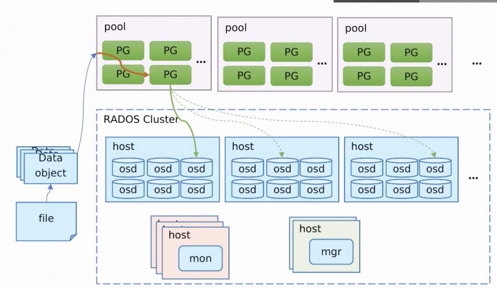

# Ceph

## 简介

* NameNode, DataNode
* shard: primary shard, replica shard
* HDFS - Hadoop Distributed FileSystem
    * GFS - Google FileSystem
* Object - 数据对象。在 Ceph 中，待管理的一个数据流（例如一个文件）会被切分成一个或多个固定大小的对象数据，并以其为原子单元完成数据存取（不可再分）。
    * 对象本身含有自己的元数据，不会额外存储。（传统文件系统存储时，采用inode+数据的方式，通过inode找到实际存储文件的block）
    * 对象数据的底层存储服务是有多个主机组成的集群，称为 **RADOS** - Reliable Automatic Distributed Object Store
    * librados - RADOS 存储集群的 API
    * 对象存在哪个节点？ - CRUSH算法 - Ceph用来对文件

## 架构

```text
                +-----+              +---------+             +--------+
                | APP |              | HOST/VM |             | CLIENT |
                +-----+              +---------+             +--------+
                   ↓                      ↓                       ↓   
           +-----------------+  +-------------------+  +---------------------+ 
           | RADOSGW         |  | RBD               |  | CEPH FS             | 
+-----+    +-----------------+  +-------------------+  +---------------------+ 
| APP |    |                 |  |  A reliable and   |  |  A POSIX-compliant  | 
+-----+    |  A bucket-based |  | fully-distributed |  | distributed file    | 
   |       | REST gateway,   |  | block device with |  | system, with a      | 
   |       | compatible with |  | a Linux kernel    |  | Linux kernel client | 
   |       | S3 and Swift    |  | client and a      |  | and support for     | 
   |    +--|                 |--| QEMU/KVM driver   |--| FUSE                |--+
   |    |  +-----------------+  +-------------------+  +---------------------+  |
   +--> | LIBRADOS                                                              |
        |   A library allowing apps to directly accoss RADOS, with support for  |
    +---|   C, C++, Java, Python, Ruby, and PHP                                 |---+
    |   +-----------------------------------------------------------------------+   |
    | RADOS                                                                         |
    |   A reliable, autonomous, distributod object store comprised of self-healing, |
    |   self-managing, intelligent storage nodes                                    |
    +-------------------------------------------------------------------------------+
```

