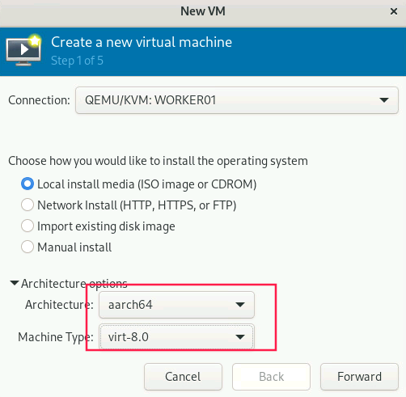
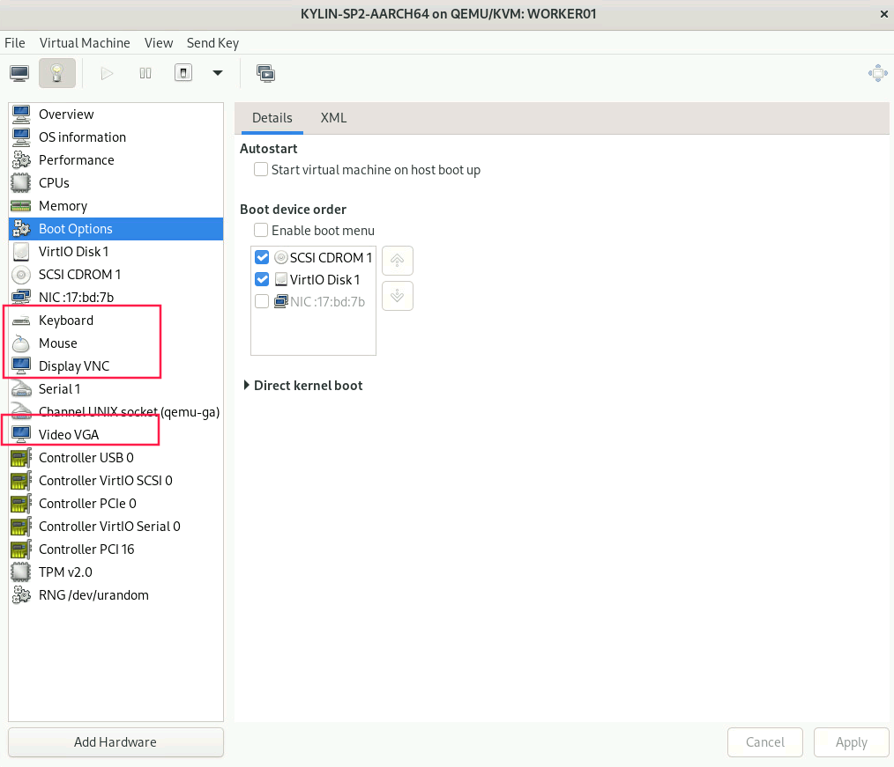

# Run aarch64 virtual machine in x86_64 host.

* 0. Env

    * **Host**: Rocky Linux 9.1
    * **Kernel**: 5.14.0-162.6.1.el9_1.x86_64
    * **Libvirt**: 8.5.0-7.el9_1
    * **qemu-kvm**: 7.0.0-13.el9
    * **virt-manager**: 4.0.0-1.el9

* 1. Build `qemu-system-aarch64` for `qemu-8.0.4.tar.gz`

    ```sh
    yum install make zlib-devel glib2-devel pixman-devel ninjia-build gcc
    
    cd ./build
    ../configure --target-list=aarch64-softmmu
    make -j 16
    make install
    ```

    > Your build may exit with error [`ninja: build stopped: subcommand failed.`](https://blog.csdn.net/gh1026385964/article/details/80581218#:~:text=%E9%94%99%E8%AF%AF%EF%BC%9Aninja%3A%20build%20stopped%3A%20subcommand,failed.%20%E5%8A%9E%E6%B3%95%E4%B8%80%EF%BC%9A%E6%8C%89%E7%85%A7%E6%8F%90%E7%A4%BA%EF%BC%9Aulimit%20-c%20unlimited%20%E8%AF%A5%E5%91%BD%E4%BB%A4%E7%9A%84%E8%AF%A6%E7%BB%86%E8%A7%A3%E9%87%8A%E5%8F%82%E8%80%83%EF%BC%9Ahttps%3A%2F%2Fwww.cnblogs.com%2Fqq78292959%2Farchive%2F2012%2F05%2F08%2F2490443.html)
    > 
    > Solved by -> `ulimited -c unlimited`


* 2. Download UEFI firmware

    [edk2.git-aarch64-0-20220719.209.gf0064ac3af.EOL.no.nore.updates.noarch.rpm](https://www.kraxel.org/repos/jenkins/edk2/)

    Install:

    ```sh
    dnf localinstall edk2.git-aarch64-0-20220719.209.gf0064ac3af.EOL.no.nore.updates.noarch.rpm
    ```

* 3. Use Virtual Machine Manager to create a aarch64 VM

    

* 4. Add hardware

    

    * Mouse
    * Keyboard
    * Video VGA
    * Display VNC