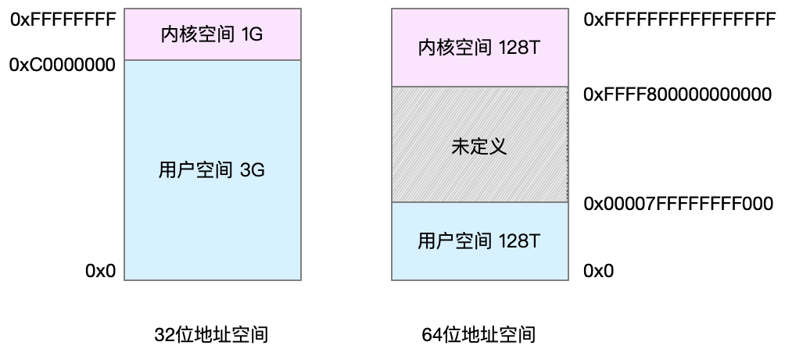
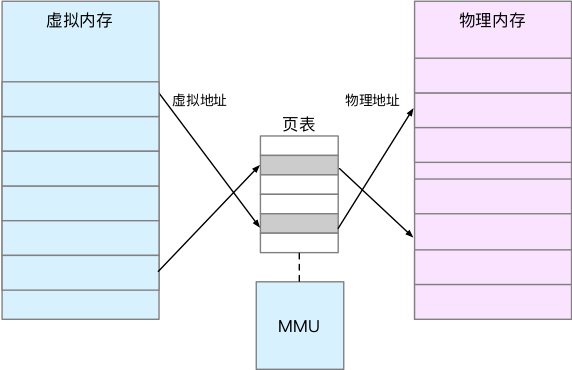

# Linux性能优化实战

## CPU

### uptime - 平均负载

平均负载是指单位时间内系统处于 **可运行状态** 和 **不可中断状态** 的平均进程数，也就是平均活跃进程数，它和 CPU 使用率并没有直接关系。

* 可运行状态 - 正在使用 CPU 或者正在等待 CPU 的进程
* 不可中断状态 - 进程正处于内核态关键流程中的进程，并且这些流程是不可打断的
    比如，当一个进程向磁盘读写数据时，为了保证数据的一致性，在得到磁盘回复前，它是不能被其他进程或者中断打断的，这个时候的进程就处于不可中断状态。如果此时的进程被打断了，就容易出现磁盘数据与进程数据不一致的问题。

示例：

```sh
# 场景一：CPU 密集型进程
stress --cpu 1 --timeout 600

# 场景二：I/O 密集型进程
stress --io 2 --hdd 2 --timeout 600

# 场景三：大量进程的场景
stress --cpu 8 --timeout 600

mpstat -P ALL 5
pidstat -u 5 1
```

### 上下文切换

* 进程调度的条件

    * 其一，为了保证所有进程可以得到公平调度，CPU 时间被划分为一段段的时间片，这些时间片再被轮流分配给各个进程。这样，当某个进程的时间片耗尽了，就会被系统挂起，切换到其它正在等待 CPU 的进程运行。 
    * 其二，进程在系统资源不足（比如内存不足）时，要等到资源满足后才可以运行，这个时候进程也会被挂起，并由系统调度其他进程运行。 
    * 其三，当进程通过睡眠函数 sleep 这样的方法将自己主动挂起时，自然也会重新调度。 
    * 其四，当有优先级更高的进程运行时，为了保证高优先级进程的运行，当前进程会被挂起，由高优先级进程来运行。 
    * 最后一个，发生硬件中断时，CPU 上的进程会被中断挂起，转而执行内核中的中断服务程序。

* vmstat

    ```sh
    procs -----------memory---------- ---swap-- -----io---- -system-- ------cpu-----
     r b  swpd    free  buff   cache   si   so     bi    bo   in   cs us sy id wa st 
     0 0     0 7005360 91564  818900    0    0      0     0   25   33  0 0 100  0  0
    
    # r（Running or Runnable）是就绪队列的长度，也就是正在运行和等待 CPU 的进程数。 
    # b（Blocked）则是处于不可中断睡眠状态的进程数。
    # in（interrupt）则是每秒中断的次数。 
    # cs（context switch）是每秒上下文切换的次数。 
    ```

* pidstat

    ```sh
    ~] pidstat -w 5 1
    Linux 4.15.0 (ubuntu)  09/23/18  _x86_64_  (2 CPU)

    08:18:26      UID       PID   cswch/s nvcswch/s  Command
    08:18:31        0         1      0.20      0.00  systemd
    08:18:31        0         8      5.40      0.00  rcu_sched
    ...

    # cswch/s，表示每秒自愿上下文切换（voluntary context switches）的次数
    # nvcswch/s，表示每秒非自愿上下文切换（non voluntary context switches）的次数。
    ```

* sysbench - 模拟多线程调度切换

    ```sh
    # 以10个线程运行5分钟的基准测试，模拟多线程切换的问题
    ~] sysbench --threads=10 --time=300 threads run

    pidstat -w -u -t 5   # -t 才会显示线程数据
    ```

* 每秒上下文切换多少次才算正常

    这个数值其实取决于系统本身的 CPU 性能。在我看来，如果系统的上下文切换次数比较稳定，那么从数百到一万以内，都应该算是正常的。但当上下文切换次数超过一万次，或者切换次数出现数量级的增长时，就很可能已经出现了性能问题。

    这时，你还需要根据上下文切换的类型，再做具体分析。比方说：
    
    * 自愿上下文切换变多了，说明进程都在等待资源，有可能发生了 I/O 等其他问题；
    * 非自愿上下文切换变多了，说明进程都在被强制调度，也就是都在争抢 CPU，说明 CPU 的确成了瓶颈；
    * 中断次数变多了，说明 CPU 被中断处理程序占用，还需要通过查看 `/proc/interrupts` 文件来分析具体的中断类型。

### CPU 使用率

* 节拍率

    为了维护 CPU 时间，Linux 通过事先定义的节拍率（内核中表示为 HZ），触发时间中断，并使用全局变量 Jiffies 记录了开机以来的节拍数。每发生一次时间中断，Jiffies 的值就加 1。

    节拍率 HZ 是内核的可配选项，可以设置为 100、250、1000:

    ```sh
    ~] grep 'CONFIG_HZ=' /boot/config-3.10.0-1160.66.1.el7.x86_64
    CONFIG_HZ=1000 # 每秒钟触发 1000 次时间中断
    ```

    因为节拍率 HZ 是内核选项，所以用户空间程序并不能直接访问。为了方便用户空间程序，内核还提供了一个用户空间节拍率 `USER_HZ`，它总是固定为 100，也就是 1/100 秒, 10ms。

    Linux 通过 `/proc` 虚拟文件系统，向用户空间提供了系统内部状态的信息，而 `/proc/stat` 提供的就是系统的 CPU 和任务统计信息。

* perf

    ```sh
    perf recode -g  # 执行 10-15s
    perf report
    perf top
    ```

* `/proc/stat`

    ```sh
    ~] cat /proc/stat | grep ^cpu
    cpu  280580 7407 286084 172900810 83602 0 583 0 0 0
    cpu0 144745 4181 176701 86423902 52076 0 301 0 0 0

    # 第一列表示的是 CPU 编号，如 cpu0、cpu1 ，而第一行没有编号的 cpu ，表示的是所有 CPU 的累加
    # 其他列：不同场景下 CPU 的累加节拍数，单位：USER_HZ (10ms)
    # 
    # user（通常缩写为 us），代表用户态 CPU 时间。注意，它不包括下面的 nice 时间，但包括了 guest 时间。
    # nice（通常缩写为 ni），代表低优先级用户态 CPU 时间，也就是进程的 nice 值被调整为 1-19 之间时的 CPU 时间
    # system（通常缩写为 sys），代表内核态 CPU 时间。
    # idle（通常缩写为 id），代表空闲时间。注意，它不包括等待 I/O 的时间（iowait）。
    # iowait（通常缩写为 wa），代表等待 I/O 的 CPU 时间。
    # irq（通常缩写为 hi），代表处理硬中断的 CPU 时间。
    # softirq（通常缩写为 si），代表处理软中断的 CPU 时间。
    # steal（通常缩写为 st），代表当系统运行在虚拟机中的时候，被其他虚拟机占用的 CPU 时间。
    # guest（通常缩写为 guest），代表通过虚拟化运行其他操作系统的时间，也就是运行虚拟机的 CPU 时间。
    # guest_nice（通常缩写为 gnice），代表以低优先级运行虚拟机的时间。
    ```

    $cpu\%=1-\frac{Used_{new}-Used_{old}}{Total_{new}-Total_{old}}$


### 不可中断进程和僵尸进程

* 进程状态

    运行（R）、空闲（I）、不可中断睡眠（D）、可中断睡眠（S）、僵尸（Z）以及暂停（T），退出（X，top等命令中不显示）

* iowait

    ```sh
    ~] dstat 1 10
    You did not select any stats, using -cdngy by default.
    --total-cpu-usage-- -dsk/total- -net/total- ---paging-- ---system--
    usr sys idl wai stl| read  writ| recv  send|  in   out | int   csw
      0   0  96   4   0|1219k  408k|   0     0 |   0     0 |  42   885
      0   0   2  98   0|  34M    0 | 198B  790B|   0     0 |  42   138
      0   0   0 100   0|  34M    0 |  66B  342B|   0     0 |  42   135
      0   0  84  16   0|5633k    0 |  66B  342B|   0     0 |  52   177
      0   3  39  58   0|  22M    0 |  66B  342B|   0     0 |  43   144
      0   0   0 100   0|  34M    0 | 200B  450B|   0     0 |  46   147
      0   0   2  98   0|  34M    0 |  66B  342B|   0     0 |  45   134
      0   0   0 100   0|  34M    0 |  66B  342B|   0     0 |  39   131
      0   0  83  17   0|5633k    0 |  66B  342B|   0     0 |  46   168
      0   3  39  59   0|  22M    0 |  66B  342B|   0     0 |  37   134
    
    ~] pidstat -d -p 4344 1 3
    06:38:50      UID       PID   kB_rd/s   kB_wr/s kB_ccwr/s iodelay  Command
    06:38:51        0      4344      0.00      0.00      0.00       0  app
    06:38:52        0      4344      0.00      0.00      0.00       0  app
    06:38:53        0      4344      0.00      0.00      0.00       0  app
    ```

* 硬中断和软中断

    * 从“取外卖”看中断：
    
        比如说你订了一份外卖，但是不确定外卖什么时候送到，也没有别的方法了解外卖的进度，但是，配送员送外卖是不等人的，到了你这儿没人取的话，就直接走人了。所以你只能苦苦等着，时不时去门口看看外卖送到没，而不能干其他事情。 不过呢，如果在订外卖的时候，你就跟配送员约定好，让他送到后给你打个电话，那你就不用苦苦等待了，就可以去忙别的事情，直到电话一响，接电话、取外卖就可以了。 这里的“打电话”，其实就是一个中断。没接到电话的时候，你可以做其他的事情；只有接到了电话（也就是发生中断），你才要进行另一个动作：取外卖。

    * 中断其实是一种异步的事件处理机制，可以提高系统的并发处理能力。 

    * 由于中断处理程序会打断其他进程的运行，所以，为了减少对正常进程运行调度的影响，中断处理程序就需要尽可能快地运行。

    * 另外一个例子：

        假如你订了 2 份外卖，一份主食和一份饮料，并且是由 2 个不同的配送员来配送。这次你不用时时等待着，两份外卖都约定了电话取外卖的方式。但是，问题又来了。 当第一份外卖送到时，配送员给你打了个长长的电话，商量发票的处理方式。与此同时，第二个配送员也到了，也想给你打电话。 但是很明显，因为电话占线（也就是关闭了中断响应），第二个配送员的电话是打不通的。所以，第二个配送员很可能试几次后就走掉了（也就是丢失了一次中断）。

    * 为了解决中断处理程序执行过长和中断丢失的问题，Linux 将中断处理过程分成了两个阶段，也就是上半部和下半部：

        * 上半部用来快速处理中断 - 直接处理硬件请求 - 硬中断
        * 下半部用来延迟处理上半部未完成的工作，通常以内核线程的方式运行 - 由内核触发 - 软中断

        上半部会打断 CPU 正在执行的任务，然后立即执行中断处理程序。而下半部以内核线程的方式执行，并且每个 CPU 都对应一个软中断内核线程，名字为 “`ksoftirqd/CPU 编号`”，比如说， 0 号 CPU 对应的软中断内核线程的名字就是 `ksoftirqd/0`。

        此外，软中断不只包括了刚刚所讲的硬件设备中断处理程序的下半部，一些内核自定义的事件也属于软中断，比如内核调度和 RCU 锁（Read-Copy Update 的缩写，RCU 是 Linux 内核中最常用的锁之一）等。

* 查看软中断和内核线程

    * `/proc/softirqs` 提供了软中断的运行情况
    * `/proc/interrupts` 提供了硬中断的运行情况

    ```sh
    ~] cat /proc/softirqs
                        CPU0       CPU1
              HI:          0          0
           TIMER:     811613    1972736
          NET_TX:         49          7
          NET_RX:    1136736    1506885
           BLOCK:          0          0
        IRQ_POLL:          0          0
         TASKLET:     304787       3691
           SCHED:     689718    1897539
         HRTIMER:          0          0
             RCU:    1330771    1354737
    # 软中断包括了 10 个类别，分别对应不同的工作类型 (第一列)
    ```

    实验：

    ```sh
    ~] hping3 -S -p 22 -i u100 192.168.161.9   # 模拟发送 SYN FLOOD
    ~] top
    ~] watch -d cat /proc/softirq
    ~] sar -n DEV 1
    ~] tcpdump -i eth0 -n tcp port 22
    ```

    * CPU 使用率最高的也是软中断进程 `ksoftirqd/1`
    * `/proc/softirqs` 中 NET_RX 值变化较快
    * sar 命令体现：`rxpck/s`、`txpck/s`很大（1w+），而 `rxkB/s`、`txkB/s` 却很小（几百）

### 工具总结

* 根据工具查指标

    

* 根据指标查工具

    

* 性能分析流程

    

### 性能优化方法论

CPU优化常用方法：

*  **CPU 绑定**：把进程绑定到一个或者多个 CPU 上，可以提高 CPU 缓存的命中率，减少跨 CPU 调度带来的上下文切换问题。
*  **CPU 独占**：跟 CPU 绑定类似，进一步将 CPU 分组，并通过 CPU 亲和性机制为其分配进程。这样，这些 CPU 就由指定的进程独占，换句话说，不允许其他进程再来使用这些 CPU。
*  **优先级调整**：使用 nice 调整进程的优先级，正值调低优先级，负值调高优先级。优先级的数值含义前面我们提到过，忘了的话及时复习一下。在这里，适当降低非核心应用的优先级，增高核心应用的优先级，可以确保核心应用得到优先处理。
* **为进程设置资源限制**：使用 Linux cgroups  来设置进程的 CPU 使用上限，可以防止由于某个应用自身的问题，而耗尽系统资源。
* **NUMA（Non-Uniform Memory Access）优化**：支持 NUMA 的处理器会被划分为多个 node，每个 node 都有自己的本地内存空间。NUMA 优化，其实就是让 CPU 尽可能只访问本地内存。
* **中断负载均衡**：无论是软中断还是硬中断，它们的中断处理程序都可能会耗费大量的 CPU。开启 irqbalance 服务或者配置 smp_affinity，就可以把中断处理过程自动负载均衡到多个 CPU 上。


## 内存

* 虚拟内存

    Linux 内核给每个进程都提供了一个独立的虚拟地址空间，并且这个地址空间是连续的。这样，进程就可以很方便地访问内存，更确切地说是访问虚拟内存：

    虚拟地址空间的内部又被分为内核空间和用户空间两部分，不同字长（也就是单个 CPU 指令可以处理数据的最大长度）的处理器，地址空间的范围也不同。比如最常见的 32 位和 64 位系统，我画了两张图来分别表示它们的虚拟地址空间，如下所示:

    

    通过这里可以看出，32 位系统的内核空间占用 1G，位于最高处，剩下的 3G 是用户空间。而 64 位系统的内核空间和用户空间都是 128T，分别占据整个内存空间的最高和最低处，剩下的中间部分是未定义的。

    进程在用户态时，只能访问用户空间内存；只有进入内核态后，才可以访问内核空间内存。虽然每个进程的地址空间都包含了内核空间，但这些内核空间，其实关联的都是相同的物理内存。这样，进程切换到内核态后，就可以很方便地访问内核空间内存。

* 内存映射

    内存映射，其实就是将虚拟内存地址映射到物理内存地址。内核为每个进程都维护了一张页表，记录虚拟地址与物理地址的映射关系，如下图所示:

    

    页表实际上存储在 CPU 的内存管理单元 MMU 中，这样，正常情况下，处理器就可以直接通过硬件，找出要访问的内存。而当进程访问的虚拟地址在页表中查不到时，系统会产生一个缺页异常，进入内核空间分配物理内存、更新进程页表，最后再返回用户空间，恢复进程的运行。

* buffer & cache

    * buffer: Relatively temporary storage for raw disk blocks that shouldn't get tremendously large (20MB or so). - 用来缓存磁盘的数据

    * cache: In-memory cache for files read from the disk (the page cache). Doesn't include SwapCached. - 用来缓存从文件读取的数据

    两个问题：

    * 第一个问题，Buffer 的文档没有提到这是磁盘读数据还是写数据的缓存，而在很多网络搜索的结果中都会提到 Buffer 只是对将要写入磁盘数据的缓存。那反过来说，它会不会也缓存从磁盘中读取的数据呢？ 

    * 第二个问题，文档中提到，Cache 是对从文件读取数据的缓存，那么它是不是也会缓存写文件的数据呢？


    探索：

    * 写文件

        ```sh
        ~] echo 3 > /proc/sys/vm/drop_caches
        ~] dd if=/dev/urandom of=/tmp/file bs=1M count=500
        
        # 通过vmstat观察
        ~] vmstat 1
        procs -----------memory---------- ---swap-- -----io---- -system-- ------cpu-----
        r  b   swpd   free   buff  cache   si   so    bi    bo   in   cs us sy id wa st
        0  0      0 7499460   1344 230484    0    0     0     0   29  145  0  0 100  0  0
        1  0      0 7338088   1752 390512    0    0   488     0   39  558  0 47 53  0  0
        1  0      0 7158872   1752 568800    0    0     0     4   30  376  1 50 49  0  0
        1  0      0 6980308   1752 747860    0    0     0     0   24  360  0 50 50  0  0
        0  0      0 6977448   1752 752072    0    0     0     0   29  138  0  0 100  0  0
        0  0      0 6977440   1760 752080    0    0     0   152   42  212  0  1 99  1  0
        ...
        0  1      0 6977216   1768 752104    0    0     4 122880   33  234  0  1 51 49  0
        0  1      0 6977440   1768 752108    0    0     0 10240   38  196  0  0 50 50  0
        # buff 和 cache 就是我们前面看到的 Buffers 和 Cache，单位是 KB
        # bi 和 bo 则分别表示块设备读取和写入的大小，单位为 块/秒。因为 Linux 中块的大小是 1KB，所以这个单位也就等价于 KB/s。
        ```

        在 Cache 刚开始增长时，块设备 I/O 很少，bi 只出现了一次 488 KB/s，bo 则只有一次 4KB。而过一段时间后，才会出现大量的块设备写，比如 bo 变成了 122880

        当 dd 命令结束后，Cache 不再增长，但块设备写还会持·续一段时间，并且，多次 I/O 写的结果加起来，才是 dd 要写的 500M 的数据。

    * 写磁盘

        ```sh
        ~] echo 3 > /proc/sys/vm/drop_caches
        ~] dd if=/dev/urandom of=/dev/sdb1 bs=1M count=2048
        
        # 通过vmstat观察
        ~] vmstat 1
        procs -----------memory---------- ---swap-- -----io---- -system-- ------cpu-----
        r  b   swpd   free   buff  cache   si   so    bi    bo   in   cs us sy id wa st
        1  0      0 7584780 153592  97436    0    0   684     0   31  423  1 48 50  2  0
        1  0      0 7418580 315384 101668    0    0     0     0   32  144  0 50 50  0  0
        1  0      0 7253664 475844 106208    0    0     0     0   20  137  0 50 50  0  0
        1  0      0 7093352 631800 110520    0    0     0     0   23  223  0 50 50  0  0
        1  1      0 6930056 790520 114980    0    0     0 12804   23  168  0 50 42  9  0
        1  0      0 6757204 949240 119396    0    0     0 183804   24  191  0 53 26 21  0
        1  1      0 6591516 1107960 123840    0    0     0 77316   22  232  0 52 16 33  0
        ```

        同是写数据，写磁盘跟写文件的现象还是不同的。写磁盘时（也就是 bo 大于 0 时），Buffer 和 Cache 都在增长，但显然 Buffer 的增长快得多。


    对比两个案例，我们发现，写文件时会用到 Cache 缓存数据，而写磁盘则会用到 Buffer 来缓存数据。所以，回到刚刚的问题，虽然文档上只提到，Cache 是文件读的缓存，但实际上，**Cache 也会缓存写文件时的数据**。

    * 读文件

        ```sh
        ~] echo 3 > /proc/sys/vm/drop_caches
        ~] dd if=/tmp/file of=/dev/null
        
        # 通过vmstat观察
        ~] vmstat 1
        procs -----------memory---------- ---swap-- -----io---- -system-- ------cpu-----
        r  b   swpd   free   buff  cache   si   so    bi    bo   in   cs us sy id wa st
        0  1      0 7724164   2380 110844    0    0 16576     0   62  360  2  2 76 21  0
        0  1      0 7691544   2380 143472    0    0 32640     0   46  439  1  3 50 46  0
        0  1      0 7658736   2380 176204    0    0 32640     0   54  407  1  4 50 46  0
        0  1      0 7626052   2380 208908    0    0 32640    40   44  422  2  2 50 46  0
        ```

        读取文件时（也就是 bi 大于 0 时），Buffer 保持不变，而 Cache 则在不停增长。

    * 读磁盘

        ```sh
        ~] echo 3 > /proc/sys/vm/drop_caches
        ~] dd if=/dev/sdb1 of=/dev/null bs=1M count=1024
        
        # 通过vmstat观察
        ~] vmstat 1
        procs -----------memory---------- ---swap-- -----io---- -system-- ------cpu-----
        r  b   swpd   free   buff  cache   si   so    bi    bo   in   cs us sy id wa st
        0  0      0 7225880   2716 608184    0    0     0     0   48  159  0  0 100  0  0
        0  1      0 7199420  28644 608228    0    0 25928     0   60  252  0  1 65 35  0
        0  1      0 7167092  60900 608312    0    0 32256     0   54  269  0  1 50 49  0
        0  1      0 7134416  93572 608376    0    0 32672     0   53  253  0  0 51 49  0
        0  1      0 7101484 126320 608480    0    0 32748     0   80  414  0  1 50 49  0
        ```

        读磁盘时（也就是 bi 大于 0 时），Buffer 和 Cache 都在增长，但显然 Buffer 的增长快很多。这说明读磁盘时，数据缓存到了 Buffer 中。

    对比以上两个案例，我们发现，读文件时数据会缓存到 Cache 中，而读磁盘时数据会缓存到 Buffer 中。

    总的来说，Buffer 是对磁盘数据的缓存，而 Cache 是文件数据的缓存，它们既会用在读请求中，也会用在写请求中。

* 缓存命中率

    缓存的命中率。所谓缓存命中率，是指直接通过缓存获取数据的请求次数，占所有数据请求次数的百分比。命中率越高，表示使用缓存带来的收益越高，应用程序的性能也就越好