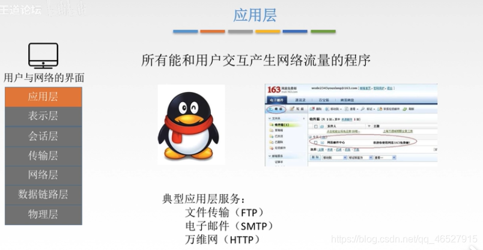
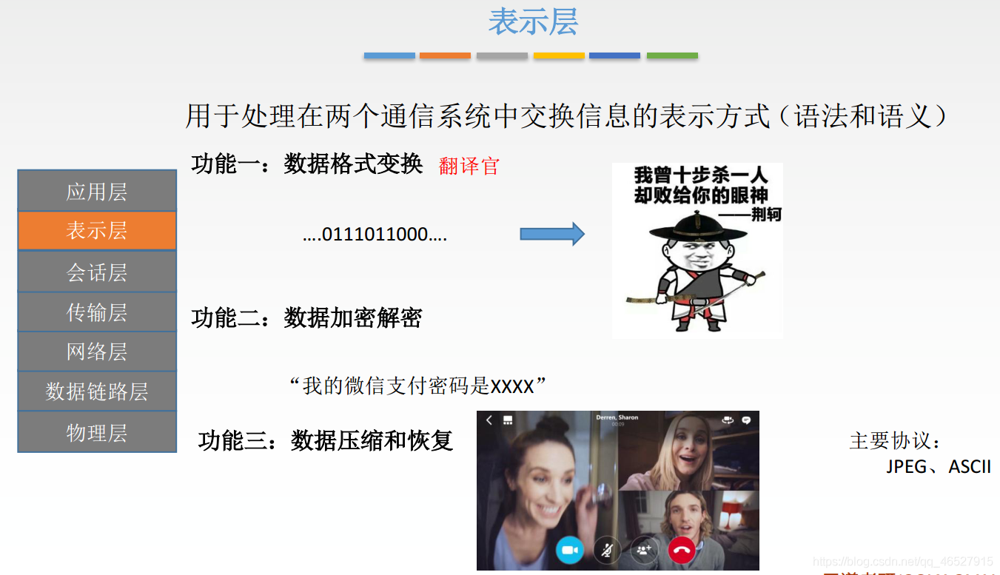
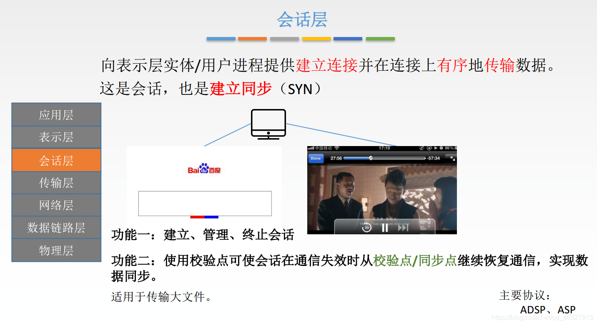
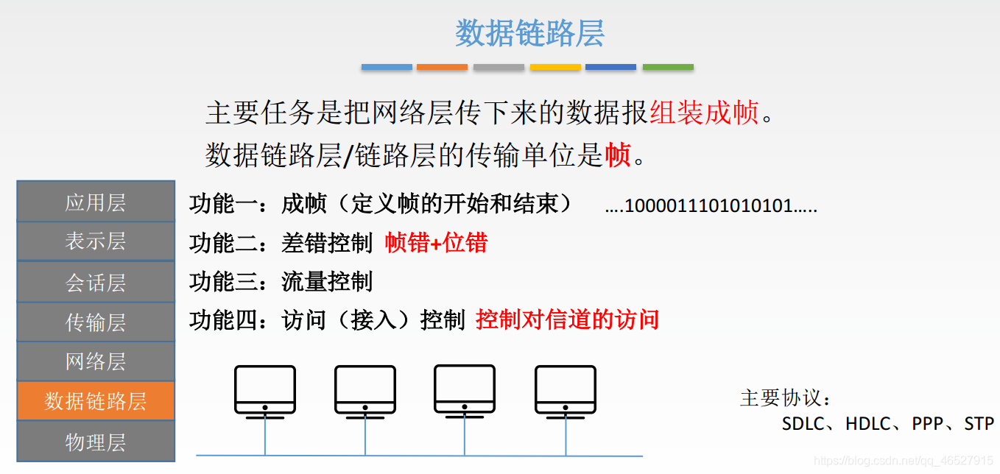

# 计算机网络

References:

* [https://blog.csdn.net/weixin_45067603/article/details/106974036](https://blog.csdn.net/weixin_45067603/article/details/106974036)

* [https://blog.csdn.net/qq_46527915/category_10424389.html](https://blog.csdn.net/qq_46527915/category_10424389.html)

## 01 组成、功能、分类

**计算机网络**：是一个将分散的、具有**独立功能的**计算系统，通过通信设备与线路连接起来，由功能完善的**软件**实现**资源共享**和**信息传递**的系统。

计算机网络是**互连的**、**自治的**计算机集合。自治的，表现为无主从关系。

### 1.1 功能

* 数据通信（连通性）
* 资源共享（硬件、软件、数据资源）
* 分布式处理
* 提高可靠性（替代机）
* 负载均衡
* ……

### 1.2 组成

* 组成部分：
    * 硬件：计算机、链路、通信设备等
    * 软件
    * 协议

* 工作方式：
    * 边缘部分：用户直接使用（c/s方式，p2p方式）
    * 核心部分：为边缘部分服务。

* 功能组成：
    * 通信子网：数据通信
    * 资源子网：资源共享/数据处理

### 1.3 分类

* 分布范围：广域网WAN（交换技术），城域网MAN，局域网LAN（广播技术），个人区域网PAN
* 使用者：公用网，专用网
* 交换技术：电路交换，报文交换，分组交换
* 拓扑结构：总线型，星型，环型，网状型
* 传播技术：
    * 广播式网络：共享公共通信信道
    * 点对点网络：使用分组**储存技术**和**路由选择机制**

## 02 标准化工作

* 法定标准
* 事实标准

RFC，request for comments，因特网标准的形式。

RFC上升为因特网标准的四个阶段：

* 因特网草案：Internet Draft
* 建议标准：RFC标准
* 草案标准：Draft Standard（IETF、IAB审核）
* 因特网标准：Internet Standard

相关组织：

* 国际标准化组织 ISO：OSI参考模型，HDLC协议
* 国际电信联盟 ITU：制定通信规则
* 国际电器电子工程师协会 IEEE：学术机构，IEEE 802系列标准，5G
* Internet工程任务组 IETF：因特网相关标准的制定，RFC xxx

## 03 性能指标

### 速率：b/s...

主机在数字信道上传送数据位数的速度

### 带宽：b/s...

单位时间内从网络中一点到另一点能通过的“最高数据率”，体现传输数据的能力

网络设备所支持的最高速度

带宽越大，表示发送bit速度的更快，但是bit在链路中的传送速率是不变的。

### 吞吐量：b/s...

单位时间内通过某个网络的数据量

> 速率就是实际网速，带宽是理论网速，吞吐量是一个或多个设备的综合速率，比如说1000m宽带的路由器连着三部手机，每部手机都是10mb/s看片，那么速率就是10mb/s，带宽是宽带的1000m，路由器吞吐量是30mb/s，即三者之和。

### 时延

从一端到另一端的时间

| 名称 | 描述 | 计算公式 |
| -- | :-- | :-- |
| 发送时延/传输时延 | 数据从主机到信道上所用的时间 | 发送的数据长度/发送速率 |
| 传播时延 | 数据在信道上传播所花费的时间 | 信道长度/电磁波在信道上传播的速率 |
| 排队时延 | 数据在路由器前等待前面数据处理的时间 | 无计算方式 |
| 处理时延 | 数据在路由器中处理需求的时间 | 无计算方式 |

使用高速链路(提高网速)，只能减小发送时延，无法减少其他三个时延

### 时延带宽积

公式：时延带宽积=传播时延x带宽

以比特为单位的链路长度

意思是某刻链路上有多少比特的数据

### 往返时延RTT

从发送方发送数据开始，到接收方确认收到为止所花费的时间

RTT=传播时延x2+处理时间(有时可能直接忽略)

### 信道利用率

信道利用率=有数据通过时间/有+无数据通过时间

### 网络利用率

网络利用率=所有信道利用率加权求平均值

## 04 分层结构

* 实体
* 协议
    * 语法
    * 语义
    * 同步
* 接口：访问服务器点SAP：上层使用下层服务的入口
* 服务：下层为上层提供的功能调用

SDU、PDU、PCI

* SDU：数据传输单元
* PCI：协议控制信息
* PDU：协议控制单元 PDU=PCI+SDU

### OSI模型

| 名称 | 英文 | 作用 |
| -- | -- | :-- |
| 应用层 | Application Layer | 直接为用户的应用进程（例如电子邮件、文件传输和终端仿真）提供服务。如HTTP、SMTP、FTP、DNS等 |
| 表示层 | Presentation Layer | 把数据转换为能与接收者的系统格式兼容并适合传输的格式，即让两个系统可以交换信息 |
| 会话层 | Session Layer | 负责在数据传输中设置和维护计算机网络中两台计算机之间的通信连接 |
| 传输层 | Transport Layer | 负责端到端通讯，可靠传输，不可靠传输 ，流量控制，复用分用 |
| 网络层 | Network Layer | 负责选择路由最佳路径，规划IP地址(ipv4和ipv6变化只会影响网络层)，拥塞控制 |
| 数据链路层 | Data Link Layer | 帧的开始和结束，还有透明传输，差错校验(纠错由传输层解决) |
| 物理层 | Physical Layer | 定义网络设备接口标准，电气标准(电压)，如何在物理链路上传输的更快 |

* 应用层

* 表示层

* 会话层

* 传输层

* 网络层

* 数据链路层

* 物理层

### TCP/IP参考模型

### 五层体系结构

传输过程：

